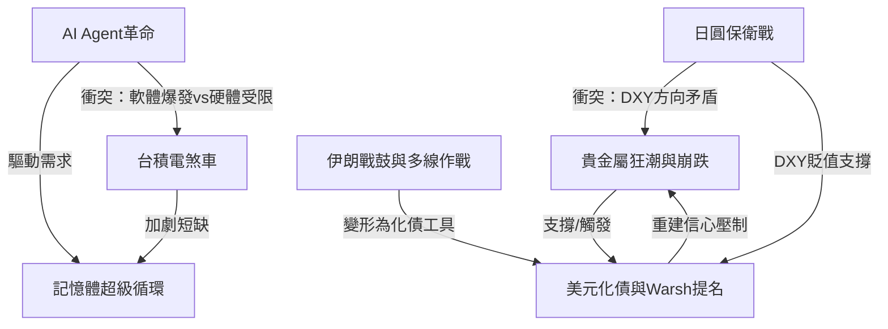
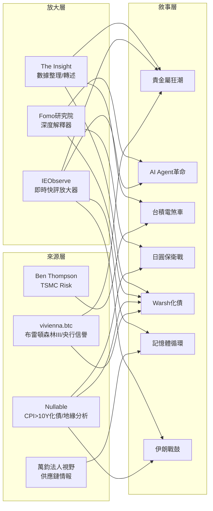

Weekly Narrative Brief（2026-01-24 ~ 2026-01-31）

## 1. 核心敘事（7 個）

### 敘事一：白銀崩塌——貴金屬狂潮從破百到單日腰斬

- **敘事骨架：** 因為去美元化敘事與地緣動盪推動金銀暴漲（黃金6天破$5000、白銀破$100），所以市場處於極度亢奮的拋物線行情，接下來Warsh提名觸發信心重建預期，白銀單日崩跌34%、市值蒸發9000億美元。
- **主要佐證：**
  1. 黃金現貨1/19破$4700→1/22破$4900→1/25破$5000，僅6個交易日（tw-0126 Post 4, tw-0124 Post 23）
  2. 白銀破$100後一度衝至$121，隨後90分鐘內完全抹去14%漲幅轉為下跌（fb-0127 Post 37）
  3. 1/30白銀單日崩跌34%，為史上最大日內反轉之一（fb-0131 Post 24, Post 29）
  4. SLV交易量一度接近S&P 500的$350億美金日交易量（tw-0131 Post 38）
- **典型放大語句：**
  「乱纪元的飓风在咆哮」——Nullable（tw-0126 Post 4）
  「白銀在90分鐘內市值蒸發了9000億美元」——The Insight（fb-0127 Post 37）
- **感染力來源：** 情緒（恐懼與貪婪的極端擺盪）＋簡單口號（「現貨黃金破5000」）＋英雄反派（多頭vs斷頭賣壓）
- **代表貼文：** tw-0124 Post 23, fb-0124a Post 19, tw-0126 Post 4, fb-0126 Post 25, fb-0127 Post 37, fb-0127 Post 44, tw-0131 Post 9, tw-0131 Post 12, fb-0131 Post 8, fb-0131 Post 29

---

### 敘事二：AI Agent吞噬軟體——Claude Code引爆SaaS崩潰潮

- **敘事骨架：** 因為Claude Code/Clawdbot等AI Agent工具讓非技術人員也能「Vibe Coding」快速生成軟體，所以傳統SaaS訂閱制護城河被瓦解，接下來市場直接用股價反映「軟體被AI吃掉」的敘事，SaaS股集體崩跌。
- **主要佐證：**
  1. Clawdbot（後改名Moltbot）讓用戶串Claude API當24小時員工，第一天就燒$130 token（fb-0126 Post 4）
  2. Claude Code安裝量飆升時間線與SaaS股崩跌完全重合（fb-0131 Post 37）
  3. Google Genie讓遊戲製作工具股（Unity）同步崩跌（fb-0131 Post 19）
  4. Moltbot自建AI專屬社交論壇Moltbook，AI Agent之間自主交流、甚至提議建E2E加密空間（fb-0131 Post 28）
- **典型放大語句：**
  「被吞噬的，竟然變成了軟體公司自己」——Fomo研究院（fb-0126 Post 23）
  「Claude Code安裝量的飆升剛好跟SaaS股崩跌重合。市場真的買單AI吃掉企業軟體的敘事」——IEObserve（fb-0131 Post 37）
- **感染力來源：** 身份認同（開發者的存在焦慮）＋道德化（AI民主化vs壟斷）＋簡單口號（「Software is being eaten by AI」）
- **代表貼文：** fb-0126 Post 4, fb-0126 Post 23, fb-0126 Post 33, fb-0127 Post 1, fb-0127 Post 4-5, fb-0131 Post 2-3, fb-0131 Post 19, fb-0131 Post 37

---

### 敘事三：台積電煞車——AI供需瓶頸的隱形天花板

- **敘事骨架：** 因為台積電資本支出極度保守（2022-2024年CapEx持平甚至下降），所以AI晶片供不應求成為整個產業的結構性瓶頸，接下來hyperscalers被迫承擔本該由TSMC承擔的風險，數十億美元營收被白白放棄。
- **主要佐證：**
  1. TSMC CEO魏哲家坦承「矽晶圓是瓶頸」，不是電力或冷卻（gm-0126 Post 3）
  2. 2026年CapEx $52-56B的產能貢獻要到2028-2029才會顯現（gm-0126 Post 3）
  3. Amazon/Microsoft/Google/Meta全部在財報中表示「需求超過供給」（gm-0126 Post 3）
  4. 唯一能迫使TSMC加大投資的力量是競爭（Intel/Samsung），而非懇求（gm-0126 Post 3）
- **典型放大語句：**
  「如果hyperscalers和晶片公司不培育TSMC的競爭者，他們注定要放棄數十億美元營收並阻礙AI革命」——Ben Thompson/Stratechery（gm-0126 Post 3）
  「台積電在投資產能上的極度謹慎，正成為阻礙AI發展的瓶頸」——The Insight轉述（fb-0127 Post 11-12）
- **感染力來源：** 道德化（壟斷者的保守vs產業的需求）＋反直覺（最大風險不是地緣政治而是經濟決策）
- **代表貼文：** gm-0126 Post 3, fb-0127 Post 11-12, fb-0124a Post 8, fb-0124a Post 36

---

### 敘事四：日圓保衛戰——美日聯手干預與DXY暴跌之謎

- **敘事骨架：** 因為高市早苗激進財政擴張導致日圓逼近160生命線，所以NY Fed罕見啟動Rate Check聯手日本干預匯市，接下來DXY大幅貶值但美股美債卻未出現拋售，暗示有「隱形護盤」機制在運作。
- **主要佐證：**
  1. 紐約聯準會1/23代表財政部向外匯交易商進行Rate Check詢價（fb-0126 Post 5-7）
  2. 日圓從近160升值至152-154，DXY 6個交易日跌3.69%（tw-0127 Post 4, tw-0131 Post 66）
  3. DXY暴跌但股市債市無拋售痕跡，懷疑有定向放水托市（tw-0127 Post 4）
  4. 貝森特否認干預（"absolutely not"），但市場不信（tw-0131 Post 62）
- **典型放大語句：**
  「Rate Check本質上是中央銀行在正式干預前的最後通牒」——Fomo研究院（fb-0126 Post 5-7）
  「美元確實是在被抛售，但股市和債市沒有拋售痕跡，反而漲挺好。非常的奇怪。」——Nullable（tw-0127 Post 4）
- **感染力來源：** 情緒（金融秩序崩塌的恐懼）＋身份（全球貨幣體系重組）＋英雄反派（美日聯手vs投機客）
- **代表貼文：** fb-0126 Post 5-7, fb-0126 Post 16-18, fb-0127 Post 20, tw-0127 Post 4, tw-0131 Post 62, tw-0131 Post 66

---

### 敘事五：Warsh化債——美元信譽重建與「CPI > 10Y」不等式

- **敘事骨架：** 因為Trump提名鷹派Kevin Warsh為Fed主席以重建央行信譽，所以市場解讀為美元信心回歸、貴金屬遭拋售，接下來化債路徑將圍繞「高增速＋高通膨＋貨幣貶值」展開，Warsh可能「降息＋縮表」同步操作。
- **主要佐證：**
  1. Warsh曾在2008金融海嘯期間任Fed理事，被視為「通膨鬥士」（fb-0131 Post 8, Post 38）
  2. 其政策哲學：降息降低企業融資成本＋QT對抗資金錯配，類似格林斯潘時代賭互聯網生產力提升（tw-0131 Post 16）
  3. Trump手握FED＋BLS＋Treasury三大部門，可執行「CPI > 10Y」化債戰略（tw-0131 Post 12）
  4. 德銀估計DXY需貶值30%，目前已貶12%，仍有15%空間（tw-0131 Post 53）
- **典型放大語句：**
  「一個相對"鷹派"且"決絕"的主席上任，或許比一個猶豫不決的相機抉擇派對美聯儲和美元更有利」——vivienna.btc（tw-0131 Post 16）
  「選Warsh說明Trump還是在乎美元地位的。他要用CPI > 10Y這個不等式化債」——Nullable（tw-0131 Post 28）
- **感染力來源：** 道德化（財政紀律vs無限印鈔）＋簡單口號（「CPI > 10Y」）＋英雄反派（Warsh重建vs鮑威爾軟弱）
- **代表貼文：** fb-0131 Post 8, fb-0131 Post 38-39, tw-0131 Post 12, tw-0131 Post 16, tw-0131 Post 27-28, tw-0131 Post 71, fb-0131 Post 12

---

### 敘事六：記憶體超級循環——台股32K與結構性短缺

- **敘事骨架：** 因為AI伺服器/HPC需求導致DRAM/NAND結構性供不應求（三星Q1 DRAM漲70%、NAND漲100%），所以台韓半導體股創歷史新高（台股破32K），接下來CSP大廠甚至跑去中國搶記憶體產能，長短料問題開始擴散。
- **主要佐證：**
  1. Apple已在談Q2 DRAM/NAND合約價一次補漲70%（fb-0126 Post 46）
  2. 歐美CSP大廠已「餓到跑去中國要記憶體產能」（fb-0127 Post 30-32）
  3. 台股正式突破32K創新高，EWT歷史天量（fb-0124a Post 13-14, Post 41）
  4. 供應鏈出現典型長短料問題，整個BOM關鍵環節卡住（fb-0126 Post 22）
- **典型放大語句：**
  「市場最大的誤判在於：很多人還用『終端賣不動』去看待一個已經結構轉型的記憶體市場」——萬鈞法人視野（fb-0126 Post 46）
  「歐美CSP大廠已經餓到跑去中國要記憶體產能」——萬鈞法人視野（fb-0127 Post 30）
- **感染力來源：** 簡單口號（「記憶體超級循環」）＋道德化（看空者的認知落差）＋身份（供應鏈內部人vs外部觀察者）
- **代表貼文：** fb-0126 Post 22, fb-0126 Post 46, fb-0126 Post 30, fb-0127 Post 23, fb-0127 Post 30-32, fb-0124a Post 12-14, fb-0124a Post 41

---

### 敘事七：伊朗戰鼓與川普多線作戰

- **敘事骨架：** 因為Trump同時在格陵蘭/Golden Dome、伊朗軍事集結、韓國關稅升級等多條戰線施壓，所以全球地緣風險急劇升溫，接下來伊朗若爆發衝突將成為「台海決戰前奏」，能源與軍工成為避險配置。
- **主要佐證：**
  1. Trump已接受多種伊朗打擊方案簡報，包括大規模轟炸IRGC設施（tw-0131 Post 33）
  2. 美軍派出「惠特尼山」號指揮舰——僅在大型戰役級別動作才會動用（tw-0127 Post 4, tw-0131 Post 41）
  3. 韓國關稅從15%直接升回25%，因國會未通過協議（fb-0127 Post 29, Post 34-36）
  4. 伊朗宣布將在荷姆茲海峽進行包含實彈射擊的軍演（tw-0131 Post 41）
- **典型放大語句：**
  「如果台海是S3決戰，伊朗戰爭就是決戰前奏」——Nullable（tw-0131 Post 41）
  「川普直接把加拿大當州」——IEObserve（fb-0126 Post 48）
- **感染力來源：** 情緒（戰爭恐懼）＋英雄反派（Trump vs 全世界）＋道德化（秩序崩塌vs重建）
- **代表貼文：** tw-0124 Post 9, tw-0124 Post 16, tw-0124 Post 25, fb-0126 Post 48, fb-0127 Post 29, fb-0127 Post 34-36, tw-0131 Post 33, tw-0131 Post 41, tw-0131 Post 59

---

## 2. 敘事星座（互相支撐/衝突/變體）

1. **「貴金屬狂潮」支撐「美元化債/Warsh提名」：** 貴金屬的暴漲本質是市場對美元信用的不信任投票，而Warsh提名正是對此回應的「信譽重建」嘗試。金銀崩跌的時間點恰好與Warsh提名重合，說明市場暫時接受了「央行信譽可被修復」的敘事。關鍵轉折點是1/30提名消息釋出。（tw-0131 Post 12, fb-0131 Post 8）

2. **「AI Agent革命」支撐「記憶體超級循環」：** AI Agent大量消耗token→CSP需要更多算力→更多AI伺服器→更多記憶體。Clawdbot單日燒$130 token正是AI算力需求暴增的微觀證據，這直接支撐了DRAM/NAND漲價敘事。（fb-0126 Post 4→fb-0126 Post 46）

3. **「台積電煞車」與「記憶體超級循環」互相支撐：** 台積電矽晶圓是瓶頸→CSP無法建更多伺服器→但已建成的伺服器仍需記憶體→記憶體的短缺更加劇烈。兩個敘事共同描繪了「需求爆發但供應鏈全面卡位」的圖景。（gm-0126 Post 3 + fb-0127 Post 30）

4. **「日圓保衛戰」衝突「貴金屬狂潮」：** 救日圓需要DXY下跌→DXY下跌理應推升貴金屬→但Warsh提名同時觸發貴金屬崩跌。這兩個敘事在DXY的方向上產生了張力：美元要弱（救日圓/化債）但又不能太弱（維護美元地位）。（tw-0127 Post 4 vs tw-0131 Post 28）

5. **「伊朗戰鼓」變形為「化債工具」：** Nullable分析認為打仗是「說服資金買美債」的方法之一（tw-0131 Post 27），戰爭敘事從純粹的地緣政治風險，變形為Trump化債戰略的一環。（tw-0131 Post 27→tw-0131 Post 71）

6. **「AI Agent革命」衝突「台積電煞車」：** AI Agent讓開發門檻降至零→更多人用AI→更多token消耗→更多算力需求→但TSMC不願冒險擴產。AI軟體端的爆發正在被硬體端的保守主義所限制。（fb-0126 Post 23 vs gm-0126 Post 3）

---

## 3. 傳播與擴散（Who amplified what）

**傳播形狀：** 本週敘事呈現「多源並發、交叉放大」的結構，不同於單一事件驅動的線性傳播。

**最早出現的來源：**
- 貴金屬敘事的最早系統性分析來自 **vivienna.btc**（tw-0124 Post 11, Post 15），她在1/22-23就以Zoltan Pozsar的「布雷頓森林體系III」框架解讀黃金暴漲，為後續的去美元化/化債敘事奠定了理論基礎。

**主要放大來源：**
1. **IEObserve 國際經濟觀察**：本週最活躍的放大器，幾乎每個核心敘事都有其即時評論，特別是貴金屬（fb-0126 Post 25）、AI Agent（fb-0126 Post 33, fb-0127 Post 1, fb-0131 Post 37）、記憶體（fb-0126 Post 30）、關稅（fb-0127 Post 29）。其風格為「一句話+情緒標點」的快評，適合社群快速傳播。
2. **Fomo研究院**：承擔「深度解釋器」角色，將新聞事件轉化為結構性分析。Rate Check機制解釋（fb-0126 Post 5-7）、銅供需失衡（fb-0127 Post 7-8）、Warsh人物解構（fb-0131 Post 8）都是由其提供最完整的分析框架。
3. **Nullable（@NullableX）**：Twitter端最核心的原創分析者，化債路徑「CPI > 10Y」不等式（tw-0131 Post 12, Post 71）、張又侠事件的深度地緣解讀（tw-0126 Post 6）、流動性四件套分析（tw-0131 Post 29）都具有高度原創性。

**跨平台擴散：**
- Ben Thompson的Stratechery文章「TSMC Risk」從Gmail newsletter → Facebook（The Insight轉述，fb-0127 Post 11-12）→社群討論
- Clawdbot/Moltbot話題從Twitter開發者圈 → Facebook財經社群（IEObserve放大）→ 與SaaS股崩跌敘事交叉
- vivienna.btc的央行信譽重建長文（tw-0131 Post 16）與Fomo研究院的Warsh分析（fb-0131 Post 8）在Facebook/Twitter形成平行放大

---

## 4. 漂移與週對週變化

（沒有上週摘要，略過）

---

## 5. 非敘事性思考、知識與Insight

- **余哲安的「局內人vs局外人」思維框架：** 局內人因看過太多公司鳥事而悲觀，但價格發現發生在外部。「你的個人際遇與好惡，有時候不是那麼重要」。這是一個投資認知的元框架，不屬於任何特定敘事。（fb-0124a Post 31-35）

- **The Insight的「社群媒體是情緒市場」反思：** 社群媒體更擅長製造共鳴、焦慮與比較，不適合做判斷。演算法推波助瀾放大多頭氣氛，需要保留距離感。（fb-0131 Post 5）

- **Fomo研究院的「財報是驗證而非賭博」框架：** 財報真正的價值在於驗證敘事邏輯是否成立，不是賭數字好壞和市場解讀。（fb-0131 Post 20-21）

- **vivienna.btc的Tether鑄幣稅分析：** Tether本質上是在做「央行」而非「商業銀行」——通過發行貨幣獲得收益（鑄幣稅）。79%現金儲備看似安全，但沒有央行救助的穩定幣與有央行兜底的商業銀行不可相提並論。（tw-0124 Post 12）

- **數感實驗室的風險vs後果思維：** Alex Honnold攀登101的啟示——風險是「機率」，後果是「代價」，兩者需拆開評估。機率可以透過練習降低。（fb-0127 Post 40）

- **自駕車對記憶體需求的結構改寫：** 到2030年近七成新車將是L2+/L3，每輛車DRAM從16GB升至128-256GB，自駕革命不是先發生在「無人」而是「資料量」。（fb-0124a Post 12）

- **Alpha School教育模式：** 利用AI將學科學習壓縮至2小時（Timeback），釋放下午4-6小時進行深度探索或專項訓練。Texas Sports Academy已驗證此模式。（fb-0124b Post 2）
