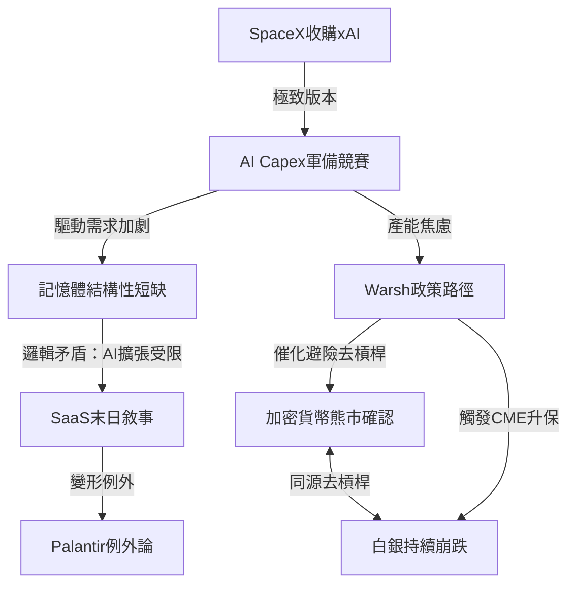
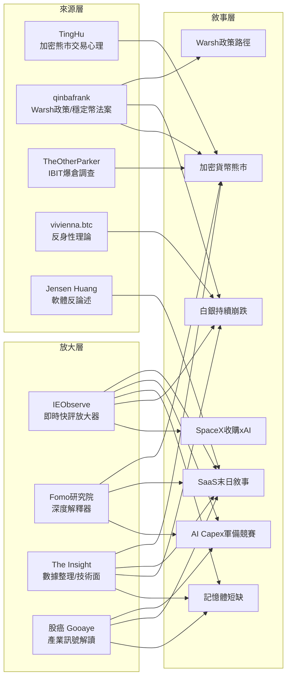

Weekly Narrative Brief（2026-02-01 ~ 2026-02-07）

## 1. 核心敘事（7 個）

### 敘事一：加密貨幣熊市確認——BTC跌破前週期高點，MSTR永動機瀕臨極限

- **敘事骨架：** 因為BTC從~80K一路崩跌至60K、跌破前週期高點（2025年11月低點與2025年4月低點皆失守），所以市場確認熊市已至，接下來MicroStrategy的mNAV跌破1倍將觸發「最後手段」出售比特幣，可能形成死亡螺旋。
- **主要佐證：**
  1. BTC一週內從~80K跌破70K，最低觸及60K，IBIT創史上最大單日成交量$10.7B（tw-0207 Post 10）
  2. MicroStrategy平均持倉成本$76,037，BTC跌破此價意味著帳面虧損，540億美元投資5年僅1.3%年化收益（fb-0202 Post 15, Post 52）
  3. MSTR CEO表示「除非BTC跌至$8,000且維持數年」才會被迫拋售，但市場不信任此說法（fb-0207 Post 12）
  4. 穩定幣發行量一個月淨減少80億美金，USDC減少近60億，CLARITY法案立法受阻（tw-0204 Post 6）
- **典型放大語句：**
  「由於沒有穩在76000附近，我覺得有大資金怕微策略在後續繼續跌的時候動用最後手段出售比特幣」——TingHu（tw-0205 Post 4）
  「目前已經沒有情境是MSTR掛掉但是比特幣活得好好的，兩者的命運是綁在一起」——IEObserve（fb-0207 Post 12）
- **感染力來源：** 情緒（恐慌與囚徒困境）＋英雄反派（Saylor「瞌了藥的殭屍」vs空頭獵殺）＋簡單口號（「熊市確認」）
- **代表貼文：** fb-0202 Post 1, Post 15, Post 50-55, fb-0204 Post 35, fb-0205 Post 31, fb-0207 Post 12, tw-0202 Post 3-12, tw-0204 Post 5-6, tw-0205 Post 4-6, tw-0207 Post 10, Post 29-30

---

### 敘事二：SaaS末日審判——「AI吞噬軟體」從恐慌到反論述

- **敘事骨架：** 因為Anthropic發布法律AI工具直接觸發標普全球-11%、湯森路透-16%等SaaS股崩跌，所以市場用「有罪推定」重新審判所有軟體公司，接下來Jensen Huang、Ben Thompson等人提出反論述「AI不會殺死軟體」，戰場從恐慌轉向辯論。
- **主要佐證：**
  1. Anthropic法律AI工具發布後，標普全球-11%、FactSet-10.5%、穆迪-8.9%、Equifax-12%、湯森路透-16%（fb-0204 Post 21）
  2. SAP財報後暴跌17%，市場「計分卡被換掉」：從Beat and Raise變成「證明你不會成為AI時代的輸家」（fb-0202 Post 44）
  3. Jensen Huang反駁「軟體被AI殺死是世界上最不合邏輯的事」（fb-0205 Post 29）
  4. GS Prime Book顯示資金大量從軟體股流向半導體設備（fb-0205 Post 29, fb-0205 Post 23）
- **典型放大語句：**
  「想想也蠻好笑，前一陣子說AI誇大了沒落地是泡沫，還沒2個月馬上變成AI太強了要摧毀SaaS行業」——IEObserve（fb-0204 Post 18）
  「這些股票現在的處境，就是『有罪推定』」——Fomo研究院（fb-0204 Post 29）
- **感染力來源：** 身份（軟體從業者的存在焦慮）＋道德化（AI進步vs就業威脅）＋反直覺（好財報也被暴殺）
- **代表貼文：** fb-0202 Post 44, fb-0204 Post 6, Post 12, Post 18, Post 21, Post 27-29, Post 33, fb-0205 Post 2, Post 23, Post 29, fb-0207 Post 4

---

### 敘事三：AI Capex軍備競賽——Google $1,800億與「產能就是霸權」

- **敘事骨架：** 因為Google宣布2026年資本支出$1,750-1,850億（前年三倍），四大科技巨頭合計突破$6,000億，所以AI基建進入「地緣政治級擴張」，接下來「誰先擁有基礎設施，誰就是AI時代的房東」，產能限制成為CEO夜不能寐的核心焦慮。
- **主要佐證：**
  1. Google 2025全年營收$4,000億、淨利成長30%，雲端營收年增48%，但2026 capex直接翻倍至$1,750-1,850億（fb-0205 Post 6, Post 24, Post 27）
  2. Pichai回答「最擔心什麼」：不是演算法而是「產能的限制」（fb-0205 Post 6）
  3. 四大科技巨頭2026年capex合計突破$6,000億（fb-0207 Post 8）
  4. Musk透露已預訂TSMC、三星所有產能：「他們全力衝刺，拼命在蓋，但還是不夠快」（fb-0207 Post 9）
- **典型放大語句：**
  「那些懷疑AI沒在賺錢的人，Google正在賺給你看」——IEObserve（fb-0205 Post 24）
  「Capex這個字，最近可以說是令不少投資人聽了就渾身發抖」——Fomo研究院（fb-0207 Post 8）
- **感染力來源：** 簡單口號（「$6,000億」）＋道德化（燒錢vs投資未來）＋英雄反派（CEO的信仰vs市場的恐懼）
- **代表貼文：** fb-0202 Post 32, fb-0205 Post 6, Post 19, Post 24, Post 27, fb-0207 Post 8-9, tw-0204 Post 16

---

### 敘事四：白銀持續崩跌——CME六度升保與中國交易員的50億美元獵殺

- **敘事骨架：** 因為CME在本週內第六次上調白銀保證金（從11%升至18%），加上中國交易員邊錫明大舉做空，所以白銀從上週的崩跌繼續加劇（再跌10-17%），接下來金銀比飆升暗示「避險資金集中湧向黃金而非白銀」。
- **主要佐證：**
  1. CME第六次上調白銀期貨保證金至18%，同時黃金保證金升至9%（tw-0207 Post 28）
  2. 白銀單日再暴跌17%，SLV交易量接近SPY（tw-0202 Post 24）
  3. 中國交易員邊錫明三年累計獲利近50億美元，其中白銀空頭單筆超5億美元——被外媒稱為「反亨特兄弟」（tw-0207 Post 16）
  4. 摩根大通在白銀$78時平倉空頭部位（fb-0203 Post 5）
- **典型放大語句：**
  「CME這是不把白銀掐死不罷休」——qinbafrank（tw-0207 Post 28）
  「這和加密貨幣領域的情況如出一轍。機構推高價格是為了獲得槓桿。然後他們將其拋售到市場上」——The Insight（fb-0203 Post 5）
- **感染力來源：** 英雄反派（邊錫明vs散戶多頭）＋情緒（恐懼CME連續升保）＋簡單口號（「反亨特兄弟」）
- **代表貼文：** fb-0202 Post 27, Post 35, Post 46, Post 56, fb-0203 Post 4-5, fb-0205 Post 1, tw-0205 Post 23, tw-0207 Post 16, Post 28

---

### 敘事五：Warsh政策路徑——「能做的比想做的重要」與漸進式改革

- **敘事骨架：** 因為Warsh被提名後市場從恐慌轉向深度解析其政策框架（降息＋縮表＋銀行去監管），所以各方開始描繪其「可能的政策節奏」而非單純標籤化為鷹派，接下來市場共識逐漸形成：以中期選舉為分水嶺，前期延續現有節奏，後期啟動漸進式體制改革。
- **主要佐證：**
  1. qinbafrank超長分析：「能做的比想做的重要得多；政策節奏比政策主張對市場影響更大」（tw-0202 Post 19-20）
  2. 財經M平方獨家報告：Warsh核心是「重建財政紀律與聯準會信譽」而非單純緊縮（fb-0204 Post 32）
  3. Joseph Wang：「More QT implies higher risk premiums...but can be offset with more rate cuts and bank deregulation」（tw-0203 Post 17）
  4. Nullable分析可能路徑：Warsh口頭恐嚇讓市場崩盤→避險資金流入10Y長債→壓低收益率→5月上任後意外大幅降息（tw-0202 Post 23）
- **典型放大語句：**
  「決定長期資產定價的是制度在未來幾年內緩慢移動的方向」——qinbafrank（tw-0202 Post 20）
  「未來美國新的經濟貨幣政策軸心：川普提供政治支持、貝森特掌財政、沃什錨定更專注市場導向的美聯儲」——qinbafrank（tw-0202 Post 20）
- **感染力來源：** 道德化（央行角色邊界）＋身份（華爾街vs主街）＋簡單口號（「縮表換降息」）
- **代表貼文：** fb-0202 Post 11, Post 13, Post 16, fb-0204 Post 5, Post 32, tw-0202 Post 19-20, Post 23, tw-0203 Post 17, tw-0204 Post 3, fb-0207 Post 6-7

---

### 敘事六：記憶體結構性短缺——從AI伺服器到手機的全面卡位

- **敘事骨架：** 因為HBM供不應求導致記憶體產能從消費電子轉向AI伺服器（結構性排擠），所以手機廠商「搶不到零件開始預防性減產」（高通明確警告），接下來記憶體短缺將定義整個2026年手機產業的規模。
- **主要佐證：**
  1. 高通CEO明確表示：「手機不是需求不足，而是手機廠商根本搶不到零件就開始預防性減產」（fb-0205 Post 18）
  2. Intel陳立武：至少會缺到2028年（fb-0205 Post 15）
  3. BoA預估記憶體漲價導致低階手機出貨量大幅衰退、筆電雙位數衰退（fb-0202 Post 4）
  4. Google TPU v8可能用CXL DRAM Pool取代部分HBM，但Richard基本面指出兩者是互補而非替代（fb-0207 Post 1, fb-0204 Post 8）
  5. 三星單日噴11%，台韓記憶體股暴力反彈（fb-0203 Post 10-12）
- **典型放大語句：**
  「記憶體嚴重不足已經開始傷害他們的手機生意，手機不是需求不足，而是手機廠商根本搶不到零件」——IEObserve轉述高通（fb-0205 Post 18）
  「AI的擴張，已經被記憶體卡住了。這會是接下來整輪AI投資最重要的概念」——萬鈞法人視野（fb-0202 Post 23）
- **感染力來源：** 反直覺（手機衰退不是因為沒人買而是沒零件組裝）＋簡單口號（「記憶體卡住AI」）＋身份（供應鏈內部人視角）
- **代表貼文：** fb-0202 Post 4, Post 23, Post 25, Post 37, fb-0203 Post 10-12, fb-0204 Post 8, fb-0205 Post 15, Post 18, Post 30, fb-0207 Post 1

---

### 敘事七：SpaceX收購xAI——太空AI帝國與史詩級IPO敘事

- **敘事骨架：** 因為xAI每月燒10億美元且一級市場融資到極限，所以SpaceX以估值$1.25萬億正式收購xAI，接下來合併後將打造「太空+AI+全球通信+宇宙理解」的超級敘事，為史上最大IPO鋪路。
- **主要佐證：**
  1. SpaceX正式併購xAI，合併估值$1.25萬億（fb-0203 Post 20, Post 24）
  2. xAI每月現金消耗約10億美元，SpaceX（Starlink已盈利）成為天然「輸血平台」（tw-0203 Post 13）
  3. SpaceX申請部署100萬顆衛星供AI/ML與邊緣運算使用（fb-0202 Post 39）
  4. Musk表示已預訂TSMC和三星所有產能，晶片是關鍵瓶頸，「進入太空之後，瓶頸會變成晶片」（fb-0207 Post 9）
- **典型放大語句：**
  「某種意義上，老馬成功將Twitter要重新打包上市了」——IEObserve（fb-0203 Post 20）
  「SpaceX收購xAI本質上是用最強的現金牛+發射能力，去保最燒錢但最有未來想象力的AI大腦」——qinbafrank（tw-0203 Post 13）
- **感染力來源：** 英雄（Musk的宏大願景）＋簡單口號（「太空AI資料中心」）＋道德化（地球能源極限vs太空無限）
- **代表貼文：** fb-0202 Post 39, fb-0203 Post 20, Post 24, fb-0207 Post 9, tw-0203 Post 13

---

## 2. 敘事星座（互相支撐/衝突/變體）

1. **「AI Capex軍備競賽」支撐「記憶體結構性短缺」：** Google $1,800億capex→需要更多AI伺服器→更多HBM/DRAM→記憶體產能全面被AI吸走→手機等消費電子被結構性排擠。Google財報中Pichai的「產能限制」焦慮，正是記憶體短缺敘事的最強佐證。（fb-0205 Post 6 → fb-0205 Post 18）

2. **「記憶體短缺」衝突「SaaS末日敘事」：** 記憶體短缺意味著AI基建擴張受限→AI Agent的大規模部署會被延遲→SaaS公司獲得更多轉型時間。但市場同時在殺SaaS（AI太強）和擔心AI基建不夠（記憶體不夠），這兩個恐懼在邏輯上互相矛盾。Jensen Huang指出這個矛盾：「軟體被AI殺死是世界上最不合邏輯的事」。（fb-0205 Post 29 vs fb-0205 Post 18）

3. **「加密貨幣熊市」與「白銀崩跌」互相支撐：** 兩者都是高槓桿擁擠交易在Warsh提名後的系統性去槓桿。The Insight直接指出「這和加密貨幣領域的情況如出一轍」。tw-0207 Post 10分析IBIT創紀錄成交量可能源自香港對沖基金的多資產爆倉——同一批資金同時涉及白銀和BTC。（fb-0203 Post 5, tw-0207 Post 10）

4. **「Warsh政策路徑」變形為「加密貨幣熊市」的催化劑：** 上週Warsh提名觸發貴金屬崩跌，本週延伸至加密貨幣。Nullable分析的「detox路徑」——Warsh口頭恐嚇→市場崩盤→避險資金流入長債→壓低10Y收益率——正在加密市場上演。穩定幣立法受阻（CLARITY法案）進一步加劇了去槓桿。（tw-0202 Post 23, tw-0204 Post 6）

5. **「SpaceX收購xAI」支撐「AI Capex軍備競賽」：** Musk的太空AI資料中心願景本質上是capex軍備競賽的「終極版本」——當地球的電力和冷卻達到極限，將運算移到太空。「太陽能量的百萬分之一就是人類文明總能耗的一百萬倍以上」，這為capex無上限提供了敘事正當性。（fb-0203 Post 20 → fb-0207 Post 8）

6. **「SaaS末日敘事」變形為「Palantir例外論」：** 在所有SaaS股被「有罪推定」殺估值的同時，Palantir營收年增70%、RPO年增143%，成為唯一「在吃別人飯碗」的軟體公司。SaaS末日敘事並非否定所有軟體，而是在區分「被AI吃」和「用AI吃人」的公司。（fb-0203 Post 13-14 vs fb-0204 Post 29）

---

## 3. 傳播與擴散（Who amplified what）

**傳播形狀：** 本週呈現「雙軌分化」結構——Facebook端以AI/半導體/軟體的產業分析為主軸，Twitter端以加密貨幣熊市的即時交易心理為主軸，兩條軌道在「記憶體」和「Warsh」兩個節點上交會。

**最早出現的來源：**
- 加密貨幣熊市的最早系統性看空分析來自 **TingHu（@TingHu888）**，他在本週初（tw-0202）就以「易老板獵殺」事件為切入點，連續發出超過40條推文，從交易心理、槓桿結構、清算機制等角度構建了完整的熊市論述框架。

**主要放大來源：**
1. **Fomo研究院**：本週最重要的「深度解釋器」，承擔了三個核心敘事的系統性分析：MSTR mNAV機制解構（fb-0202 Post 15）、SaaS「有罪推定」框架（fb-0202 Post 44, fb-0204 Post 29）、Google capex的財務衝擊分析（fb-0205 Post 6）、tech capex $6,000億的商業博弈（fb-0207 Post 8）。其風格為「長文＋結構化小標題」，適合Facebook深度閱讀。
2. **IEObserve 國際經濟觀察**：持續擔任「即時快評放大器」，幾乎每個核心敘事都有其一句話定性評論：SaaS末日的「前後矛盾」（fb-0204 Post 18）、Google財報的「AI正在賺給你看」（fb-0205 Post 24）、記憶體反彈的「大奇蹟日」（fb-0203 Post 10）、白銀的「雲霄飛車」（fb-0202 Post 27）。高頻發文使其成為跨敘事的連結者。
3. **qinbafrank**：Twitter端最核心的宏觀分析者，本週貢獻了兩個最深度的原創分析：Warsh政策路徑的超長分析（tw-0202 Post 19-20，涵蓋政策節奏、法律約束、中期選舉等維度）、穩定幣CLARITY法案的完整解構（tw-0204 Post 6）。其分析深度在Twitter端無人可比。

**跨平台擴散：**
- Jensen Huang的「軟體不會被AI殺死」言論從NVIDIA官方→IEObserve在Facebook快評放大（fb-0204 Post 12）→股癌轉述（fb-0205 Post 29）→形成反論述浪潮
- TheOtherParker的IBIT爆倉分析（tw-0207 Post 10）從Twitter交易圈→TingHu轉發放大→與Facebook端的MSTR分析（fb-0207 Post 12）形成跨平台交叉驗證
- vivienna.btc的反身性理論長文（tw-0205 Post 12）提供了「金銀崩跌」的理論框架，與Facebook端The Insight的技術面分析（fb-0203 Post 5）互補

---

## 4. 漂移與週對週變化

| 敘事骨架 | 上週（1/24-1/31） | 本週（2/1-2/7） | 漂移方向 | 代表貼文 |
|---|---|---|---|---|
| **貴金屬崩跌** | 白銀單日崩跌34%，「史上最大日內反轉」，焦點在Warsh提名的觸發效應 | 白銀持續崩跌10-17%，CME六度升保，焦點轉向**中國交易員邊錫明的50億美元獵殺**與CME的制度性壓制 | 從「意外崩盤」→「結構性獵殺」；英雄/反派從「多頭vs斷頭賣壓」→「邊錫明vs散戶」 | tw-0207 Post 16, Post 28 |
| **AI Agent吞噬軟體** | Claude Code安裝量飆升與SaaS股崩跌重合，「Software is being eaten by AI」 | Anthropic法律AI直接觸發金融數據股崩跌，但**反論述出現**：Jensen Huang「最不合邏輯」、Ben Thompson「AI只是把開發變成巷戰」、M觀點「軟體退居基礎層但更關鍵」 | 從「一面倒恐慌」→「攻防辯論」；情緒從純恐懼轉為分歧 | fb-0204 Post 6, Post 12, Post 18, fb-0205 Post 2 |
| **記憶體超級循環** | 「CSP大廠餓到跑去中國要記憶體產能」，焦點在AI伺服器的HBM短缺 | 高通明確警告**手機端也被記憶體短缺傷害**，從AI伺服器擴散到消費電子全面受影響；Google TPU v8的CXL DRAM Pool方案引發「HBM是否被取代」辯論 | 從「AI單點短缺」→「全產業鏈短缺」；新增「HBM vs CXL」技術路線辯論 | fb-0205 Post 18, fb-0207 Post 1, fb-0204 Post 8 |
| **Warsh化債** | 焦點在提名本身的市場衝擊，「CPI > 10Y」不等式，偏向「政策主張是什麼」 | 焦點深入到**政策落地的節奏與約束**：qinbafrank分析中期選舉分水嶺、流動性現實壓力、Basel III法律約束，偏向「能做什麼、怎麼做」 | 從「他想幹什麼」→「他能幹什麼」；時間尺度從短期衝擊拉長到4年任期 | tw-0202 Post 19-20 |
| **台積電煞車** | 上週的核心敘事，Ben Thompson長文分析TSMC保守投資 | 本週被**Musk的「我已訂光所有產能」**與Google的$1,800億capex所延伸，但焦點從批評TSMC轉向「需求端的瘋狂」 | 從「供給端的保守」→「需求端的瘋狂」 | fb-0207 Post 9 |

---

## 5. 非敘事性思考、知識與Insight

- **萬鈞法人視野的「基金經理人會不會恐慌」坦白書：** 「不是抽象的心理壓力，是我親眼看過坐在我對面的經理人落淚。」這段自白揭示了專業投資者面對不確定性時的真實心理——最折磨人的不是虧損本身，而是「不知道這是正常波動還是策略失效」。（fb-0203 Post 22-23）

- **余哲安的「金錢是記憶」貨幣哲學：** 引用Kocherlakota的論文「Money is Memory」，將比特幣定位為「記憶工程」的具體實作。「每個國家的政治制度透過條文攤開，而比特幣的政治制度透過代碼設計來實現。」這提供了超越「比特幣是軟體」辯論的分析框架。（fb-0204 Post 19）

- **Freddy的「槓鈴策略拆解」：** 標準版槓鈴策略本質上是「富人的特權遊戲」——需要能夠長期支付保費。與余哲安的「保費支出要被利息收入覆蓋」互相呼應，兩人從不同角度揭示了Taleb哲學的「執行摩擦」問題。提出「人生槓鈴」的概念——右端保費趨近於零（寫作、跨界連結），左端是「反AI護城河」。（fb-0204 Post 22, Post 24-25）

- **HYPE/Hyperliquid的估值大辯論：** Huma Capital引用的超長分析（tw-0204 Post 7）是本週最深度的基本面分析之一——用DCF框架拆解$200億估值需要的假設：$60億營收、50%淨利率、25x本益比，在所有歷史交易所都面臨競爭壓縮的前提下，「高毛利不是護城河，是邀請競爭的霓虹燈」。

- **vivienna.btc的反身性分析框架：** 將金融市場的「屬性」（如黃金抗通膨、美林周期）定義為「暫時的、由參與者互動鑄就的幻象」。庄家通過製造敘事引導散戶→資金流入驗證敘事→反身性循環。「散戶若想生存，必須覺察並利用這些反饋循環，順勢參與，但在真相被拆穿之前逆勢離場。」（tw-0205 Post 12）

- **蕭上農的「常識」歷史類比：** 用1776年潘恩《常識》的出版歷史，類比當代台灣的政治認同問題。「把大家心裡知道、但不敢說的事情說出來了」——這是一個關於「how to frame a narrative」的元分析。（fb-0204 Post 7）
