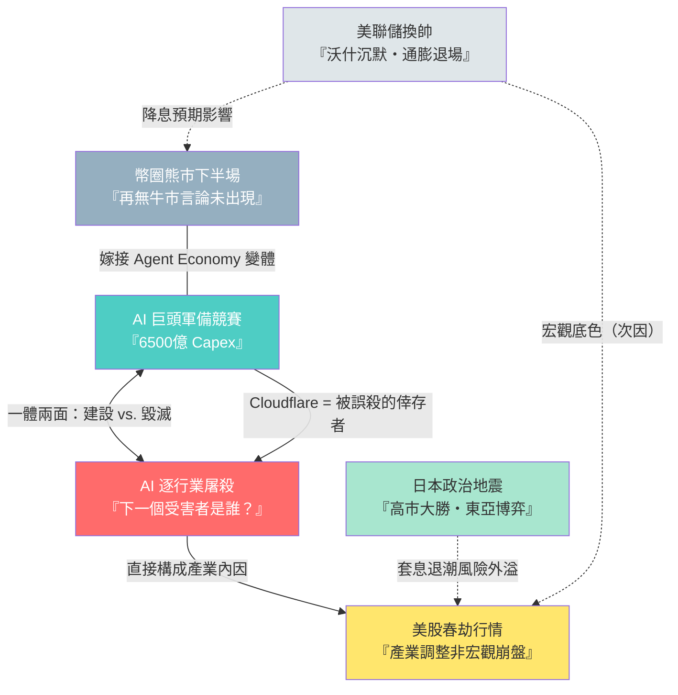
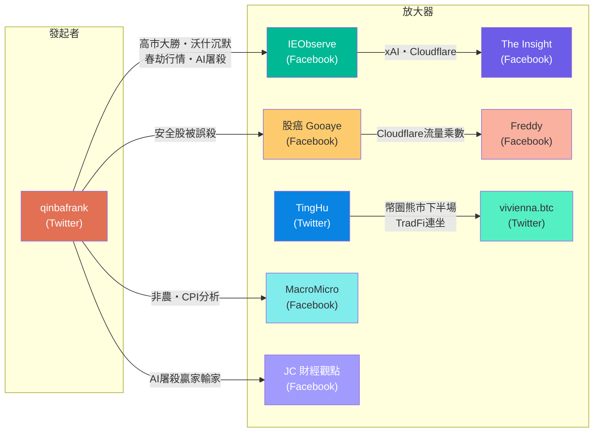

# Weekly Narrative Brief（2026-02-08 ~ 2026-02-15）

## 1. 核心敘事（6 個）

### 敘事一：AI 逐行業屠殺——「下一個受害者是誰？」

- **敘事骨架**：因為 AI Agent 工具（Claude Cowork、Insurify、Altruist、Algorhythm）在一週內接連上線展示能力，所以市場對軟體、保險經紀、財富管理、物流行業進行恐慌性拋售，接下來投資者在「先撤退再想」與「找被誤殺標的」之間擺盪。
- **主要佐證**：
  1. Anthropic 2/3 發布 Claude Cowork 11 款智能體插件覆蓋銷售/財務/法律，軟體股 IGV ETF RSI 跌至 18（史上最超賣）
  2. Insurify 推出新工具，標普 500 保險指數當日跌近 4%
  3. Altruist 推出 AI 稅務策略工具，嘉信理財、Raymond James、LPL Financial 跌幅超 7%
  4. Algorhythm 白皮書稱可將卡車空駛里程降低 70%，物流股大跌
- **典型放大語句**：「上週殺軟體股、週一殺保險經紀、週二殺財富管理…下一個 AI 受害者是誰？市場往往都是這樣，新的趨勢一出來就會對老一代產品有極其悲觀的預期、先撤退然後再停下來想。」（qinbafrank, tweet-2026-02-11）
- **感染力來源**：恐懼情緒 + 連續事件形成「誰都可能是下一個」的末日感 + 簡單口號化（「AI 受害者」）
- **代表貼文**：qinbafrank tweet-2026-02-11（AI受害者連環）、qinbafrank tweet-2026-02-13（物流受害者）、qinbafrank tweet-2026-02-15（高盛贏家輸家）、qinbafrank tweet-2026-02-12（軟體外包最先被消滅）、JC 財經觀點 fb-2026-02-12（摩根大通 AI 彈性軟體股）、股癌 fb-2026-02-12（Cloudflare 被誤殺）、IEObserve fb-2026-02-12（Cloudflare 財報）、Freddy fb-2026-02-12（Cloudflare 驗證）

---

### 敘事二：AI 巨頭軍備競賽——6500 億美元 Capex 是信仰還是豪賭？

- **敘事骨架**：因為 Alphabet/Amazon/Meta/Microsoft 2026 年合計預告約 6500 億美元 AI 資本支出，所以市場一邊敬畏需求的真實性（客戶訂單積壓），一邊擔心回報能否到位，接下來「負責任的激進」vs.「不惜一切」成為分歧焦點。
- **主要佐證**：
  1. Alphabet 預估 2026 年 capex 約 1850 億美元，Amazon 約 2000 億美元，Meta 1150-1350 億美元，Microsoft 約 1050 億美元
  2. 微軟 Azure 超過 6000 億 RPO 訂單近半來自 OpenAI
  3. Anthropic CEO Dario Amodei 訪談：年營收以 10 倍速狂飆，但警告「如果需求晚到一年或增長率從 10 倍降至 5 倍，沒有對沖能阻止公司破產」
  4. xAI 全員大會：兩年半打造全球最快 AI 公司，語音技術 6 個月超越 OpenAI
- **典型放大語句**：「AI 已將這些公司從『主要以軟體為主』轉變為『大規模基礎設施建設者』，而投資人則不確定回報是否能及時到位。」（The Insight, fb-2026-02-09）；「如果我預測 2027 年會有萬億級需求從而提前購買價值一萬億美元的算力，但需求晚了一年……沒有任何對沖能阻止公司破產。」（Dario Amodei, qinbafrank tweet-2026-02-15）
- **感染力來源**：天文數字的震撼感 + 「信仰 vs. 理性」的身份對立 + 英雄敘事（Musk/Altman/Dario 各據山頭）
- **代表貼文**：The Insight fb-2026-02-09（6500 億 capex）、IEObserve fb-2026-02-09（Azure RPO）、IEObserve fb-2026-02-12（xAI 全員大會）、qinbafrank tweet-2026-02-15（Dario 訪談）、qinbafrank tweet-2026-02-13（xAI Jimmy 遞迴自我提升）、Freddy fb-2026-02-12（MSFT 長期思維）

---

### 敘事三：美股「春劫行情」——產業調整而非宏觀崩盤

- **敘事骨架**：因為 AI 產業內部出現多重微裂縫（MSFT 雲指引略低、Agent 殺軟體、NVDA-OpenAI 融資博弈、GOOGL capex 嚇人）疊加市場本身極端高槓桿（保證金債務 1.23 萬億歷史新高、基金經理現金倉位 2% 歷史低點），所以美股出現中小級別調整，接下來等待產業催化劑（OpenAI 千億融資敲定、Agent 趨勢更明朗、川普托底）才能轉折。
- **主要佐證**：
  1. 道瓊突破 50,000 點里程碑，川普喊出 2029 年 100,000 點目標
  2. 納指橫盤三個月，缺乏向上催化劑
  3. 基金經理現金倉位 2%（歷史最低）、FINRA 保證金債務 1.23 萬億（歷史新高）、空頭頭寸八年最低——多頭沒子彈、空頭沒燃料
  4. 非農就業 +13 萬大超預期（預期 7 萬），失業率降至 4.3%，FedWatch 定價 3 月維持利率不變機率超 90%
- **典型放大語句**：「美股大盤特別是納指橫盤了三個月，深層次還是缺乏足夠強向上催化劑……正常來說向上不能突破那就向下尋找支撐。」（qinbafrank, tweet-2026-02-15）；「The stock market is the opium of the elite.」（Joseph Wang, tweet-2026-02-11）
- **感染力來源**：「春劫」一詞的情緒化命名 + 數據密集的專業感 + 「不是末日但要小心」的中間立場降低防禦心
- **代表貼文**：qinbafrank tweet-2026-02-15（春劫行情完整分析）、The Insight fb-2026-02-12（道瓊 50,000）、IEObserve fb-2026-02-09（川普道瓊 10 萬點）、MacroMicro fb-2026-02-12（非農數據）、qinbafrank tweet-2026-02-11（非農分析）、Joseph Wang tweet-2026-02-11（Dow 100,000 = 赤字）、The Insight fb-2026-02-12（金融股 AI 焦慮）

---

### 敘事四：日本政治地震——高市大勝與東亞博弈升溫

- **敘事骨架**：因為高市早苗領導的自民黨在眾議院選舉中取得壓倒性勝利（單獨過半、與維新會合計達修憲 2/3 門檻），所以市場預期日本將加速右翼化（修憲、國防支出升至 GDP 5%、3000 億美元 AI 投資）與擴張性財政，接下來中日博弈升級但短期動武概率不高，需密切關注美日匯率與套息交易退潮風險。
- **主要佐證**：
  1. 自民黨單獨過 2/3 席位，日本戰後單一政黨最大勝
  2. 日經創歷史新高突破 57,000 點，日元一度貶至 159 日元/美元
  3. 高市宣示「日元疲軟有利有弊，將繼續奉行負責任積極財政政策」——市場解讀為不急於干預匯率
  4. 中國召見日本駐華大使抗議、軍方發言警告、旅行安全警告、航班縮減、東海演習
- **典型放大語句**：「整體她會越來越右翼，看起來高市正在成為日本的『女川普』，川普的急先鋒。東亞特別是中日之間博弈會越來越激烈。」（qinbafrank, tweet-2026-02-09）
- **感染力來源**：地緣政治的緊張感 + 「女川普」的標籤化 + 歷史類比（對比 2016 年薩德事件）提供認知錨點
- **代表貼文**：qinbafrank tweet-2026-02-09（高市大勝完整分析）、qinbafrank tweet-2026-02-09（中日會動武嗎）、IEObserve fb-2026-02-09（自民黨大勝）、qinbafrank tweet-2026-02-08（眾議院選舉預判）、qinbafrank tweet-2026-02-13（美日匯率走低分析）、TingHu tweet-2026-02-09（日經 AI 解讀）

---

### 敘事五：幣圈熊市下半場——「再無牛市」的群體言論尚未出現

- **敘事骨架**：因為比特幣跌破 74,508 關鍵支撐位且加密市場與傳統市場的關聯性因交易所上線 TradFi 永續合約而加深，所以熊市下半場正式開始，接下來等待 2026 年底部形成期間做震盪波段，並觀察「再無牛市」的群體性悲觀言論何時出現作為底部信號。
- **主要佐證**：
  1. BTC 跌破 74,508（一年來最關鍵支撐）
  2. 幣安上線 AMZN/MSTR/PLTR/CRCL/COIN 等 TradFi 永續合約，白銀暴跌首次同步拖累幣圈——「幣圈主動開門融合」
  3. ETH 對 BTC 的 alpha 消失：ETF 通過、Tom Lee 真金白銀購買均未帶動超額上漲
  4. Trend Research 清倉 ETH 最終虧損 8.69 億美元
  5. 目前尚未出現「再無牛市」的群體性言論（僅個體在 6 萬時發長文）
- **典型放大語句**：「拉升不帶你，因為資金不進來，下跌爆倉拉著你，因為連帶著止損賣出爆槓桿。」（TingHu, tweet-2026-02-09）；「目前還未出現再無牛市或長熊的群體言論。」（TingHu, tweet-2026-02-15）
- **感染力來源**：歷史周期類比的可信度（18 年礦機按斤賣、22 年礦場破產）+ 大戶爆倉的戲劇性 + 「等群體性悲觀」的反向指標提供行動指引
- **代表貼文**：TingHu tweet-2026-02-08（熊市下半場正式開始）、TingHu tweet-2026-02-09（TradFi 合約連坐）、TingHu tweet-2026-02-12（ETH alpha 消失）、TingHu tweet-2026-02-15（尚無群體性悲觀）、TingHu tweet-2026-02-11（Trend Research 虧 8.69 億）、vivienna.btc tweet-2026-02-08（IBIT ETF 套利傳導機制）

---

### 敘事六：美聯儲換帥——沃什的沉默與「通膨退場」

- **敘事骨架**：因為沃什被提名後異常沉默（踐行「Fed speaks too much」的改革理念，同時也因鮑威爾刑事調查導致聽證受阻），所以市場只能依據其過往發言推演「降息+縮表」政策方向而感到不安，接下來通膨正在退出市場主要風險源地位（CPI 拐頭向下），聯儲政策節奏的決定權轉向勞動力市場數據。
- **主要佐證**：
  1. 沃什 1/30 被提名以來零公開發言，與歷任提名人慣例形成鮮明對比
  2. 1 月 CPI 低於預期，克利夫蘭聯儲實時預測與 Truflation 均顯示通膨持續走低
  3. 貝森特表態：「美聯儲不會迅速縮減資產負債表，可能需長達一年時間做決定」
  4. 中國監管機構口頭指導銀行控制美債持有規模（彭博報導）
- **典型放大語句**：「22-24 年通膨決定市場，26 年通膨只是噪音。接下來市場波動的來源，將越來越少來自通膨。」（qinbafrank, tweet-2026-02-14）；「能做的比想做的重要得多，政策的節奏比政策主張對市場影響更大。」（qinbafrank, tweet-2026-02-09）
- **感染力來源**：「沉默」本身成為敘事素材（越沉默越被解讀）+ 專業術語密集營造權威感 + 框架轉換（從通膨到勞動力）提供新認知角度
- **代表貼文**：qinbafrank tweet-2026-02-08（沃什為何沉默）、qinbafrank tweet-2026-02-09（沃什政策路徑）、qinbafrank tweet-2026-02-14（CPI 退場）、qinbafrank tweet-2026-02-11（非農分析）、vivienna.btc tweet-2026-02-11（收益率曲線與國債拍賣）、qinbafrank tweet-2026-02-09（中國指導銀行減持美債）

---

## 2. 敘事星座（互相支撐/衝突/變體）

**關係一**：「AI 逐行業屠殺」支撐「美股春劫行情」。AI Agent 連環上線殺軟體/保險/財管/物流，直接構成春劫行情的產業內因。qinbafrank 在 tweet-2026-02-15 明確將 Agent 殺軟體列為春劫五大產業原因之首。春劫行情的「市場槓桿極端」論述則為 AI 屠殺的恐慌提供了放大器——多頭沒子彈、空頭沒燃料的脆弱結構讓任何產業衝擊都被放大。

**關係二**：「AI 巨頭軍備競賽」與「AI 逐行業屠殺」互為矛盾的一體兩面。6500 億 capex 是因為相信 AI 將顛覆一切（利多基礎設施/晶片），但 AI 顛覆一切的過程同時在殺死傳統軟體與服務業（利空舊經濟）。Cloudflare 成為連接兩者的關鍵案例——它既受益於 Agent 流量爆炸（軍備競賽面），又被歸類為「被誤殺的安全股」（屠殺面的倖存者）。見股癌 fb-2026-02-12、qinbafrank tweet-2026-02-11。

**關係三**：「日本政治地震」與「美股春劫行情」間接衝突。高市大勝推動日經創新高、日元貶值，但若美日匯率持續走低（2/12 後已出現資金回流日元日債的跡象），套息交易退潮風險可能外溢到全球風險資產，加劇春劫行情。qinbafrank tweet-2026-02-13 警告「密切關注美日匯率是否繼續大幅下跌」。

**關係四**：「幣圈熊市下半場」與「AI 巨頭軍備競賽」形成變體。幣圈的 Agent Economy（Coinbase Agentic Wallets）嘗試將自己嫁接到 AI 敘事上，但市場短期仍以幣圈本身的周期下行為主導。qinbafrank tweet-2026-02-12（Agentic Wallets）試圖構建正面敘事，但 Coinbase 當季虧損 6.67 億、COIN 股價從 400 跌至 140 的現實壓過了敘事。

**關係五**：「美聯儲換帥」為「春劫行情」和「幣圈熊市」提供宏觀背景但非主因。qinbafrank 反覆強調宏觀是「次因」，通膨正在退場，聯儲暫停降息是已知信息。但沃什的沉默本身製造了不確定性溢價，為其他敘事的恐慌情緒提供了底色。

---

## 3. 傳播與擴散（Who amplified what）

### 傳播形狀

本週敘事傳播呈現**「Twitter 深度分析引領，Facebook 跨平台放大」**的雙層結構。Twitter 端以長文分析為主（qinbafrank 單週發文超 15 篇深度分析），Facebook 端以 IEObserve、The Insight、MacroMicro 等財經帳號轉譯/簡化為中文投資社群可消費的格式。

### 關鍵角色

- **最早出現的來源/發起者**：**qinbafrank (@qinbafrank)**——本週最核心的敘事發起者。他最早完整分析了高市大勝的地緣意涵（tweet-2026-02-08，選舉投票日當天）、最早提出沃什沉默的五層原因（tweet-2026-02-08）、最早串聯「AI 逐行業屠殺」的連環殺邏輯（tweet-2026-02-11）、最早提出「春劫行情」一詞並給出完整的「產業主因+宏觀次因」框架（tweet-2026-02-15）。他的分析常被後續貼文引用或呼應。

- **主要放大器一**：**IEObserve 國際經濟觀察**（Facebook）——將 Twitter 端的深度分析轉譯為短句式的 Facebook 貼文，放大了「日本高市大勝」（fb-2026-02-09）、「xAI 全員大會/離職潮」（fb-2026-02-12）、「Cloudflare 強勢財報」（fb-2026-02-12）等敘事。其風格偏向一句話點評+原始事實，門檻低易傳播。

- **主要放大器二**：**TingHu (@TingHu888)**（Twitter）——幣圈敘事的核心放大器。他以高頻個人復盤+歷史周期類比的方式持續強化「熊市下半場」敘事，從 2/8 到 2/15 幾乎每天發文複述同一骨架（18 年/22 年類比→等底部信號），使其成為幣圈社群本週最具穿透力的敘事框架。同時他首先指出 TradFi 永續合約造成的「連坐效應」（tweet-2026-02-09），這一觀察被社群廣泛引用。

### 跨平台擴散

- **Cloudflare 財報**是本週最明顯的跨平台敘事：qinbafrank（Twitter）最早從「安全股被誤殺」角度分析→股癌（Facebook）從「流量乘數」角度放大→Freddy（Facebook）從財報數據驗證→IEObserve（Facebook）提煉 CEO 金句→The Insight（Facebook）做結構化財報摘要。五個帳號從不同角度形成共振。
- **日本高市大勝**的擴散路徑：qinbafrank tweet → IEObserve fb → TingHu tweet（AI 解讀日經走勢）。

### 事件觸發

本週敘事多由**具體產品發布/財報/選舉結果**觸發，而非由單一宏觀事件引爆：
- 2/3 Claude Cowork → 軟體股崩 → AI 屠殺敘事啟動
- 2/8 日本眾議院選舉 → 地緣敘事啟動
- 2/11 非農數據 → 春劫行情宏觀次因被校準
- 2/11 Cloudflare 財報 → 「被誤殺」反敘事形成
- 2/14 CPI 低於預期 → 「通膨退場」敘事確認

---

## 4. 漂移與週對週變化

| 敘事骨架 | 上週（2/1-2/7） | 本週（2/8-2/15） | 漂移方向 | 代表貼文 |
|---|---|---|---|---|
| **加密貨幣熊市** | BTC 跌破前週期高點至 60K，焦點在 MSTR 永動機瀕臨極限、「是否被迫拋售比特幣」的囚徒困境 | BTC 跌破 74,508 確認「熊市下半場正式開始」，焦點轉向**幣圈與傳統市場的結構性連坐**（幣安上線 TradFi 永續合約→白銀暴跌同步拖累幣圈）、**ETH alpha 消失**成為共識、以及**底部信號尚未出現**（群體性「再無牛市」言論未現） | 從「MSTR 會不會爆」→「整個幣圈正在被傳統市場吸血」；反派從 Saylor 轉向結構性問題（TradFi 合約連坐）；時間尺度從「這一波能否止跌」拉長到「等 2026 年底部」 | TingHu tweet-2026-02-09（TradFi 連坐）、TingHu tweet-2026-02-12（ETH alpha 消失）、TingHu tweet-2026-02-15（群體性悲觀未現） |
| **SaaS 末日 → AI 逐行業屠殺** | Anthropic 法律 AI 觸發金融數據股崩跌，但**反論述出現**（Jensen Huang「最不合邏輯」），戰場從恐慌轉向辯論 | AI 屠殺從軟體擴散到**保險經紀、財富管理、物流**三個非軟體行業，「下一個 AI 受害者是誰？」成為每日恐慌主題；同時**被誤殺反敘事**從辯論層升級為具體標的推薦（Cloudflare 財報驗證、高盛贏家輸家名單、摩根大通 19 檔 AI 彈性軟體） | 從「AI 殺軟體」→「AI 殺一切傳統服務業」；反論述從「軟體不會死」升級為「誰是贏家、誰是輸家」的精準分揀；情緒從「辯論」轉向「篩選」 | qinbafrank tweet-2026-02-11（連環殺）、qinbafrank tweet-2026-02-13（物流受害者）、qinbafrank tweet-2026-02-15（高盛贏輸家）、股癌 fb-2026-02-12（Cloudflare） |
| **AI Capex 軍備競賽** | Google $1,800 億 capex 震撼市場，四大合計突破 $6,000 億，焦點在「產能就是霸權」的信仰敘事 | 數字微調至合計 $6,500 億，但焦點從「燒多少」轉向**「燒的方式是否理性」**：Dario Amodei 提出「負責任的激進」——如果需求晚到一年就破產；同時 xAI 全員大會展示速度但伴隨大量離職，暴露軍備競賽的人才耗損面 | 從「capex 數字震撼」→「capex 可持續性質疑」；英雄形象從「不計代價的信仰者」分化為「理性的 Dario」vs.「瘋狂的 Musk」；新增人才耗損維度（xAI 離職潮） | qinbafrank tweet-2026-02-15（Dario 訪談）、IEObserve fb-2026-02-12（xAI 全員大會/離職）、The Insight fb-2026-02-09（6500 億 capex） |
| **Warsh 政策路徑 → 沃什沉默與通膨退場** | 焦點在政策落地的節奏與約束分析（中期選舉分水嶺、Basel III 法律約束），偏向「他能幹什麼」 | 沃什被提名後的**持續沉默**本身成為敘事焦點（五層原因分析）；同時**通膨正式退出市場主要風險源**（CPI 拐頭、克利夫蘭聯儲預測低於預期），敘事重心從「聯儲政策」轉向「通膨噪音化、勞動力市場接棒」 | 從「他能幹什麼」→「他為什麼不說話」；新增「通膨退場」子敘事；決策變量從「通膨 vs. 降息」轉為「勞動力市場 vs. 降息」 | qinbafrank tweet-2026-02-08（沃什沉默）、qinbafrank tweet-2026-02-14（CPI 退場）、vivienna.btc tweet-2026-02-11（國債拍賣遇冷） |
| **白銀崩跌 → 幣圈連坐效應** | CME 六度升保、邊錫明 50 億美元獵殺，焦點在白銀市場本身的結構性壓制 | 白銀敘事本身降溫（本週提及頻率大幅下降），但其**外溢效應**成為幣圈新敘事的關鍵素材：幣安上線白銀永續合約→白銀暴跌首次同步拖累幣圈爆倉→「幣圈主動開門融合」 | 從「白銀本身的故事」→「白銀作為幣圈連坐的觸發器」；焦點從白銀市場轉移到跨市場傳導機制 | TingHu tweet-2026-02-09（白銀拉幣圈一起死）、TingHu tweet-2026-02-09（幣安上線 TradFi 合約） |
| **記憶體結構性短缺**（上週核心敘事之一） | 高通警告手機端被排擠、Intel 說缺到 2028、HBM vs CXL 辯論 | 本週轉為**正面驗證**：美光財務長親口證實 HBM4 提前出貨、通過 NVIDIA 認證，「之前的小作文洗出一大堆沒信心的籌碼是無稽之談」；台股在創新高氛圍中封關 | 從「短缺焦慮」→「供給驗證」；情緒從擔憂轉向信心修復；敵人從「產能不足」變成「空頭小作文」 | 萬鈞法人視野 fb-2026-02-12（HBM4 提前出貨）、IEObserve fb-2026-02-12（94 一直噴） |
| **SpaceX 收購 xAI**（上週新敘事） | 聚焦合併估值 $1.25 萬億、「太空 AI 帝國」的宏大願景、史詩級 IPO 敘事 | xAI 全員大會公布路線圖同時伴隨**大量華人員工離職**，市場解讀為組織重整+可能的就業國籍限制；焦點從「合併願景」下沉到「執行層面的人才流失」 | 從「太空 AI 帝國的願景」→「帝國內部的人事地震」；Musk 形象從「遠見者」增添「管理混亂」面向 | IEObserve fb-2026-02-12（xAI 離職/全員大會）、qinbafrank tweet-2026-02-13（xAI Jimmy 離職） |
