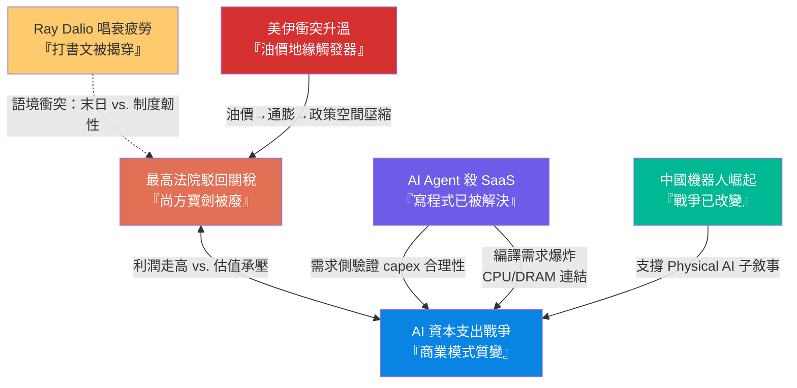
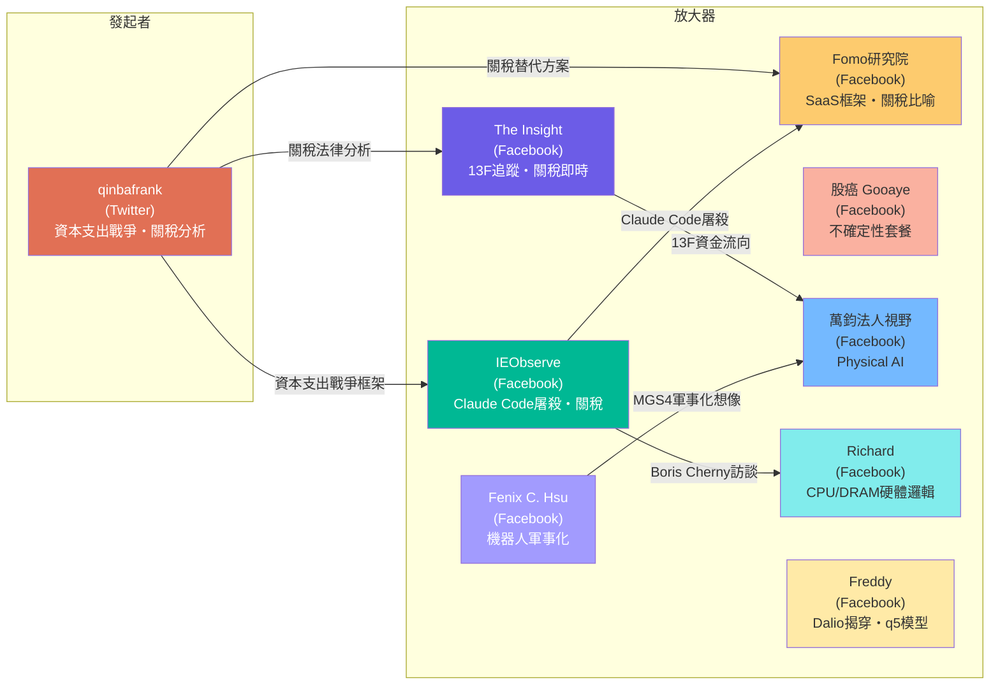

# Weekly Narrative Brief（2026-02-16 ~ 2026-02-22）

## 1. 核心敘事（6 個）

### 敘事一：最高法院駁回關稅——「尚方寶劍」被廢，替代方案混戰開始

- **敘事骨架**：因為美國最高法院以 6:3 裁定川普依據 IEEPA 徵收的對等關稅違憲（徵稅權屬國會），所以川普第二任期的核心經濟工具被折斷，接下來他立即動用 Section 122（10%→隔天加碼至 15%）、計畫啟動 Section 232 與 301 調查，關稅政策從「一刀切」進入「碎片化多法案」的新階段。
- **主要佐證**：
  1. 2/20 最高法院 6:3 裁定 IEEPA 關稅違憲，首席大法官 Roberts 明確指出「regulate」與「importation」兩個詞「無法承受如此沉重的意涵」
  2. 川普數小時內簽署 Section 122 條款對全球商品徵收 10% 關稅，隔日加碼至 15%
  3. Section 122 最長僅 150 天、稅率上限 15%，需國會批准延長——川普同步計畫啟動 Section 232（國安調查）與 Section 301（不公平貿易調查）
  4. 退稅問題懸而未決：法院未裁定退款機制，川普暗示不會主動退，進口商可能需逐一訴訟，耗時數年
- **典型放大語句**：「這應該是川普第二任期內最重大的政治挫折，因為其核心經濟議程都是圍繞著關稅展開的。」（qinbafrank, tweet-2026-02-20）；「川普的關稅政策，唯一不變的，就是一直在變。」（The Insight, fb-2026-02-22）
- **感染力來源**：法律戲劇性（6:3 憲政對決）+ 即時反擊的緊迫感 + 「退稅紅利 vs. 新關稅不確定性」的矛盾讓多空雙方都能找到支撐
- **代表貼文**：qinbafrank tweet-2026-02-20（完整裁定分析）、qinbafrank tweet-2026-02-21（122 條款後續節奏）、IEObserve fb-2026-02-21（IEEPA 違法裁定+台灣被提及）、The Insight fb-2026-02-21（最高法院駁回速報）、Fomo研究院 fb-2026-02-21（關稅大棒被折斷）、IEObserve fb-2026-02-22（122/301/232 法案比較）、The Insight fb-2026-02-22（15% 加碼聲明原文）、股癌 fb-2026-02-22（不確定性套餐）

---

### 敘事二：AI 資本支出戰爭——從「燒多少」到「商業模式質變」

- **敘事骨架**：因為四大科技巨頭 2026 年合計 capex 約 6500 億美元（接近阿根廷 GDP），且上游零組件漲價使同樣支出只能買到七成算力，所以大科技正從「高增長輕資產」轉向「高增長重資產」，接下來估值中枢將結構性下移，自由現金流被吞噬、股票回購可能被迫放緩。
- **主要佐證**：
  1. Alphabet 2026 年預期 capex 1800 億，可吃掉全年自由現金流+現金儲備；Amazon 2000 億，自由現金流不夠覆蓋
  2. 折舊壓力：Alphabet 伺服器 6 年攤銷，2026 年底折舊費可能翻倍，直接壓制毛利率
  3. 四家公司 2025 年新增債務與租賃近 1170 億美元，2026 年可能接近 2000 億
  4. 微軟與埃克森美孚 PE 已重合，沃爾瑪 PE 高於亞馬遜——估值扭曲加劇
- **典型放大語句**：「以前是高速增長、輕資產、低資本開支；未來是高速增長、重資產、高資本開支。商業模式的變化也意味著估值方式的變化。」（qinbafrank, tweet-2026-02-17）；「你要討論的不是『會不會太貴』，而是成長能走多久。」（萬鈞法人視野, fb-2026-02-17）
- **感染力來源**：天文數字震撼感（6500 億=阿根廷 GDP）+ 「公用事業化」的身份降級恐懼 + 具體財報數據的可驗證性
- **代表貼文**：qinbafrank tweet-2026-02-17（資本支出戰爭完整版）、qinbafrank tweet-2026-02-19（六大思考總結）、qinbafrank tweet-2026-02-22（MSFT vs 埃克森 PE 重合）、萬鈞法人視野 fb-2026-02-17（Physical AI 第二階段）、萬鈞法人視野 fb-2026-02-18（台積電法說意義）、Richard fb-2026-02-17（Gartner IT 支出 6.15 兆）、Freddy fb-2026-02-22（q5 模型看 AI capex 合理性）

---

### 敘事三：AI Agent 元年——「寫程式已被解決」與 SaaS 持續屠殺

- **敘事骨架**：因為 Claude Code 創造者 Boris Cherny 公開宣稱「寫程式已被解決」並預告 AI 將自主提案修復建議，所以市場將 AI Agent 視為 SaaS 的終極取代者而非工具，接下來「每推出一個新功能就屠殺一個行業板塊」的恐慌模式持續擴散到資安領域（Palo Alto Networks 盤後-6%）。
- **主要佐證**：
  1. Boris Cherny：Claude 已開始自己看回饋、bug 報告和 telemetry 主動提出修復建議與功能提案，預告一個月內 Claude Code 能自決何時進入 Plan Mode
  2. Claude Code 新安全功能上線後，資安板塊隨即被大規模拋售——IEObserve 評論「已經消滅數兆市值」
  3. Fomo研究院提出 SaaS 被取代的六維框架：定價權脫鉤（席位→產出計費）、資料護城河、轉換成本、工作流複雜度、監管要求、網路效應
  4. GitHub 專案上傳量、iOS 新 App 數、新網站註冊量在 2025 年底出現明顯上升拐點，與 Claude Code/Codex 發布時間吻合
- **典型放大語句**：「現在最幽默的就是 Anthropic Claude Code 發什麼新功能，那個行業板塊就開始大規模屠殺……目前已經消滅數兆市值了，Anthropic 的估值怎麼才幾千億。」（IEObserve, fb-2026-02-21）；「80% 的工作從 Plan Mode 開始。」（Boris Cherny, IEObserve fb-2026-02-21 轉述）
- **感染力來源**：創造者本人的權威背書 + 「每次新功能=新行業屠殺」的連環恐慌公式 + 具體生產力數據（GitHub/App Store）的不可否認性
- **代表貼文**：IEObserve fb-2026-02-21（Boris Cherny 訪談）、IEObserve fb-2026-02-21（Claude Code 消滅數兆市值）、Fomo研究院 fb-2026-02-18（SaaS 六維框架）、The Insight fb-2026-02-18（軟體生產力拐點數據）、IEObserve fb-2026-02-18（PANW 法說 AI 資安討論）、Richard fb-2026-02-21（編譯需求爆炸帶動 CPU/DRAM）、Richard fb-2026-02-22（AI Agent 中 CPU 是瓶頸）、Nullable tweet-2026-02-18（OpenClaw 源碼分析）

---

### 敘事四：中國機器人崛起——春晚舞台上的「戰爭已改變」

- **敘事骨架**：因為 2026 年中國春晚史上最大規模機器人表演陣容展示了飛躍性的運動控制提升（後空翻、武術、家務場景），所以市場與觀察者開始將中國機器人從「展示品」重新定位為「可量產的軍民兩用技術」，接下來中國無人機（飛龍-300D 年產 100 萬台、單價 $10K、600 公里射程）與人形機器人的軍事化想像成為焦點。
- **主要佐證**：
  1. 宇樹科技 H2/G1 表演武術（後空翻、馬步）、松延動力機器人在小品中展示情緒陪伴、銀河通用機器人展示家務場景
  2. 對比 2025 年表演，性能飛躍性提升——多位觀察者（Fenix、IEObserve、The Insight）分別獨立確認
  3. 中國無人機飛龍-300D 可能今年量產 100 萬台，約 $10K 造價、600 公里射程，可透過機器人運輸與發射
  4. 春晚金主從消費品/房地產/互聯網轉向人形機器人與 AI 巨頭——「春晚是中國經濟的心電圖」
- **典型放大語句**：「戰爭變了……掌控了戰場的人，就掌控了歷史。看起來 5-10 年內就會發生。」（Fenix C. Hsu, fb-2026-02-17，引用 Metal Gear Solid 4）；「換作是十幾二十年前，一定沒人想到人形機器人最先取代的職業，是中國春晚表演的舞群。」（IEObserve, fb-2026-02-17）
- **感染力來源**：視覺震撼（春晚直播畫面）+ 遊戲/動漫跨文化引用（MGS4「War has changed」）降低認知門檻 + 軍事化想像激發恐懼/興奮的強烈情緒
- **代表貼文**：Fenix C. Hsu fb-2026-02-17（MGS4 戰爭已變）、IEObserve fb-2026-02-17（人形機器人取代舞群）、The Insight fb-2026-02-17（中國機器人發展速度）、qinbafrank tweet-2026-02-17（春晚機器人陣容清單）、qinbafrank tweet-2026-02-16（春晚金主變遷=中國經濟心電圖）、萬鈞法人視野 fb-2026-02-17（Physical AI 第二階段論述）

---

### 敘事五：Ray Dalio「世界秩序崩壞」——唱衰大師的可信度危機

- **敘事骨架**：因為 Ray Dalio 發布「世界秩序壞掉了」文章在社群引發大量轉發（「2026 年必讀」），但被揭穿是其著作第六章的貼上版，所以社群轉而嘲諷其「打書文」策略與末日預測的歷史槓龜紀錄，接下來 Dalio 的敘事影響力進一步被折扣定價。
- **主要佐證**：
  1. Freddy 指出該文即其《How Countries Go Broke》第六章貼上版，「比較幽默的是很多轉貼的人會講：『我早就說了吧！』」
  2.「我是有生產力的人」用 Grok 整理 Dalio 歷史預言，列出 8-10 項明顯槓龜案例（1981 大蕭條、2015 年 1937 式衰退等）
  3. IEObserve 串聯 2020 年「現金是垃圾」、2021 年「中國將超越美國」、2025 年「美國債務危機」等歷次槓龜
  4. Freddy 補充：看完《暗黑原則》後，對 Dalio 寫東西的誘因機制保持「健康的懷疑態度」
- **典型放大語句**：「整個 X 上面都在洗 Ray Dalio 的新文章……每個轉貼的都說：『如果你 2026 年必須看一篇文章，那就是這篇！』但讀了以後卻發現……就是把書中的第六章給貼上來。」（Freddy, fb-2026-02-17）；「Ray Dalio 是少數比我有錢 10000 倍但是我卻不怎麼尊敬的人。」（我是有生產力的人, fb-2026-02-17）
- **感染力來源**：拆穿權威的「反英雄」快感 + 幽默/嘲諷的語調降低傳播阻力 + 歷史槓龜清單的可驗證性提供「證據感」
- **代表貼文**：Freddy fb-2026-02-17（打書文揭穿）、我是有生產力的人 fb-2026-02-17（Dalio 歷史槓龜清單）、IEObserve fb-2026-02-17（歷次預測串聯）、Freddy fb-2026-02-17（暗黑原則健康懷疑）、我是有生產力的人 fb-2026-02-17（Dalio 缺乏道德勇氣）

---

### 敘事六：美伊衝突升溫——油價是通膨的地緣觸發器

- **敘事骨架**：因為美伊第二輪談判分歧仍大（核問題+彈道飛彈雙卡關）且美軍部署規模超過去年「午夜之錘」行動，所以油價走強引發通膨預期上升疊加聯儲 1 月會議紀要提及加息可能性，接下來市場在「川普不想冒油價上漲風險」vs.「內塔尼亞胡可能獨自暴走」之間評估打擊概率。
- **主要佐證**：
  1. 美軍部署：48 架 F-16、12 架 F-22、18 架 F-35A、福特號航母戰鬥群接近地中海——規模超去年 6 月行動
  2. 伊朗最高領袖在 X 放話要擊沉美國航母；伊朗外長稱將在兩週內提交方案
  3. 聯儲 1 月會議紀要：「幾位官員」開始討論加息可能性
  4. 歐洲多國發出撤僑警告
- **典型放大語句**：「市場盤前走弱是『油價』上漲引發的……地緣風險上升、油價漲、通膨預期上升、美聯儲更難降息。」（qinbafrank, tweet-2026-02-19）；「很多歐洲國家在撤僑警告了，美軍現在大軍壓境要極限施壓伊朗。」（IEObserve, fb-2026-02-21）
- **感染力來源**：戰爭恐懼的本能觸發 + 具體軍事部署數字的權威感 + 油價→通膨→利率的清晰因果鏈
- **代表貼文**：qinbafrank tweet-2026-02-19（伊朗局勢完整分析）、qinbafrank tweet-2026-02-19（油價是通膨溫度計）、IEObserve fb-2026-02-21（撤僑警告）、Fomo研究院 fb-2026-02-21（軍工股不要碰——信息效率論）

---

## 2. 敘事星座（互相支撐/衝突/變體）

**關係一**：「最高法院駁回關稅」與「AI 資本支出戰爭」互為拉扯。關稅裁定短期利好企業利潤（退稅可能增加 1000 億美元），但川普的替代方案（15% 全球關稅）將推升上游零組件成本，直接壓縮已經緊繃的 AI capex 回報率。qinbafrank tweet-2026-02-20 指出市場將處於「利潤走高、但估值承壓」的矛盾狀態。

**關係二**：「AI Agent 殺 SaaS」是「AI 資本支出戰爭」的需求側驗證。AI Agent 逐行業屠殺的敘事為巨額 capex 提供了「需求是真的」的佐證——如果 Claude Code 真能消滅數兆市值的軟體公司，那算力就是新時代的電力，6500 億美元的投入就有合理性。同時，Richard（fb-2026-02-21/fb-2026-02-22）提出的「編譯需求爆炸帶動 CPU/DRAM」論述，將 Agent 的軟體層衝擊直接連結到硬體層的資本支出邏輯。

**關係三**：「中國機器人崛起」支撐「AI 資本支出戰爭」中的 Physical AI 子敘事。萬鈞法人視野（fb-2026-02-17/fb-2026-02-18）反覆強調「模型競賽只是第一階段，物理 AI 才是第二階段」，而春晚機器人表演正好提供了「物理 AI 正在發生」的視覺證據。這使得 AI capex 的合理性從「雲端訓練」擴展到「分散式全天候推理負載」。

**關係四**：「Ray Dalio 唱衰疲勞」與「最高法院駁回關稅」形成微妙的語境衝突。Dalio 的「世界秩序崩壞」文章與最高法院裁定在同一週出現——前者預告末日，後者展示制度韌性（司法制衡行政權）。社群對 Dalio 的嘲諷，某種程度上也是對「制度性末日論」的情緒性反駁。

**關係五**：「美伊衝突」為「最高法院駁回關稅」增添複雜度。川普在關稅工具被限縮的同時面對伊朗軍事壓力，若動武推升油價，將進一步壓縮其以替代法案維持關稅威脅的政策空間——因為 Section 122 的法律基礎正是「國際收支逆差」，油價上漲會惡化美國貿易赤字但也強化徵稅理由，形成政策上的自我矛盾。

---

## 3. 傳播與擴散（Who amplified what）

### 傳播形狀

本週傳播呈現**「事件驅動的多點爆發」**結構。關稅裁定（2/20）是最大的單一觸發事件，幾乎所有帳號在數小時內同步反應；而 AI Agent 與 Physical AI 敘事則是由不同平台的不同角度持續累積。

### 關鍵角色

- **最早出現的來源/發起者**：**qinbafrank (@qinbafrank)**——持續擔任核心敘事架構師。他最早發布「資本支出戰爭」完整分析框架（tweet-2026-02-17，含大科技現金流拆解、「算力=新時代電力」類比、六大投資思考），最早完整分析關稅裁定的法律細節與替代方案節奏（tweet-2026-02-20/21），並首先串聯「AI 滲透速度」的歷史類比（互聯網 20 年→移動互聯 10 年→AI 更短）。

- **主要放大器一**：**IEObserve 國際經濟觀察**（Facebook）——以簡短評論+事實摘要的形式放大了「Claude Code 消滅數兆市值」（fb-2026-02-21）、「Boris Cherny 寫程式已被解決」（fb-2026-02-21）、「最高法院駁回關稅+台灣被提及」（fb-2026-02-21）等敘事。他的「一句話+深度展開」格式使其成為 Facebook 端傳播效率最高的帳號。其放大的敘事主要為**AI Agent 殺 SaaS**和**關稅裁定**。

- **主要放大器二**：**The Insight**（Facebook）——以結構化財報摘要與大師持股追蹤（Buffett、Ackman、Chris Hohn、Dev Kantesaria、段永平 13F）放大了**AI capex 戰爭**中的資金流向面，同時以快速翻譯模式放大了**關稅裁定**的即時資訊流（fb-2026-02-21 連發多篇）。其放大的敘事主要為**資本支出戰爭的驗證面**與**關稅政策變動**。

### 跨平台擴散

- **關稅裁定**是本週最明顯的跨平台同步事件：qinbafrank（Twitter）提前分析可能情境→最高法院宣判→qinbafrank 即時分析法律細節→IEObserve（Facebook）翻譯為中文投資社群格式→The Insight（Facebook）做原文翻譯與即時更新→Fomo研究院（Facebook）用「大棒被折斷」的比喻放大情緒→股癌（Facebook）用「不確定性套餐」一詞總結。
- **AI Agent/SaaS 屠殺**的擴散：Boris Cherny 訪談→IEObserve fb 轉述→Fomo研究院 fb 延伸為六維框架→Richard fb 從硬體層（CPU/DRAM 需求爆炸）補充→Nullable tweet 從源碼角度分析 OpenClaw。

### 事件觸發

- 2/17 春晚機器人表演 → Physical AI 與中國機器人敘事同步爆發
- 2/17 Ray Dalio 文章被揭穿 → 唱衰疲勞敘事形成
- 2/19 伊朗核談判窗口關閉警告 → 油價/通膨敘事升溫
- 2/20 最高法院關稅裁定 → 本週最大敘事爆發
- 2/21 Boris Cherny 訪談流出 → AI Agent 殺 SaaS 敘事再強化

---

## 4. 漂移與週對週變化

| 敘事骨架 | 上週（2/8-2/15） | 本週（2/16-2/22） | 漂移方向 | 代表貼文 |
|---|---|---|---|---|
| **AI Capex 軍備競賽** | 焦點在「數字震撼」（6500 億）與「燒的方式是否理性」（Dario「負責任的激進」）；英雄分化為「理性 Dario」vs.「瘋狂 Musk」 | 焦點轉向**商業模式本身的質變**（輕→重資產）與**估值中枢結構性下移**；新增「上游漲價使同樣 capex 只能買七成算力」的成本放大器；MSFT PE=埃克森、WMT PE>AMZN 的扭曲被作為證據 | 從「能不能賺回來」→「整個估值方式要改」；時間尺度從「短期回報」拉長到「商業模式世代轉換」；新增成本通膨維度 | qinbafrank tweet-2026-02-17（商業模式質變）、qinbafrank tweet-2026-02-22（PE 扭曲） |
| **AI 逐行業屠殺 → Agent 殺 SaaS** | 從軟體擴散到保險/財管/物流，「下一個受害者是誰？」的連環恐慌；反敘事升級為「贏家/輸家」精準分揀 | Boris Cherny 公開宣稱**「寫程式已被解決」**，從「AI 能取代哪些工作」升級為「AI 開始自主提案功能」——Agent 從工具變成同事；資安板塊成為最新受害者；反敘事新增**硬體層受益**邏輯（編譯需求爆炸→CPU/DRAM） | 從「AI 殺哪個行業」→「AI 開始自己決定殺什麼」；Agent 角色從「工具」→「同事」→「自主提案者」；英雄從用戶轉移到 AI 本身 | IEObserve fb-2026-02-21（Boris Cherny）、Richard fb-2026-02-21/22（CPU 瓶頸） |
| **美股春劫行情** | 「產業調整非宏觀崩盤」，等待 OpenAI 千億融資、Agent 趨勢更明朗、川普托底 | 本週**宏觀因素升級**：最高法院關稅裁定+川普替代方案反擊+美伊衝突油價上升+聯儲會議紀要提及加息。從「產業為主因、宏觀為次因」的判斷面臨挑戰——宏觀不確定性顯著加大 | 從「宏觀只是噪音」→「宏觀突然變成主角」；「春劫」的情緒從「可控的調整」升級為「不確定性套餐」 | 股癌 fb-2026-02-22（不確定性套餐）、The Insight fb-2026-02-18（納指跌破季線） |
| **幣圈熊市下半場** | BTC 跌破 74,508 確認熊市下半場，等待「再無牛市」群體性悲觀出現作為底部信號 | 本週幣圈敘事**轉向制度建設面**：CLARITY 法案白宮草案取得進展（通過概率從 56%→85%）、CME 7×24 交易、CFTC 對州政府宣戰保護預測市場管轄權。焦點從「價格底部在哪裡」轉向「加密基礎設施的制度化」 | 從「等底部」→「等法案」；敵人從「市場週期」轉向「州政府監管越界」；情緒從絕望轉向制度博弈的耐心等待 | qinbafrank tweet-2026-02-20（CLARITY 法案 90%）、qinbafrank tweet-2026-02-18（CFTC 宣戰書） |
| **記憶體結構性短缺** | 從「短缺焦慮」轉向「供給驗證」（HBM4 提前出貨），情緒修復 | 萬鈞法人視野（fb-2026-02-22）進一步深化：SK 海力士庫存僅 4 週、潔淨室空間受限、Flash 廠去年六月還在討論崩盤——**「提前擴產」本質是從極低基期往上修正**而非泡沫。新增 DDR4→DDR5 轉換受阻的結構性問題（Richard fb-2026-02-17：LCD TV 主晶片只支援 DDR4） | 從「供給驗證」→「賣方議價權確認」；新增 DDR4/DDR5 轉換卡關的中長期觀察 | 萬鈞法人視野 fb-2026-02-22（SK 海力士庫存）、Richard fb-2026-02-17（DDR4 困局） |
