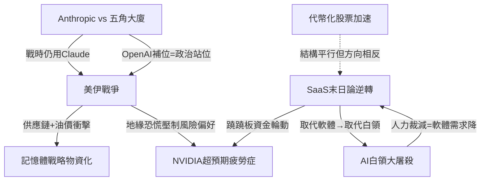
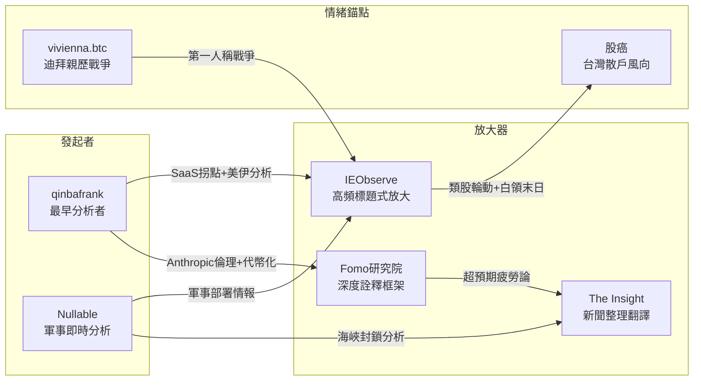

# Weekly Narrative Brief（2026-02-23 ~ 2026-03-01）

## 1. 核心敘事（7 個）

### 敘事一：SaaS 末日論逆轉——Anthropic 遞出橄欖枝，「被取代」變「被增強」

- **敘事骨架**：因為 Anthropic 發布會不再強調「取代」而是邀請 Intuit、DocuSign、Salesforce 等「受害者」同台展示合作整合，加上 Salesforce 財報 Agentforce ARR 年增 169% 且大單加速，所以市場情緒從「AI 殺死 SaaS」修復為「AI 讓 SaaS 更值錢」，接下來市場將重新定價「誰是合作夥伴、誰仍是受害者」。
- **主要佐證**：
  1. Anthropic 發布會定位 Claude 為「編排層」而非替代者，FactSet、S&P Global、LSEG 親自參與開發專屬插件
  2. Salesforce Q4 單季營收 112 億美元 YoY+12%，RPO 突破 720 億美元 YoY+14%，百萬美元以上大單 YoY+26%，千萬美元以上大單 YoY+33%
  3. Snowflake Q4 產品營收 YoY+30%，RPO 加速至 YoY+42%，簽下公司史上最大單筆合約（>4 億美元）
  4. HSBC 發布報告主張「軟體是 AI 擴散到企業的主要機制」——Freddy 評為「把已經 in the price 的東西寫出來」但時機聰明
- **典型放大語句**：「這場反彈本質上是情緒的修復，而非邏輯的重構。」（Fomo研究院, fb-2026-02-25）；「基本面根本沒有太大的變化，變的是敘事和情緒。」（IEObserve, fb-2026-02-27）
- **感染力來源**：「死貓反彈 vs. 真實轉折」的爭辯感 + 具體財報數據的可驗證性 + 類股輪動的直觀視覺衝擊（AI 族群殺、SaaS 彈）
- **代表貼文**：Fomo研究院 fb-2026-02-25（Anthropic 發布會分析+死貓反彈論）、IEObserve fb-2026-02-27（Salesforce 財報+SaaSpocalypse 壓力測試）、IEObserve fb-2026-02-27（Snowflake 財報+AI 地基論）、qinbafrank tweet-2026-02-25（軟體股抛售拐點分析）、IEObserve fb-2026-02-27（類股輪動觀察）、Freddy fb-2026-02-25（HSBC 報告時機評論）、IEObserve fb-2026-02-25（Stripe 年度信函）

---

### 敘事二：美以「咆哮的獅子」攻伊朗——哈梅內伊被擊斃，中東秩序重寫

- **敘事骨架**：因為美以聯合發動代號「史詩怒火」與「獅吼」的大規模軍事行動，精準斬首擊斃伊朗最高領袖哈梅內伊及多名高階軍政官員，所以 47 年的伊朗神權統治核心被瓦解，接下來伊朗報復性攻擊波及阿聯酋、巴林等中東國家，霍爾木茲海峽封鎖風險飆升至近七成，油價與全球市場面臨劇烈衝擊。
- **主要佐證**：
  1. 2/28 美以戰機在白晝發動突襲，以色列戰機向哈梅內伊官邸投下 30 枚炸彈；伊朗國家電視台確認哈梅內伊死亡
  2. 伊朗報復行動擴大至阿聯酋（137 枚火箭+209 架無人機）、巴林（美軍第五艦隊基地）、卡達等國——遠超去年「十二日戰爭」範圍
  3. Polymarket 荷爾木茲海峽關閉賭盤機率飆升至近七成；沙烏地阿拉伯發表聲明從中立轉向譴責伊朗
  4. 美軍史上首次在實戰使用低成本無人機 LUCAS（單價約 3.5 萬美元），逆向工程自伊朗 Shahed-136
- **典型放大語句**：「你們獲得自由的時刻即將到來。待在室內，不要離開家。等我們完事之後，你們就接管你們的政府。」（川普, The Insight fb-2026-02-28）；「我看帳戶就知道開戰了。」（Fenix C. Hsu, fb-2026-02-28）
- **感染力來源**：即時戰爭直播的臨場感（阿布達比爆炸、迪拜無人機碎片）+ 斬首成功的戲劇高潮 + 油價/海峽封鎖的切身經濟恐懼 + 川普直接對伊朗人民喊話的英雄敘事
- **代表貼文**：The Insight fb-2026-02-28/03-01（川普聲明+斬首確認+以色列情報能力）、IEObserve fb-2026-02-28/03-01（川普宣戰+荷爾木茲封鎖+哈梅內伊確認死亡）、qinbafrank tweet-2026-02-28（咆哮的獅子行動完整分析）、Nullable tweet-2026-02-28（軍事部署分析+以色列獨走論）、vivienna.btc tweet-2026-02-28（迪拜親歷無人機攻擊）、國際大事收藏版 fb-2026-03-01（中東權力重組完整整理）、蕭上農 fb-2026-03-01（LUCAS 無人機實戰分析）

---

### 敘事三：Anthropic vs 五角大廈——AI 軍用倫理之戰與 OpenAI 補位

- **敘事骨架**：因為 Anthropic 堅持兩條紅線（禁止大規模監控+禁止全自主武器）拒絕五角大廈要求的「所有合法用途」條款，所以川普震怒下令全面停用 Anthropic 技術並將其列為「國安供應鏈風險」，接下來 OpenAI 以更靈活姿態提出幾乎相同的安全條件但獲得國防部接受，凸顯政治捐獻與談判態度才是真正的分野。
- **主要佐證**：
  1. Anthropic 與五角大廈的 2 億美元合約破裂——Claude Gov 是唯一獲准在 Secret 級機密網路運行的前沿模型
  2. 川普在 Truth Social 痛罵 Anthropic 為「左翼瘋子」，下令六個月過渡期逐步淘汰
  3. OpenAI 提出幾乎相同的安全紅線但國防部欣然接受——差異在於 Anthropic 要求寫入合同為法律強制性條款，OpenAI 則保持「合作前提下保留底線」的靈活姿態
  4. 華爾街日報報導美軍在攻擊伊朗行動中仍在使用 Anthropic 技術——「真實又恨又離不開」
- **典型放大語句**：「Anthropic 那些左派瘋子，試圖對戰爭部施壓，逼迫他們遵守該公司的服務條款，而不是我們的憲法。」（川普, IEObserve fb-2026-02-28）；「五角大楼把 Anthropic 列為國家安全供應鏈風險。但換成 OpenAI 提同樣的條件，國防部就欣然接受了。為何？」（qinbafrank, tweet-2026-03-01）
- **感染力來源**：道德 vs. 國家權力的終極對立 + 政治獻金陰謀論的陰暗吸引力 + 「同樣紅線不同待遇」的不公義感 + 核模擬研究（Claude 86% 使用戰術核武）的恐怖數據
- **代表貼文**：Fomo研究院 fb-2026-02-23（Anthropic vs 國防部衝突起源）、IEObserve fb-2026-02-28（川普禁令全文+左翼瘋子罵文）、qinbafrank tweet-2026-02-28/03-01（深層邏輯分析+OpenAI 補位+政治捐獻因素）、The Insight fb-2026-02-28/03-01（五角大廈黑名單+核模擬研究）、Fomo研究院 fb-2026-03-01（Dario Amodei 回應分析）、IEObserve fb-2026-02-28（OpenAI 與戰爭部協議）

---

### 敘事四：NVIDIA「超預期疲勞症」——好到爆的財報為何漲不動

- **敘事骨架**：因為 NVIDIA Q4 營收 681 億美元 YoY+73%、EPS 1.62 美元大幅超越預期、下季指引 780 億更遠超共識 720 億，但市場已連續 14 季「超越預期」成為基本預期，所以好數字無法帶來驚喜，股價財報後反跌 5.5%，接下來市場焦點全數轉向 3/16 GTC 大會的 Groq LPU 機櫃與 CPO 解決方案。
- **主要佐證**：
  1. Q4 資料中心營收 623 億 YoY+75%，其中 Networking 爆發 YoY+263% 至 110 億，代表 hyperscaler 正建構整體 AI 叢集架構
  2. 黃仁勳首次強調 CPU only 的重要性——AI Agent 後訓練任務中 CPU 角色提升，Grace/Vera CPU 從配角升為主角之一
  3. 美股韭菜王渠道檢查：2026 全年 GB+VR 機櫃出貨量可望 70,000-75,000 櫃；VR 7-8 月開始早期交貨
  4. Fomo研究院分析：Groq 收購後 SRAM+VLIW 架構可能成為 GTC 的「祕密武器」
- **典型放大語句**：「過去 14 個季度，Nvidia 一直在超越預期。如今，『超越預期』本身，已經成為了市場的『基本預期』。」（Fomo研究院, fb-2026-02-28）；「美林調查 fcst guide 73.5，樂觀市場仔喊得高一點 75-77，開 78。反應看起來...一般。」（股癌, fb-2026-02-27）
- **感染力來源**：「最好的成績單卻下跌」的悖論感 + GTC「祕密武器」的懸念吊胃口 + 供應鏈渠道數據的稀缺信號價值
- **代表貼文**：Fomo研究院 fb-2026-02-27/28（財報分析+Groq LPU 猜想+超預期疲勞論）、美股韭菜王 fb-2026-02-25/27（財報預覽+GTC 催化劑）、萬鈞法人視野 fb-2026-02-27（推論接棒訓練+Networking 爆發意義）、IEObserve fb-2026-02-27（營收數據速報）、股癌 fb-2026-02-27（fcst guide 評論）、Richard fb-2026-02-28/03-01（CPU only 轉變+Groq VLIW 分析）、MacroMicro fb-2026-02-27（輝達電話會議重點整理）

---

### 敘事五：AI 白領大屠殺——Block 砍半、人均毛利 200 萬成新基準

- **敘事骨架**：因為 Block（前 Square）CEO Jack Dorsey 在財報亮眼（毛利+24%）的情況下主動裁撤近半數員工（從 10,000+ 砍至不到 6,000），明確宣示目標人均毛利 200 萬美元（原本的 4 倍），所以市場將此解讀為「AI 取代白領」的里程碑事件而非經營困難，接下來 Fintech 同業面臨股東質疑「為什麼我們還需要那麼多人」的壓力。
- **主要佐證**：
  1. Block 裁員 4,000+ 人，重災區在軟體工程師（砍 70%），股價盤後暴漲 25%+
  2. Dorsey：「不是因為遇到麻煩才做這個決定」——目標人均毛利 200 萬美元成為全行業 benchmark
  3. Amazon SCOT 團隊將 AI 自動化能力列為晉升評估核心標準，要求主管證明如何「以少辦多」而非擴大團隊
  4. 過去數月 Amazon 已裁撤 3 萬名員工；CEO Andy Jassy 雖否認與 AI 有關，但晉升標準說了實話
- **典型放大語句**：「白領末日徵兆，Jack Dorsey 直接要砍掉一半的 Block 員工……不是因為業務出問題，是有 AI 的時代真的不需要那麼多人。」（IEObserve, fb-2026-02-27）；「AI 不是用來輔助員工的，AI 是用來置換官僚體系的。」（Fomo研究院, fb-2026-02-23）
- **感染力來源**：「不是裁員，是進化」的反直覺敘事 + 人均毛利 200 萬的簡單口號 + 股價暴漲=市場投票的鐵證 + 「下一個被問的就是你老闆」的恐懼擴散
- **代表貼文**：IEObserve fb-2026-02-27/28（白領末日+Dorsey 人均毛利 200 萬+Fintech 連鎖效應）、Fomo研究院 fb-2026-02-28（Block 裁員深度分析）、Fomo研究院 fb-2026-02-23（Amazon AI 計分板）、Freddy fb-2026-02-28（Block 管理風格評論）、Richard fb-2026-02-23（使用 AI 與績效連結+資料飛輪）

---

### 敘事六：記憶體從景氣循環變戰略物資——缺貨、漲價、HBF 新物種

- **敘事骨架**：因為 AI 基礎設施對記憶體的需求從「建設期拉貨」轉為「營運期持續消耗」，且三大廠全力轉產高階 HBM 導致低階產品供應缺口，所以手機 LPDDR 價格半年翻三倍、2026 全球手機出貨量預計創紀錄下跌 12.4%，接下來 SanDisk 與 SK Hynix 聯手推出 HBF（高頻寬快閃記憶體）統一格式，試圖在 HBM 與 SSD 之間開闢新層級。
- **主要佐證**：
  1. Counterpoint 預測 2026 手機出貨量跌破 11 億部、YoY-12.4%——創有史以來最大年度跌幅，主因為記憶體供應緊縮
  2. 2026Q2 行動 LPDDR4/5 價格預計達 2025Q3 的近三倍；SSD 廠商表示 2026 大部分生產配額已達成
  3. 美光正準備停掉部分消費型品牌 Crucial 模組業務——大廠往高階走，低階缺口加劇
  4. HBF 定位為「Flash 版 HBM」——高頻寬+超大容量+低成本，填補 HBM 與 SSD 之間的效能鴻溝
- **典型放大語句**：「這半年記憶體從『景氣循環』直接變成『戰略物資』，你只要跟任何一間做伺服器的公司聊，就會知道現在市場不是在問『要不要買』，是在問『你拿不拿得到』。」（萬鈞法人視野, fb-2026-03-01）；「買不起 SSD 的惡夢還在繼續。」（Richard, fb-2026-02-23）
- **感染力來源**：「缺貨」的直觀恐慌 + 手機出貨量創紀錄跌幅的震撼數據 + HBF 新名詞的新鮮感與想像空間 + 供應鏈具體報價的稀缺性
- **代表貼文**：萬鈞法人視野 fb-2026-02-23/27/03-01（記憶體缺貨+Agentic AI 結構性需求+HBF 定位分析）、Richard fb-2026-02-23/28（SSD 缺貨+手機出貨量崩跌+Rubin CPX 記憶體規格變更）、Fomo研究院 fb-2026-02-28（HBF 技術解析）、IEObserve fb-2026-02-27（SK Hynix+SanDisk 推 HBF）、IEObserve fb-2026-02-23（記憶體超級循環 ETF）

---

### 敘事七：代幣化股票加速——幣股融合的「新時代」之辯

- **敘事骨架**：因為幣安 Alpha 上線 Ondo 代幣化美股、Coinbase 推出 5x24 小時美股交易、Meta 計畫重返穩定幣，且美國穩定幣法案白宮會談進入最後倒數，所以加密交易所正式跨入傳統券商領域，接下來代幣化證券與傳統市場的融合將從數十億快速向數百億擴展，但也將擠壓原有山寨幣的購買力。
- **主要佐證**：
  1. 幣安 Alpha 上線 Ondo 代幣化美股（AAPL、TSLA、NVDA 等 10 檔），OKX 上線美股代幣合約
  2. Meta 計畫 2026 下半年推出新一代穩定幣，透過 Stripe 等第三方合作而非自建生態
  3. 白宮穩定幣法案第三次會談——Ripple CEO 稱通過概率 90%，Polymarket 概率升至 78-85%
  4. Circle（USDC 發行商）財報亮眼帶動股價大漲，但穩定幣鏈上交易量無法直接類比 VISA 支付價值
- **典型放大語句**：「真的是一個新時代的到來……幣安 Alpha 上線 Ondo 代幣化美股、Coinbase 5x24 美股交易、OKX 美股代幣合約。」（qinbafrank, tweet-2026-02-25）；「幣安接入股票代幣，這不是新時代，只是幣圈的交易所也可以吃傳統券商的份額了，對幣圈只有利空。」（TingHu, tweet-2026-02-24）
- **感染力來源**：「新時代」口號的激勵感 vs.「只有利空」的冷水對比 + Meta 30 億用戶的規模想像 + 穩定幣法案倒數的緊迫感
- **代表貼文**：qinbafrank tweet-2026-02-25（代幣化股票全景整理+Ondo 分析+Meta 穩定幣）、TingHu tweet-2026-02-24/25（利空觀點+穩定幣購買力擠壓）、余哲安 fb-2026-02-27（Circle 財報+穩定幣交易量迷思拆解）

---

## 2. 敘事星座（互相支撐/衝突/變體）

**關係一：「SaaS 末日論逆轉」支撐「NVIDIA 超預期疲勞症」**
當 Anthropic 發布會將 AI 定位為「增強 SaaS」而非「取代 SaaS」，SaaS 股反彈的同時資金從漲多的 AI 硬體族群輪出——這解釋了為何 NVIDIA 即使財報超預期仍下跌。兩個敘事形成蹺蹺板：SaaS 復活=AI 硬體獲利了結。見 IEObserve fb-2026-02-27（類股輪動觀察）、Fomo研究院 fb-2026-02-25（死貓反彈論）。

**關係二：「美伊戰爭」觸發「記憶體戰略物資化」的新維度**
美伊衝突推升油價與地緣風險，使原本已緊繃的半導體供應鏈雪上加霜。荷爾木茲海峽封鎖風險直接威脅能源供應與全球物流，加劇記憶體「拿不拿得到」的恐慌。見 MacroMicro fb-2026-02-27（3 月投資月報+油價關鍵）、萬鈞法人視野 fb-2026-03-01（美伊開打+記憶體分析並置）。

**關係三：「Anthropic vs 五角大廈」衝突但依附於「美伊戰爭」**
Anthropic 被踢出政府體系的時間點恰好是美伊開戰前夕，而華爾街日報揭露美軍在攻擊伊朗時仍使用 Anthropic 技術——「又恨又離不開」。戰爭的急迫性反向凸顯了 AI 倫理限制在實戰中的荒謬感，削弱了 Anthropic 道德立場的說服力。見 qinbafrank tweet-2026-03-01（WSJ 報導+能力缺口）、The Insight fb-2026-03-01（核模擬研究）。

**關係四：「AI 白領大屠殺」是「SaaS 末日論」的人力版變體**
Block 砍半與 SaaS 末日論共享同一骨架——「AI 取代中間層」。SaaS 末日論攻擊的是軟體產品本身，白領大屠殺攻擊的是使用軟體的人。兩者互相佐證：如果軟體都被取代了，操作軟體的人自然更不需要。見 IEObserve fb-2026-02-27（Block 裁員+Fintech 連鎖效應）、Fomo研究院 fb-2026-02-23（Amazon AI 計分板）。

**關係五：「代幣化股票」與「SaaS 末日論」的隱性平行**
代幣化股票對傳統券商的威脅，與 AI Agent 對傳統 SaaS 的威脅結構相似——都是新技術繞過中間層直接觸達用戶。但方向相反：SaaS 末日論本週出現逆轉（合作勝過取代），而代幣化股票的融合敘事仍在加速。見 qinbafrank tweet-2026-02-25（代幣化+軟體股拐點同日分析）。

---

## 3. 傳播與擴散（Who amplified what）

本週敘事傳播的形狀呈現「雙中心爆發」模式：前半週（2/23-2/26）以 AI 產業敘事為主，後半週（2/27-3/1）被美伊戰爭強力蓋過。

**最早出現的來源**：
- SaaS 逆轉敘事：qinbafrank（tweet-2026-02-24）最早在 Anthropic 發布會當天即發出完整分析，定義了「軟體股抛售拐點」的框架。

**主要放大來源一：IEObserve 國際經濟觀察**
IEObserve 是本週最高頻的敘事放大器，幾乎每一條敘事都有其身影。特別在「類股輪動」（fb-2026-02-27）和「白領末日」（fb-2026-02-27）兩條敘事上，IEObserve 以簡短但極具衝擊力的標題式發文引導情緒方向。其 Salesforce/Snowflake 財報解讀跨越了「SaaS 末日論」與「AI 利多論」的邊界。

**主要放大來源二：Fomo研究院**
Fomo研究院扮演「深度詮釋者」角色，將產業事件翻譯為投資敘事。本週在 NVIDIA 財報（fb-2026-02-27/28）、Block 裁員（fb-2026-02-28）、Anthropic 倫理之戰（fb-2026-02-23/03-01）三條線上均提供了最完整的分析框架。其「死貓反彈 vs. 邏輯重構」的二分法成為 SaaS 討論的錨定語言。

**跨平台擴散**：
- 美伊戰爭敘事由 Twitter（qinbafrank、Nullable 即時軍事分析）率先爆發，隨後 Facebook（The Insight、IEObserve、國際大事收藏版）接力提供中文整理與深度詮釋
- vivienna.btc（tweet-2026-02-28）從迪拜親歷無人機攻擊的第一人稱視角，成為最具情緒感染力的單條貼文
- SaaS/NVIDIA 敘事主要在 Facebook 端傳播（中文投資社群），Twitter 端以加密貨幣與地緣為主

**事件觸發順序**：
2/24 Anthropic 發布會 → SaaS 反彈敘事啟動 → 2/26 NVIDIA 財報 → 超預期疲勞+類股輪動 → 2/27 Block 裁員 → 白領末日敘事疊加 → 2/28 美以攻擊伊朗 → 所有敘事被戰爭蓋過

---

## 4. 漂移與週對週變化

| 漂移項目 | 上週（2/16-2/22） | 本週（2/23-3/01） | 關鍵轉折 | 代表貼文 |
|---------|-----------------|-----------------|---------|---------|
| SaaS 末日論 | AI Agent 每推新功能就屠殺一個板塊，「已消滅數兆市值」 | Anthropic 遞橄欖枝，Salesforce/Snowflake 財報驗證 AI 利多，「死貓反彈 or 邏輯重構？」 | Anthropic 發布會從「取代者」轉型為「編排層」，市場情緒從恐慌轉為觀望 | Fomo研究院 fb-2026-02-25、IEObserve fb-2026-02-27 |
| 美伊衝突 | 「油價是通膨的地緣觸發器」——升溫但仍在外交斡旋階段，撤僑警報為主要信號 | 直接開戰：美以「咆哮的獅子」斬首哈梅內伊，伊朗報復擴及多國，荷爾木茲海峽面臨封鎖 | 2/28 白晝突襲打破外交窗口期，從「以打促談」升級為實際軍事行動 | qinbafrank tweet-2026-02-28、The Insight fb-2026-02-28 |
| AI 軍用倫理 | Anthropic vs 國防部合約分歧初露——作為背景敘事出現 | 全面爆發：川普怒斥「左翼瘋子」、全面停用+OpenAI 補位+核模擬研究曝光 | 川普個人介入將商業合約分歧升級為政治報復，OpenAI 獲利漁翁得利 | Fomo研究院 fb-2026-02-23、qinbafrank tweet-2026-03-01 |
| NVIDIA 敘事 | 「AI 資本支出戰爭」聚焦 capex 可持續性與估值壓力，等待財報 | 財報超預期但股價反跌，焦點轉向 GTC 大會的 Groq LPU 與 CPU-only 論述 | 從「花多少錢」轉向「錢花了能產出什麼新東西」，推論>訓練成為新主線 | Fomo研究院 fb-2026-02-27、Richard fb-2026-02-28 |
| 記憶體供應 | 背景敘事——DDR4 漲 7 倍、CPU/DRAM 需求上升為既定事實 | 升級為「戰略物資」敘事——手機出貨量創紀錄跌幅、HBF 新物種出現、三大廠高階轉產加劇低階缺口 | Counterpoint 手機出貨量預測+HBF 統一格式發布為雙重催化劑 | 萬鈞法人視野 fb-2026-03-01、Richard fb-2026-02-28 |
