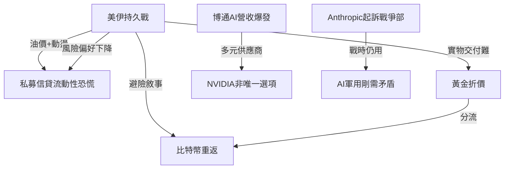
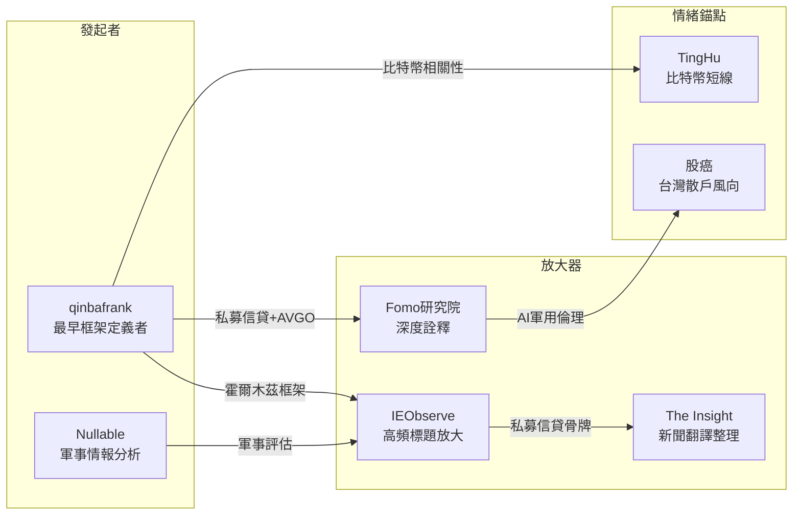

# Weekly Narrative Brief（2026-03-02 ~ 2026-03-08）

## 1. 核心敘事（5 個）

### 敘事一：美伊戰爭「無條件投降」與霍爾木茲海峽持久戰

- **敘事骨架**：因為川普要求伊朗「無條件投降」並宣布「史詩狂怒行動」升級，而伊朗由強硬派瓦希迪和拉里賈尼主導報復持續攻擊油輪，所以市場從「閃電戰預期」轉向「持久戰」定價，接下來霍爾木茲海峽能否恢復正常航運將是市場拐點。
- **主要佐證**：
  1. 川普3/6發文「UNCONDITIONAL SURRENDER」，白宮重新定義為「當伊朗不再構成威脅時即處於無條件投降狀態」
  2. 布蘭特原油單週暴漲36%至$92.69，創歷史最大單週漲幅；WTI觸及$90，為2023年以來最高
  3. 伊朗革命衛隊宣布「完全控制」霍爾木茲海峽，保險公司撤銷海峽航運承保，數千艘船滯留港口
  4. 川普預估戰事持續「四周左右」，但情報機構認為更迭伊朗政權可能性不大
- **典型放大語句**：「衝突的『持續時間』已取代『爆發本身』成為決定原油、黃金、美股走向的核心變數」（qinbafrank, tweet-2026-03-06）；「霍爾木茲海峽沒有恢復正常，油價還要漲，風險市場繼續承壓」（qinbafrank, tweet-2026-03-07）
- **感染力來源**：戰爭直播臨場感 + 「無條件投降」戲劇性表態 + 油價切身民生恐懼 + 「四周」具體時間框架的可追蹤性
- **代表貼文**：qinbafrank tweet-2026-03-06/07（霍爾木茲海峽分析+無條件投降解讀）、Nullable tweet-2026-03-04/06（軍事評估+伊朗國內分裂）、The Insight fb-2026-03-05/06/07（原油價格+川普訊息）、IEObserve fb-2026-03-06（伊朗道歉+川普嗆聲）、Joseph Wang tweet-2026-03-06（情報機構評估）

---

### 敘事二：私募信貸「成人禮」——貝萊德、黑石限制贖回恐慌

- **敘事骨架**：因為貝萊德HLEND基金首次突破5%贖回上限、黑石BCRED遭遇7.9%贖回申請，所以市場擔憂2兆美元私募信貸市場的流動性風險，接下來銀行對私人信貸的直接風險敞口成為焦點。
- **主要佐證**：
  1. 貝萊德HLEND（260億美元）投資人申請贖回9.3%份額，基金僅批准5%；黑石BCRED（820億美元）申請7.9%，上調至7%滿足+自掏4億美元補足
  2. 大型銀行對私人信貸基金直接貸款承諾額約950億至3000億美元，佔銀行總股本約11.5%
  3. Blue Owl旗下零售基金OBDC II停止季度贖回，股價大跌
  4. 聯準會稱銀行直接暴露「有限、可吸收」
- **典型放大語句**：「這波壓力可以看作是私募信貸零售化後的『成人禮』」（qinbafrank, tweet-2026-03-08）；「那個高達2兆美金、長期躲在監管陰影下的『私募信貸』市場，會不會成為推倒華爾街銀行的下一塊多米諾骨牌？」（Fomo研究院, fb-2026-03-08）
- **感染力來源**：「貝萊德」品牌震驚效應 + 「多米諾骨牌」比喻的末日感 + 數據可驗證性（贖回比例、銀行敞口）
- **代表貼文**：qinbafrank tweet-2026-03-08（貝萊德+黑石完整分析）、Fomo研究院 fb-2026-03-08（私募信貸風險）、IEObserve fb-2026-03-08（銀行敞口數據）

---

### 敘事三：黃金折價與「數位黃金」比特幣重返

- **敘事骨架**：因為伊朗衝突導致黃金運輸和保險成本飆升、交易商折價出售，同時比特幣在戰爭避險敘事下突破9萬美元，所以「數位黃金」重返避險王者地位，接下來兩者走勢分化揭示資金風險偏好。
- **主要佐證**：
  1. 伊朗局勢導致航班停飛、物流受阻，黃金折價出售；比特幣單日反彈7%，跑贏黃金
  2. qinbafrank分析：比特幣與軟體股IGV走勢高度相關，同屬高beta風險資產
  3. MicroStrategy持續買入（每日700-1000顆比特幣），規模超越礦工產出
  4. 比特幣在3/5從6萬低點反彈，市場押注「戰爭快速結束」
- **典型放大語句**：「比特幣上漲4% 重回數位黃金寶座」（The Insight, fb-2026-03-05）；「數位黃金的論述真的要成真了嗎？」（Fenix C. Hsu, fb-2026-03-05）
- **感染力來源**：實物黃金VS數位黃金的劍拔弩張 + 「被動接受」vs「主動掌控」的身份隱喻 + 價格走勢的直觀對比
- **代表貼文**：qinbafrank tweet-2026-03-05（比特幣+IGV相關性）、Fenix C. Hsu fb-2026-03-05/07（比特幣買入）、The Insight fb-2026-03-05（數位黃金）、TingHu tweet-2026-03-04（比特幣行情分析）

---

### 敘事四：博通AI營收爆發——NV並非唯一選項

- **敘事骨架**：因為博通Q1 AI晶片營收84億美元（年增106%）、Q2指引107億美元、2027年AI營收預期超1000億美元，所以市場確認「AI晶片非NV一家」的多元供應鏈敘事，接下來光纖vs銅纜、 CPO延遲成為硬體新焦點。
- **主要佐證**：
  1. AVGO Q1營收193億美元，Q2指引220億美元（年增46.6%）
  2. 2027年AI晶片營收預期超1000億美元，出貨規模接近10GW；客戶包括Google、Anthropic、META、ByteDance、OpenAI、Softbank
  3. Hock Tan直接潑冷水：「CPO？不是今年，也許不是明年」——銅纜仍將主導
  4. NVIDIA同日向Coherent和Lumentum各砸20億美元，確保光學互連供應
- **典型放大語句」：「comment 可能意外地救了 scale up 銅類股」（股癌, fb-2026-03-05）；「磷化銦晶圓全球大缺，Lumentum說產能加了20%還是少交25%到30%的貨，這是AI基礎建設真正的瓶頸」（IEObserve, fb-2026-03-07）
- **感染力來源」：Q1營收數字的視覺衝擊 + 「不是今年，也不是明年」的斷言張力 + 供應瓶頸的稀缺性恐懼
- **代表貼文」：股癌 fb-2026-03-05（AVGO財報）、IEObserve fb-2026-03-07（光纖vs銅纜）、Richard fb-2026-03-05（博通分析）、美股韭菜王 fb-2026-03-05（AVGO營收）

---

### 敘事五：Anthropic起訴戰爭部——AI軍用倫理戰爭

- **敘事骨架**：因為Anthropic堅持AI不用於「大規模監控」和「全自主武器」的兩條紅線，拒絕五角大廈「所有合法用途」條款，所以川普宣布全面停用並列為國安供應鏈風險，接下來Anthropic將起訴政府，OpenAI以更靈活姿態補位。
- **主要佐證」：
  1. 川普在Truth Social痛罵Anthropic為「左翼瘋子」，宣布六個月過渡期停用
  2. Anthropic將起訴川普政府，挑戰《國防生產法》
  3. OpenAI提出几乎相同紅線但獲國防部接受——差異在政治獻金與談判姿態
  4. 華爾街日報揭露：美軍在攻擊伊朗時仍使用Anthropic技術
- **典型放大語句」：「任何私人公司都永遠無法左右我們的國家安全」（貝森特, The Insight fb-2026-03-05）；「Anthropic試圖將使用條款強加到與美國政府的合約中，這是不可接受的」（貝森特, The Insight fb-2026-03-05）
- **感染力來源」：道德vs.國家權力的終極對立 + 政治獻金陰謀論 + 「又恨又離不開」的能力依賴
- **代表貼文」：The Insight fb-2026-03-05（貝森特聲明）、qinbafrank tweet-2026-03-06（Anthropic分析）、IEObserve fb-2026-03-07（Anthropic起訴）

---

## 2. 敘事星座（互相支撐/衝突/變體）

**關係一：「美伊持久戰」觸發「私募信貸恐慌」**
美伊戰爭升級導致油價暴漲、金融市場動盪，投資人風險偏好下降，私募信貸零售基金遭贖回壓力。兩個敘事形成「地緣風險→流動性收縮」的連鎖反應。見 qinbafrank tweet-2026-03-08（私募信貸分析）、Fomo研究院 fb-2026-03-08（私募信貸骨牌論）。

**關係二：「美伊持久戰」分化「黃金」與「比特幣」**
伊朗衝突導致黃金實物交付困難（折價），而比特幣在「數位黃金」敘事下反彈更強。兩個資產同為避險但走勢分化，反映市場對「實物資產VS數位資產」的偏好轉變。見 qinbafrank tweet-2026-03-05、The Insight fb-2026-03-05。

**關係三：「博通AI爆發」支撐「多元供應鏈」敘事**
博通2027年AI營收預期超1000億美元，確認AI晶片不只NV一台。這個敘事與上週的「NVIDIA超預期疲勞」形成呼應——市場開始接受「多元供應商」框架。見股癌 fb-2026-03-05、IEObserve fb-2026-03-07。

**關係四：「Anthropic起訴」vs.「AI軍用剛需」**
Anthropic因倫理紅線被踢出國防合約，但華爾街日報揭露美軍仍在戰爭中使用其技術——「道德立場」與「實戰剛需」形成諷刺性衝突。見 qinbafrank tweet-2026-03-06、The Insight fb-2026-03-05。

---

## 3. 傳播與擴散（Who amplified what）

本週敘事傳播呈現「戰爭單中心擴散」模式：美伊戰爭從週中開始蓋過所有其他議題，成為市場主旋律。

**最早出現的來源**：
- qinbafrank（tweet-2026-03-04）最早系統性分析「霍爾木茲海峽」作為市場拐點的框架，並在整週持續更新伊朗局勢、私募信貸、比特幣相關性等多條主線

**主要放大來源一：qinbafrank**
本週最高產出的分析者，涵蓋美伊局勢（6條以上長文）、私募信貸（完整解讀貝萊德+黑石）、比特幣+軟體股相關性、AVGO財報等多個戰線。其「持續時間取代爆發本身」框架成為本週被最廣泛引用的市場定價邏輯。

**主要放大來源二：IEObserve 國際經濟觀察**
高頻標題式發文引導情緒，在私募信貸（fb-2026-03-08）、伊朗局勢（fb-2026-03-06/07）、記憶體（fb-2026-03-07）三條線上提供簡短但具衝擊力的切入點。

**情緒錨點**：
- TingHu（ tweet-2026-03-04/05/06）：比特幣短線交易視角，提供市場情緒與資金流向觀察
- Nullable（tweet-2026-03-04/06）：軍事層面即時分析（薩德被毀、伊朗國內分裂、「內塔尼亞胡坑了川普」論）

**跨平台擴散**：
- Twitter端：qinbafrank、Nullable、Joseph Wang 提供即時分析與軍事情報
- Facebook端：The Insight、IEObserve、Fomo研究院 提供中文整理與深度詮釋

**事件觸發順序**：
3/4 川普宣布DFC提供海峽戰爭險+美軍護航 → 油價反彈、市場情緒好轉
3/5 AVGO財報、比特幣反彈、黃金折價
3/6 川普「無條件投降」升級、貝萊德限制贖回、Anthropic被禁
3/7 非農-9.2萬、原油週漲36%、伊朗宣布「已打爆」
3/8 私募信貸恐慌持續、qinbafrank完整分析

---

## 4. 漂移與週對週變化

| 漂移項目 | 上週（2/23-3/01） | 本週（3/02-3/08） | 關鍵轉折 | 代表貼文 |
|---------|-----------------|------------------|---------|---------|
| 美伊衝突 | 斬首哈梅內伊、閃電戰預期、「四周」框架形成 | 升級至「無條件投降」、霍爾木茲海峽實質封鎖、持久戰定價 | 焦點從「是否開戰」轉向「何時結束」，霍爾木茲海峽成為核心變數 | qinbafrank tweet-2026-03-06/07 |
| 私募信貸 | 背景敘事——零售基金流動性討論 | 升級為焦點事件——貝萊德首次突破贖回上限、黑石自掏腰包 | 從「擔憂」到「恐慌」，Fomo研究院首次使用「骨牌」比喻 | qinbafrank tweet-2026-03-08、Fomo研究院 fb-2026-03-08 |
| 黃金vs比特幣 | 戰爭避險：黃金比特幣同漲 | 黃金折價、比特幣重返數位黃金、兩者走勢分化 | 伊朗導致黃金實物交付困難，比特幣「可攜帶性」敘事強化 | qinbafrank tweet-2026-03-05、The Insight fb-2026-03-05 |
| AI硬體敘事 | NVIDIA超預期疲勞、軟體股反彈 | 博通AI營收爆發確認多元供應、光纖vs銅纜分歧 | 從「NV漲不動」到「博通也爆」，市場確認多元供應商框架 | 股癌 fb-2026-03-05、IEObserve fb-2026-03-07 |
| Anthropic衝突 | 川普罵「左翼瘋子」、全面停用 | Anthropic將起訴、OpenAI補位、華爾街日报揭露「又恨又離不開」 | 從商業分歧升級為法律戰，OpenAI政治姿態成對比 | The Insight fb-2026-03-05、qinbafrank tweet-2026-03-06 |

---

## 非敘事內容（Insight）

本週以下內容為知識/洞察型，非敘事，已存放至 @data/insight：

1. **Verifiable Credentials（VC）與經濟連續性**：qinbafrank分析區塊鏈技術在戰時確保身份、支付連續性的應用
2. **中國兩會要點**：淡化GDP目標、重視結構調整（@data/insight/insight-2026-03-02-to-03-08.md）
3. **美光HBM產能觀察**：記憶體供應缺口與價格展望
4. **WBC台灣晉級**：運動賽事（非投資相關）
