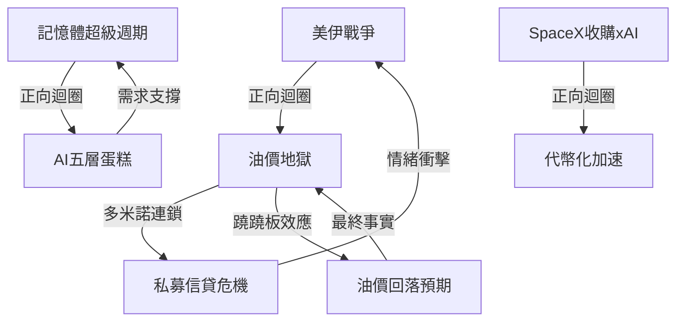
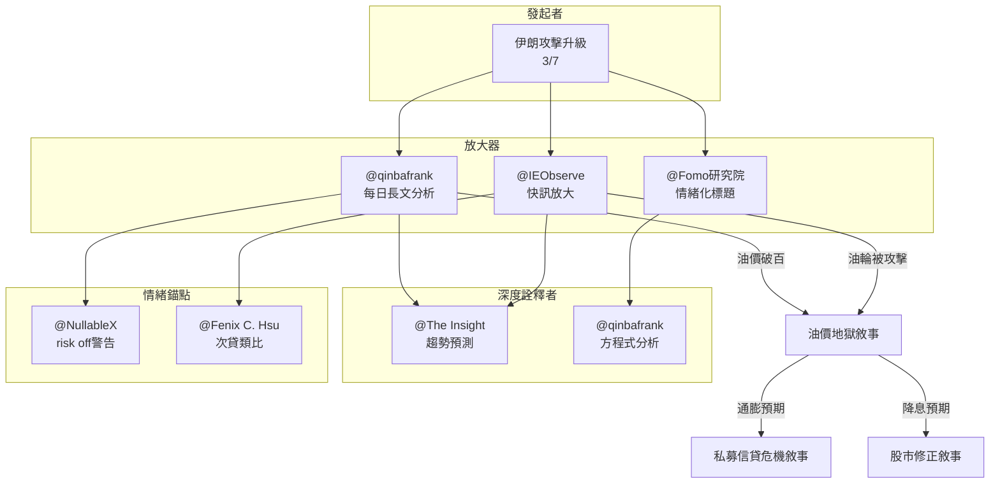

Weekly Narrative Brief（2026-03-09 ~ 2026-03-15）

### 1. 核心敘事（5個）

#### 敘事一：美伊戰爭——油價地獄與海峽封鎖
- **敘事骨架**：因為荷姆茲海峽實質封鎖（每日2000萬桶石油運輸中斷）、伊朗發動不對稱作戰（UUV水下無人機、水雷、飛彈攻擊油輪），所以油價一度飆破100美元創2022年以來新高，全球股市重挫（韓股單週跌逾10%），接下來觀察川普是否派地面部隊、伊朗是否持續封鎖海峽。
- **主要佐證**：
  - 布蘭特原油3月7日漲至110美元，單週漲幅35.6%超越2022年俄烏戰爭（26.3%）
  - 荷姆茲海峽平時每日約100艘船隻通過，彭博數據顯示上週僅7艘船隻駛離波斯灣
  - IEA史上最大規模釋出4億桶石油儲備（3/12），但油價隨即反彈破百
  - G7、美國相繼釋出戰略儲油，但每日釋放量（約140-300萬桶）遠低於海峽正常流量（2000萬桶）
- **典型放大語句**：
  - 「油價暴力上漲突破百元，荷姆茲海峽流量懸崖式下跌」（@MacroMicro 財經M平方，fb-2026-03-10）
  - 「美以伊戰火封鎖荷姆茲海峽，油價飆升歷史會重演嗎？」（@MacroMicro 財經M平方，fb-2026-03-12）
- **感染力來源**：
  - **可驗證性**——油價是即時公開數據，且有IEA、G7、各國政府動作同步證實，數字說服力極強
  - **反直覺性**——市場原本預期「速戰速決」，但伊朗用不對稱作戰（封鎖海峽而非正面交戰）讓美國陷入泥淖，挑戰「美國必勝」的直覺假設
  - **身份認同**——普通人被高油價直接影響（加油成本上升），容易将自己代入「受害者」角色
- **代表貼文**：
  - @Fomo研究院（fb-2026-03-10）——深度詮釋者，用「死亡、烈火和憤怒」敘事框架錨定恐懼情緒
  - @IEObserve 國際經濟觀察（fb-2026-03-12）——第一線情報源，率先發布「伊朗繼續攻擊民用油輪，布蘭特原油噴回100塊」
  - @The Insight（fb-2026-03-13）——趨勢預測者，精準預告油價上100美元「不是終點」
  - @qinbafrank（tweet-2026-03-12）——深度詮釋者，用「數學方程式」分析衝突持續時間，強調「戰略儲備無法替代正常貿易」
  - @NullableX（tweet-2026-03-12）——情緒錨點，警告「油價不上來，risk off走向會保持很久」

---

#### 敘事二：記憶體超級週期——AI剛需與供給瓶頸
- **敘事骨架**：因為黃仁勳喊話「擴多少產能，輝達就用多少」（3/10 Morgan Stanley科技大會）、HBM吃掉大量晶圓、先進製程CoWoS供不應求，所以記憶體景氣从循環股變結構成長股，SK hynix與三星股價大漲，接下來觀察N3產能是否成為新瓶頸。
- **主要佐證**：
  - 黃仁勳：「DRAM廠儘管去擴產，擴增產能多少，輝達就會用掉多少產能」（3/10）
  - 滙豐(HSBC)將2026年全球伺服器出貨量年增預期從4%大幅上調至20%
  - 供應鏈瓶頸：CPU和DRAM記憶體供應缺口30%-40%
  - SK hynix表示2027年全球記憶體短缺可能比2026年更嚴重
- **典型放大語句**：
  - 「這次的核心不是手機、PC回補庫存，也不是短單追價造成的價格波動，而是AI基礎建設把整個記憶體產業的需求結構改掉了」（@萬鈞法人視野 WJ Capital Perspective，fb-2026-03-10）
  - 「記憶體產業的邏輯正在改變，以前大家習慣把DRAM、NAND都當成高度標準化商品，現在不能再用過去那套庫存循環去理解」（@萬鈞法人視野，fb-2026-03-14）
- **感染力來源**：
  - **英雄/反派結構**——黃仁勳是「需求保證人」英雄角色，挑戰過去記憶體「景氣循環 = 擴產地獄」的反派敘事
  - **簡化口號**——反覆強調「這次不一樣」「不能用舊框架理解」，用一句話推翻十年投資既定認知
  - **可驗證性**——黃仁勳親口喊話、伺服器出貨數據、CoWoS產能缺口都有具體數字支撐
- **代表貼文**：
  - @萬鈞法人視野 WJ Capital Perspective（fb-2026-03-10, 03-14）——產業專家，長期研究記憶體，關鍵時刻提供「不一樣的框架」
  - @Richard只談基本面（fb-2026-03-12）——基本面分析師，拆解「為何記憶體常用PB而非PE」，提供估值邏輯
  - @美股送分題（fb-2026-03-12）——散戶教育者，用「三次super cycle看定價三階段」把複雜議題簡化

---

#### 敘事三：AI 五層蛋糕——從晶片到應用的全棧革命
- **敘事骨架**：因為黃仁勳發表《AI is a 5-Layer Cake》文章，強調AI是「電力與網路等級」的基礎設施，而非單一聰明App，所以市場開始理解AI投資邏輯要「從上往下」看整條供應鏈，從能源、晶片、基礎設施、模型到應用層層拉動，接下來觀察哪一層先見頂、哪一層還在補漲。
- **主要佐證**：
  - 黃仁勳明確劃分五層：能源→晶片→基礎設施→模型→應用
  - 「每一個成功的應用都會拉動其下的每一層，直至維持其運行的動力設備」
  - Cloudflare透露：AI代理流量6週翻倍、50% API流量已由AI發起
- **典型放大語句**：
  - 「黃仁勳：五層蛋糕架構：能源→晶片→基礎設施→模型→應用。每一個成功的應用都會拉動其下每一層。這就是未來幾年的財富密碼」（@TingHu，tweet-2026-03-15）
  - 「黃仁勳試圖告訴我們：AI不是一個聰明的App，也不是一個單純的模型，它是像『電力』與『網路』一樣的基礎設施」（@Fomo研究院，fb-2026-03-12）
- **感染力來源**：
  - **簡化口號**——「五層蛋糕」比複雜的技術架構好記100倍
  - **可驗證性**——每層都有具體公司對應（能源→NextEra；晶片→NVIDIA；基礎設施→Cloudflare、Oracle；模型→OpenAI；應用層正在爆發）
  - **情緒觸發**——用「電力」「網路」暗示這是「每個人都會用、每個國家都會建」的東西，喚起類似1990年代網路泡沫的FOMO
- **代表貼文**：
  - @Fomo研究院（fb-2026-03-12）——第一個把五層蛋糕翻譯成「敘事」的華語帳號
  - @qinbafrank（tweet-2026-03-11）——深度解讀「AI是一個五層蛋糕你想吃哪一層」，強調「硬體+原材料層 = 耐用、確定性高」
  - @股癌 Gooaye（fb-2026-03-10）——從Cloudflare觀察切入，提供產業第一線數據

---

#### 敘事四：私募信貸風暴——hidden risk與流動性恐懼
- **敘事骨架**：因為Blue Owl與BlackRock私募信貸基金傳出限制贖回（3月），加上油價飆升推升通膨預期、壓縮降息空間，所以市場開始擔心2008年「期限錯配」恐劇再現，導致風險資產被拋售，接下來觀察私募信貸底層資產是否真的健康、贖回壓力是否持續。
- **主要佐證**：
  - Blue Owl、BlackRock私募信貸基金傳出停止贖回
  - 千禧年(Millennium)上週因戰爭波動損失約15億美元（資產的1.7%）
  - Balyasny Asset Management股價下跌3.5%、Point72下跌1.1%
- **典型放大語句**：
  - 「private credit很單純：私募信貸基金跟散戶或家族基金募錢→借給中小型公司賺利差...問題是這些貸款是長期不流動的，但基金卻承諾投資人可以每季贖回最多5%」（@Fenix C. Hsu，fb-2026-03-10）
  - 「這跟2008年次貸的結構有相似之處：用短期負債去fund長期不流動的資產」
- **感染力來源**：
  - **身份認同**——散戶最怕「贖不回來」的恐懼，直接對應「本金可能不見」的焦慮
  - **可驗證性**——有具體公司名（Blue Owl、BlackRock）、具體損失數字（15億美元）
  - **反直覺性**——過去被包裝為「穩健高收益」的私募信貸，突然被發現結構跟次貸類似
- **代表貼文**：
  - @Fenix C. Hsu（fb-2026-03-10）——用「數位資產取代私募信貸」觀點對比，扮演「清醒的旁觀者」

---

#### 敘事五：SpaceX收購xAI——太空超級計算機與代幣化敘事
- **敘事骨架**：因為SpaceX宣布收購xAI（新公司估值1.25兆美元）、馬斯克說要在太空建AI資料中心，所以市場出現「太空+AI+通信」的史詩級敘事，後續觀察合併後估值與實際營收何時能撐起故事。
- **主要佐證**：
  - SpaceX收購xAI，每股定價527美元，新公司估值1.25兆美元
  - 交易所正在修改規則讓SpaceX比正常更快納入指數（15個交易日vs正常的1年）
  - 納斯達克宣布與Kraken合作推出7×24小時代幣化股票交易
- **典型放大語句**：
  - 「SpaceX收購xAI本質上是『用最強的現金牛+發射能力，去保最燒錢但最有未來想像力的AI大腦』」（@qinbafrank，tweet-2026-03-13）
  - 「馬斯克之前多次公開講過：地球上建超大AI資料中心會遇到電力、散熱、土地、監管等極限，而太空（軌道）是更好的地方」（同上）
- **感染力來源**：
  - **英雄/反派結構**——馬斯克是「跨界顛覆者」英雄，目標是「太空超級計算機」這個史詩目標
  - **簡化口號」——1.25兆美元估值+「太空AI」概念，比任何財報數字都容易傳播
  - **反直覺性」——顛覆「AI一定要在地球」的慣性思維
- **代表貼文**：
  - @qinbafrank（tweet-2026-03-13）——第一個完整解讀SpaceX收購xAI的華語分析師
  - @qinbafrank（tweet-2026-03-13）——深度追蹤代幣化股票監管框架進展

---

### 2. 敘事星座（互相支撐/衝突/變體）

| 關係 | 類型 | 說明 | 引用貼文 |
|------|------|------|----------|
| 美伊戰爭 → 油價地獄 | **正向迴圈** | 戰爭加劇→海峽封鎖→油價漲→通膨預期升→聯準會降息路徑受阻→股市壓力→風險偏好下降 | fb-2026-03-10~03-14 多篇 |
| 油價地獄 → 私募信貸危機 | **多米諾連鎖** | 油價漲→通膨預期升→SOFR維持高檔→私募信貸借款人利息壓力升→贖回恐懼→流動性緊張 | fb-2026-03-10 @Fenix C. Hsu |
| 記憶體超級週期 → AI五層蛋糕 | **正向迴圈** | 記憶體供給緊→晶片層漲價→基礎設施成本墊高→應用層定價壓力→但黃仁勳說「需求會吸收一切」 | fb-2026-03-12 @Richard |
| SpaceX收購xAI → 代幣化加速 | **正向迴圈** | 傳統金融(交易所)擁抱加密→代幣化股票更方便→更多傳統資產上鏈→加密敘事更強 | tweet-2026-03-13 @qinbafrank |
| 美伊戰爭結束預期 → 油價回落 | **蹺蹺板效應** | 川普說「戰爭快結束」→油價暴跌→股市反彈→但伊朗仍在攻擊油輪→油價又回歸百元 | fb-2026-03-12~13 多篇 |

**mermaid圖：敘事星座關係圖**

---

### 3. 傳播與擴散

**整體形狀**：單中心擴散 + 事件驅動連鎖反應

- **最早發起者**：@qinbafrank（持續追蹤伊朗局勢、每日更新長文分析），資訊優勢來源：追蹤英文一手財報與地緣政治情報
- **兩大放大器**：
  1. **@Fomo研究院**（fb）——標題式傳播，擅長用「死亡、烈火和憤怒」「五層蛋糕」等強烈修辭錨定情緒
  2. **@IEObserve 國際經濟觀察**（fb）——快訊型放大，第一時間發布「伊朗繼續攻擊民用油輪」「油價噴回100塊」等關鍵節點
- **深度詮釋者**：@qinbafrank（用「數學方程式」分析衝突時間）、@The Insight（精準預測油價破百）
- **情緒錨點**：@NullableX（「油價不下来，risk off走向會保持很久」）、@Fenix C. Hsu（把私募信貸類比2008次貸）

**事件觸發時間順序**：
3/7(六) 伊朗攻擊加劇、海峽實質封鎖 → 3/10(一) 油價首度破百、川普放話「快結束」 → 3/11(二) IEA宣布釋儲4億桶 → 3/12(三) 油價回落後反彈、川普威脅轟炸哈爾克島 → 3/13(四) 美軍部署海軍陸戰隊、伊朗新最高領袖出爐 → 3/14(五) 油價再破百、川普要各國派軍艦護航

**mermaid圖：傳播與擴散關係圖**

---

### 4. 漂移與週對週變化

| 敘事 | 上週措辭 | 本週措辭 | 變化原因 | 引用 |
|------|----------|----------|----------|------|
| 美伊戰爭 | 「速戰速決」「精準打擊」 | 「不對稱作戰」「困局」 | 伊朗封鎖海峽讓美國難堪，市場從樂觀轉保守 | fb-2026-03-10~14 |
| 油價 | 「短期衝擊」「趕快獲利了結」 | 「高油價新常態」「100美元成為底部」 | 油價持續破百、儲備釋出不如預期 | fb-2026-03-12~14 |
| 記憶體 | 「循環股要小心」 | 「不能用舊框架理解」 | 黃仁勳親口喊話、SK hynix說2027更缺貨 | fb-2026-03-10 vs 03-14 |
| 私募信貸 | 「個別事件」 | 「結構性流動性風險」 | Blue Owl限制贖回、對沖基金巨額損失 | fb-2026-03-10 @Fenix C. Hsu |
| AI投資 | 「模型、应用」 | 「五層蛋糕、從能源到應用」 | 黃仁勳文章定調敘事框架 | fb-2026-03-12 @Fomo研究院 |

---

### 5. 本週Insight（知識沉澱，非敘事）

本週有以下內容屬於「分析架構」或「知識沉澱」而非「情緒動員型敘事」，已分流至Insight：

- **@Richard只談基本面**的記憶體PB/PE估值邏輯拆解（fb-2026-03-12）
- **@Fomo研究院**對CPO技術發展時間表的技術分析（fb-2026-03-13）
- **@qinbafrank**對美國301調查與川習會的經貿分析（fb-2026-03-13）
- **@vincentchengwenyu**對a16z受訪時「工程師問答案vs業務問動機」的觀察（fb-2026-03-14）
- **@qinbafrank**對比特幣與美元流動性的關聯分析（tweet-2026-03-13）
