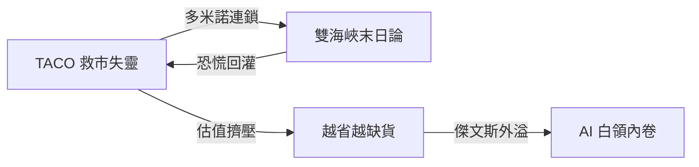
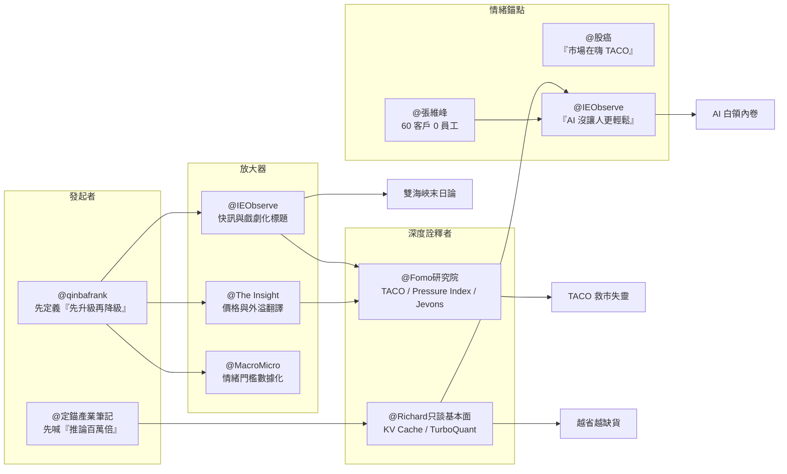

Weekly Narrative Brief（2026-03-23 ~ 2026-03-29）

### 1. 核心敘事（4 個）

- 敘事名：TACO 救市失靈——川普一句話能砸油價，卻終結不了戰爭
- 敘事骨架：因為川普先丟出「48 小時最後通牒」、又臨門一腳改口延後 5 天，且市場發現伊朗條件與美方條件仍相距甚遠，所以情緒從「TACO 還會救市」轉為「先交易緩和、但不相信緩和」，接下來要追蹤 4/6 最後期限、Pressure Index 是否續創高點，以及美軍部署是否真的停下來。
- 主要佐證：3/21 川普要求伊朗在 48 小時內開放荷姆茲海峽，3/23 又宣布延後打擊 5 天（MacroMicro，fb-2026-03-24-213544）；布蘭特原油在談判消息後單日跌 11% 至 99.94 美元，但 3/28 又反彈至 112.57 美元（The Insight，fb-2026-03-24-213544；fb-2026-03-29-164853）；川普把期限延到 2026-04-06，五角大廈同時評估增派 1 萬名地面部隊與裝甲車（The Insight，fb-2026-03-29-164853）；德銀 Pressure Index 在衝突接近 1 個月時升到歷史高點，超過「解放日」關稅衝擊（Fomo研究院，fb-2026-03-29-164853）。
- 典型放大語句：「川普發現用嘴就能控油價，比釋放什麼戰備儲油還好用」（IEObserve，fb-2026-03-24-213544）；「市場願意對『緩和消息』做交易，但還不願意把它當真相」（qinbafrank，tweet-2026-03-29-164859）。
- 感染力來源：簡化口號——`TACO` 與「先升級、再降級」把複雜戰局壓成一個人人都會轉述的交易口訣，所以傳播成本極低；英雄/反派結構——川普同時扮演救市者與製造波動者，角色反差讓每次發文都像劇情反轉；可驗證性——48 小時、5 天、4/6、油價 99.94 與 112.57 這些硬數字讓人覺得不是情緒，而是行情真的被一句話拖著走。
- 代表貼文：@qinbafrank（tweet-2026-03-29-164859）——發起者，最早把局勢定義成「先升級、再降級」的戰術性劇本；@IEObserve 國際經濟觀察（fb-2026-03-24-213544）——放大器，用一句話把「口頭控油價」變成散戶口耳相傳的笑柄；@The Insight（fb-2026-03-24-213544）——放大器，把油價、股市、殖利率的一日大震盪翻成可交易敘事；@MacroMicro 財經M平方（fb-2026-03-24-213544）——數據型放大器，把 90~120 天變成市場是否傷到基本面的門檻；@Fomo研究院（fb-2026-03-29-164853）——深度詮釋者，用 Pressure Index 把「TACO 是否還有效」框成政治容錯率問題；@股癌 Gooaye（fb-2026-03-24-213544）——情緒錨點，用 USS Tripoli 前進波灣對沖市場樂觀。

- 敘事名：雙海峽末日論——霍爾木茲的火，開始燒向鋁與化肥
- 敘事骨架：因為霍爾木茲沒有替代出口路線、滿載油輪通過仍要 10 到 14 小時，加上胡賽放話封鎖曼德海峽，並且鋁與化肥已出現明確外溢，所以市場從「這只是油價問題」轉向「這是全球供應鏈多米諾」，接下來要追蹤雙海峽是否同時失靈、鋁與化肥價格是否把恐慌從能源擴散到製造與農業。
- 主要佐證：霍爾木茲海峽平時每天約 140 艘商船通過，滿載油輪安全駛出仍需 10 到 14 小時，護航無法一對一覆蓋（Fomo研究院，fb-2026-03-27-091818）；霍爾木茲每日運送 2,090 萬桶石油、佔全球 21%，曼德海峽每日 420 萬桶、佔 6%，兩者合計接近 30% 海運石油流量（IEObserve，fb-2026-03-29-164853）；中東鋁生產商約占全球供應 9%，EGA 受損且阿聯酋是美國第二大鋁供應國（IEObserve，fb-2026-03-29-164853）；2020 至 2025 年中國對波灣經濟體氮肥出口累計 500 億美元，近期中斷可能把全球化肥成本推高 30%（The Insight，fb-2026-03-29-164853）。
- 典型放大語句：「霍爾木茲是波斯灣唯一的出口，沒有替代方案」（Fomo研究院，fb-2026-03-27-091818）；「雙海峽中斷將阻斷近 30% 海運石油流量，油價可能飆破每桶 150 美元」（IEObserve，fb-2026-03-29-164853）。
- 感染力來源：情緒觸發——它把抽象的地緣戰爭翻成「油、鋁、化肥、運費都要漲」的生活恐懼，轉述門檻極低；可驗證性——21%、6%、9%、500 億美元、30% 這些硬數字讓人有「不是末日文學，是供應鏈算術」的感受；反直覺性——很多人原本只盯石油，但敘事把鋁與化肥也拉進來，擴大了風險想像的半徑。
- 代表貼文：@Fomo研究院（fb-2026-03-27-091818）——深度詮釋者，把霍爾木茲脆弱性講成可視化的交通瓶頸；@IEObserve 國際經濟觀察（fb-2026-03-29-164853）——放大器，先把雙海峽威脅壓成 21%+6% 的口號；@IEObserve 國際經濟觀察（fb-2026-03-29-164853）——供應鏈放大器，把鋁業受損與美國進口依賴串進來；@The Insight（fb-2026-03-29-164853）——深度詮釋者，把化肥中斷翻成農業播種季風險；@The Insight（fb-2026-03-29-164853）——宏觀詮釋者，用 Larry Fink 的 150 美元油價情境把衰退風險推到檯面；@qinbafrank（tweet-2026-03-29-164859）——跨平台補充者，用加拿大油企與安全產能的對比，證明市場已開始在供應鏈外溢中找贏家。

- 敘事名：越省越缺貨——TurboQuant、KV Cache 和 Groq 把 AI 推論需求越壓越大
- 敘事骨架：因為 GTC 把推論需求喊到 100 萬倍，Richard 與 The Insight 都把 TurboQuant、KV Cache 解讀成「降低單位成本但放大總需求」，而 Groq 又把速度直接變成定價權，所以市場敘事從「效率提升會傷硬體」轉向「效率提升會炸開推論使用量」，接下來要追蹤 HBM 擴產、速度分級定價與記憶體股是否從情緒性修正回到需求定價。
- 主要佐證：GTC 2026 直接把未來運算需求上看 100 萬倍，並揭露 2028 年堆疊式客製化 HBM 路線（定錨產業筆記，fb-2026-03-23-213033）；Richard 提到 Nvidia 新 KV Cache 技術若真能把記憶體壓到原本的 1/20，反而意味算力與記憶體需求會再長一輪（Richard，fb-2026-03-23-213033）；Groq 舉例客戶需求可在會議結束後不到 1 小時由 coding agent 做完，且速度越快、每 token 單價越高（IEObserve，fb-2026-03-29-164853）；SK 海力士評估赴美發 ADR 募資 10 兆到 15 兆韓元、約占總股本 2.4%，明指 HBM 與 AI 基礎設施擴產（萬鈞法人視野，fb-2026-03-24-213544）。
- 典型放大語句：「節省記憶體為 1/20？很好，如果實用的話算力和記憶體需求又要大成長了」（Richard，fb-2026-03-23-213033）；「很多 SaaS 公司一週推一次新版本，如果你能一天推一次？一小時推一次呢？」（IEObserve 轉述 Groq，fb-2026-03-29-164853）。
- 感染力來源：反直覺性——大家直覺認為「更省」等於「更不缺」，但這個敘事反過來說「更省會讓你用更多」，極容易被轉述成一句悖論；可驗證性——100 萬倍、1/20、不到 1 小時、10~15 兆韓元這些數字把抽象技術討論拉回資本開支與商業化；簡化口號——`越省越缺` 把 Jevons Paradox 翻成非技術人也能記住的口號。
- 代表貼文：@定錨產業筆記（fb-2026-03-23-213033）——發起者，先把 GTC 的推論爆發講成產業主線；@Richard只談基本面（fb-2026-03-23-213033）——深度詮釋者，用 KV Cache 反推硬體需求不減反增；@Fomo研究院（fb-2026-03-24-213544）——跨域詮釋者，把放射科案例翻成 Jevons Paradox 的通俗版本；@The Insight（fb-2026-03-27-091818）——補充者，指出 Google 節省記憶體的前提就是「記憶體已經稀缺」；@萬鈞法人視野 WJ Capital Perspective（fb-2026-03-24-213544）——資本市場放大器，用海力士募資把敘事落到 CAPEX；@IEObserve 國際經濟觀察（fb-2026-03-29-164853）——放大器，把 Groq 的速度經濟學變成企業能立即想像的競爭場景。

- 敘事名：不是失業，是軍備競賽——AI 把白領焦慮從替代恐懼改寫成產出內卷
- 敘事骨架：因為 Fomo 與黃仁勳把 AI 定義成「任務會消失，但目的不會」，同時社群又不停出現 60 客戶、0 員工、5 點下班與「20 美元 AI 比人更有輸入」這種一人公司範本，所以情緒從單純害怕被取代，轉成害怕自己不夠快、不夠多、不夠像 agent，接下來要追蹤能直接接管電腦的 agent 工具與一人高產模式會不會被更多人當成新標配。
- 主要佐證：黃仁勳以放射科為例，說 10 年前大家以為 AI 會取代醫師，但 10 年後需求反而「以前所未有的速度」飆升（Fomo研究院，fb-2026-03-24-213544）；日本稅務師用一份 `CLAUDE.md` 管 60 家客戶、員工 0 人、5 點準時下班（張維峰，fb-2026-03-23-213033）；IEObserve 直言大家現在覺得 token 上限沒用滿很浪費，反而比以前工作更長（fb-2026-03-23-213033）；vivienna 直接把人與 AI 做價格比較，說若一個人帶來的輸入不如 20 美元包月 AI，就在浪費生命（tweet-2026-03-29-164859）。
- 典型放大語句：「任務會消失，但『目的』不會」（Fomo研究院，fb-2026-03-24-213544）；「AI 沒有讓人更輕鬆，感覺更多人更焦慮了」（IEObserve，fb-2026-03-23-213033）。
- 感染力來源：身份認同——白領、內容工作者、交易員、獨立工作者都能把自己代入「如果別人已經是 1 人公司，我是不是落後了」的角色，所以傳播帶有很強自我投射；情緒觸發——這不是單純的失業恐懼，而是更貼身的效率羞恥與 FOMO，因為比較對象從公司變成你身邊的人；簡化口號——`60 客戶、0 員工、5 點下班` 與 `20 美元 AI` 這種極端對照特別容易被複述與放大。
- 代表貼文：@Fomo研究院（fb-2026-03-24-213544）——發起者，把「取代」重寫成「任務 vs 目的」；@IEObserve 國際經濟觀察（fb-2026-03-23-213033）——情緒錨點，用「沒更輕鬆、反而更焦慮」直接命名感受；@張維峰（fb-2026-03-23-213033）——樣板放大器，用一人稅務師案例把抽象焦慮具象化；@IEObserve 國際經濟觀察（fb-2026-03-24-213544）——工具放大器，強調 Claude 正走向遠端接管電腦；@vivienna.btc（tweet-2026-03-29-164859）——極端情緒錨點，用「20 美元 AI」把人類輸入商品化；@IEObserve 國際經濟觀察（fb-2026-03-29-164853）——深度補充者，用 Groq 的速度定價說明為何這不是情緒，而是商業壓力。

### 2. 敘事星座（互相支撐/衝突/變體）

- 多米諾連鎖｜「TACO 救市失靈」支撐了「雙海峽末日論」：一開始市場還願意把 48 小時最後通牒、5 天延後與談判風聲當成交易題材，但當 Fomo 把霍爾木茲講成「沒有替代方案」後，討論就從總統嘴砲轉向實體航運瓶頸；到了 3/29，IEObserve 與 The Insight 再把鋁與化肥拖進來，風險從金融波動變成供應鏈外溢。例子見 IEObserve、The Insight、Fomo 於 fb-2026-03-24-213544、fb-2026-03-27-091818、fb-2026-03-29-164853。
- 恐慌回灌｜「雙海峽末日論」又反過來強化「TACO 救市失靈」：一旦風險不只在石油，而是延伸到鋁、化肥與運費，市場就更不容易相信川普一句「談得很好」能快速修復現實供應；這也是為什麼油價能從跌破 100 美元再回到 112.57 美元。例子見 The Insight 與 IEObserve 於 fb-2026-03-24-213544、fb-2026-03-29-164853。
- 傑文斯外溢｜「越省越缺貨」變形成「不是失業，是軍備競賽」：當 Fomo 用放射科醫師講清楚「效率提升不等於需求消失」，Richard 與 Groq 又把這件事落到 KV Cache、推論速度與商業競爭，社群情緒就從「工作會被拿走」變成「工作還在，但標準被抬高」。例子見 Fomo、Richard、IEObserve 於 fb-2026-03-24-213544、fb-2026-03-23-213033、fb-2026-03-29-164853。
- 估值擠壓｜「TACO 救市失靈」壓制了「越省越缺貨」的股價表現：長線上大家還在談 100 萬倍推論與 HBM 擴產，但戰爭驅動的估值修正先把記憶體股打爛；MacroMicro 甚至直接把「美伊搖擺不定」和「記憶體遭三大利空狙擊」寫在同一篇裡。例子見 MacroMicro、萬鈞法人視野、IEObserve 於 fb-2026-03-29-164853、fb-2026-03-24-213544。

### 3. 傳播與擴散（Who amplified what）

本週的傳播形狀是「單中心連鎖擴散，AI 為平行次波」。主中心是美伊局勢與川普訊號，幾乎所有大資產、供應鏈與避險討論都先經過這個中心再往外擴散；AI 線則不是被事件打斷，而是以 GTC 餘波的形式平行延伸成「推論需求」與「白領焦慮」兩個子敘事。

- 最早出現的來源：@qinbafrank（tweet-2026-03-29-164859）最早把本週戰局框成「先升級、再降級」「以打促談」的連續劇本，資訊優勢來自他長期追蹤英文一手軍政與市場線索，能比 Facebook 二手整理更早定義框架。
- 主要放大來源一：@IEObserve 國際經濟觀察（fb-2026-03-23-213033、fb-2026-03-24-213544、fb-2026-03-29-164853）用高頻短句、數字截面與戲劇化口吻放大情緒，擅長把複雜訊息濃縮成「川普用嘴控油價」「雙海峽近 30% 海運石油」這種可複述標題。
- 主要放大來源二：@The Insight（fb-2026-03-24-213544、fb-2026-03-29-164853）用價格、殖利率、產業外溢做長文翻譯，擅長把同一事件從油價、航空股、化肥、鋁一路串成完整市場故事，放大的不是情緒強度，而是敘事可交易性。
- 深度詮釋者：@Fomo研究院（fb-2026-03-24-213544、fb-2026-03-27-091818、fb-2026-03-29-164853）把 TACO、Pressure Index、Jevons 悖論做成框架；@Richard只談基本面（fb-2026-03-23-213033、fb-2026-03-27-091818）則把 KV Cache、TurboQuant 這些技術點翻成需求邏輯。
- 情緒錨點：@股癌 Gooaye（fb-2026-03-24-213544）用「市場在嗨 TACO」把樂觀情緒釘住；@IEObserve 國際經濟觀察（fb-2026-03-23-213033）用「AI 沒有讓人更輕鬆」固定 AI 焦慮；@張維峰（fb-2026-03-23-213033）用「60 客戶、0 員工、5 點下班」固定一人公司想像。
- 事件觸發的時間順序：3/23 川普 48 小時最後通牒臨門改口延後 5 天 → 市場先交易 TACO 反彈（IEObserve、The Insight、MacroMicro） → 3/24~3/27 談判真假拉扯，`先升級再降級` 成為主框架（qinbafrank、Fomo、股癌） → 3/27 霍爾木茲「沒有替代方案」被深度講解（Fomo） → 3/29 雙海峽、鋁、化肥外溢把末日論擴成供應鏈敘事（IEObserve、The Insight）；另一路是 3/23 GTC「推論百萬倍」 → 3/24 放射科/傑文斯悖論 → 3/27 TurboQuant、KV Cache → 3/29 Groq 速度定價與 AI 焦慮（定錨、Fomo、Richard、IEObserve）。

### 4. 漂移與週對週變化

以下以上一份可用週報 `2026-03-09 ~ 2026-03-15` 為對照基準；中間週 `2026-03-16 ~ 2026-03-22` 的 narrative 檔目前不在 repo 內。

| 敘事骨架 | 上上週（2026-03-09 ~ 2026-03-15） | 本週（2026-03-23 ~ 2026-03-29） | 漂移機制 | 代表引用 |
|---|---|---|---|---|
| 美伊衝突與油價 | 從「油價地獄」「海峽封鎖」出發，核心是伊朗不對稱作戰造成即時供應衝擊，市場在問油價是否破百、海峽是否守不住 | 漂移成「TACO 救市失靈」，核心不再只是伊朗能不能封鎖，而是川普能不能靠 48 小時最後通牒、延後 5 天與談判放話反覆操控市場情緒 | **主角轉移**：敘事重心從「伊朗是供應衝擊來源」轉成「川普是波動放大器」；情緒也從單向恐慌變成帶點嘲諷的犬儒交易 | 上上週：fb-2026-03-10、fb-2026-03-12、tweet-2026-03-12；本週：fb-2026-03-24-213544、fb-2026-03-29-164853、tweet-2026-03-29-164859 |
| 戰爭外溢 | 上上週的外溢主要落在「通膨預期、risk off、私募信貸流動性壓力」，金融傳染是主軸 | 本週外溢改寫成「雙海峽末日論」，從石油擴到鋁、化肥、運費與播種季，變成實體供應鏈多米諾 | **衝擊半徑擴大**：同樣是戰爭骨架，但受害者從金融資產持有人擴大成製造業、農業與全球貿易參與者，傳播面更廣 | 上上週：fb-2026-03-10、fb-2026-03-12；本週：fb-2026-03-27-091818、fb-2026-03-29-164853 |
| AI 硬體/記憶體 | 上上週是「記憶體超級週期」與「AI 五層蛋糕」：黃仁勳是英雄，語言是「這次不一樣」「從能源到應用」，偏資本市場與產業配置敘事 | 本週變成「越省越缺貨」：同樣仍是 AI 基礎設施需求，但措辭從供給瓶頸、擴產保證，轉向 KV Cache、TurboQuant、推論速度與 Jevons 悖論 | **論證方式漂移**：從 CEO 願景與 CAPEX 故事，轉成效率技術如何反而放大需求的反直覺邏輯；英雄從黃仁勳本人，轉到具體技術與速度定價 | 上上週：fb-2026-03-10、fb-2026-03-12、fb-2026-03-14、tweet-2026-03-11；本週：fb-2026-03-23-213033、fb-2026-03-24-213544、fb-2026-03-27-091818、fb-2026-03-29-164853 |
| AI 對人的影響 | 上上週談 AI 時，主情緒是 FOMO 與投資框架重估，重點在「哪一層蛋糕值得吃」 | 本週同一條 AI 擴張骨架下，敘事落點變成白領內卷與一人公司神話，重點是「你會不會被更高產的人類+agent 組合甩開」 | **情緒下沉**：從資本市場的樂觀想像，下沉到個體工作者的效率羞恥與身份焦慮；時間尺度也從「未來幾年產業紅利」縮成「今天你有沒有跟上」 | 上上週：fb-2026-03-12、tweet-2026-03-11；本週：fb-2026-03-23-213033、fb-2026-03-24-213544、tweet-2026-03-29-164859 |
