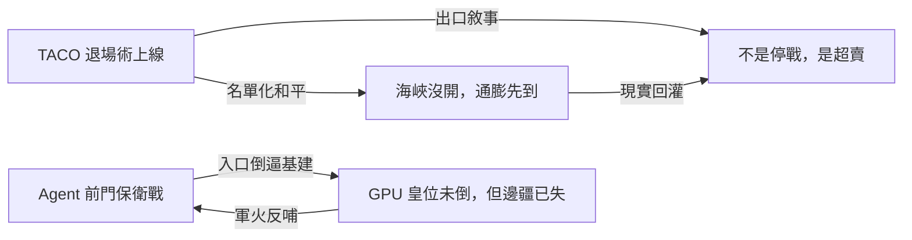
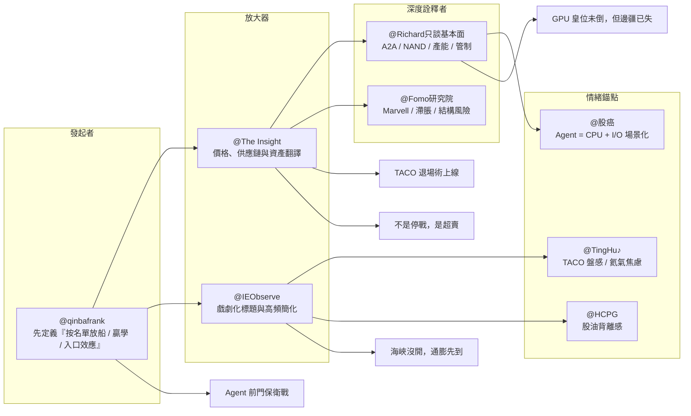

Weekly Narrative Brief（2026-03-30 ~ 2026-04-04）

### 1. 核心敘事（5 個）

- 敘事名：TACO 退場術上線——川普準備把戰略僵局講成歷史性勝利
- 敘事骨架：因為 10 年期美債殖利率逼近 4.5% 的「致命底線」、川普又接連釋出 4/6 延後、15 點停戰條件、2 到 3 週或 4 到 6 週內結束行動等訊號，而伊朗只說願在獲得保證下結束戰爭、並未真正承認直接談判，所以市場情緒從「TACO 救不救得了市」漂移成「白宮會不會用贏學包裝退場」，接下來要追蹤 2026-04-06 前後白宮說法、伊朗強硬派實際動作，以及荷姆茲海峽是否真的恢復全面通行。
- 主要佐證：3/30 市場已把美國 10 年期公債殖利率 4.5% 視為川普反射性安撫市場的觸發線（MacroMicro，fb-2026-03-30-185126）；4/1 川普被報導願意在不完全重開荷姆茲海峽的情況下結束戰爭，並談到 2 到 3 週、或 4 到 6 週內結束敵對行動（The Insight、qinbafrank，fb-2026-04-01-164648；tweet-2026-04-01-164702）；美方同時透過巴基斯坦傳遞「15 點停戰條件」，且先前軍事行動已延後到 4/6（MacroMicro，fb-2026-04-01-164648）；伊朗總統僅表示在獲得保證下願意結束戰爭，但伊朗外長隨後又強調不相信與美國談判會有成果，形成明顯訊號分裂（The Insight、qinbafrank，fb-2026-04-01-164648；tweet-2026-04-01-164702）。
- 典型放大語句：「川普開始準備贏學敘事了？」（qinbafrank，tweet-2026-04-01-164702）；「今天又是一個雞同鴨講的平行世界」（IEObserve，fb-2026-03-30-185126）。
- 感染力來源：英雄/反派結構——川普同時扮演戰場升級者、救市喊話者與最後的勝利敘事編劇，角色反差讓每次表態都像劇情反轉，所以極易被轉述；簡化口號——`TACO`、`贏學`、`平行世界` 這些短語把複雜外交與軍事進程壓縮成散戶也能複述的情緒符號，所以能高速擴散；可驗證性——4.5%、4/6、15 點、2 到 3 週、4 到 6 週這些具體數字與日期，讓人覺得這不是純政治八卦，而是可以拿來下注的事件腳本。
- 代表貼文：@MacroMicro 財經M平方（fb-2026-03-30-185126）——框架發起者，用 4.5% 殖利率把川普安撫市場的觸發條件公式化；@The Insight（fb-2026-04-01-164648）——放大器，把「不完全重開海峽也可停戰」翻成股市與油市的可交易劇本；@qinbafrank（tweet-2026-04-01-164702）——深度詮釋者，直接把白宮訊號命名為「贏學敘事」；@IEObserve 國際經濟觀察（fb-2026-03-30-185126）——情緒錨點，用「平行世界」釘住官方口徑與現實落差；@TingHu♪（tweet-2026-03-30-185107）——散戶風向標，把川普訊號當成可觀察 TACO 強弱的反指標；@The Insight（fb-2026-04-01-164648）——外交補充者，用伊朗「需要保證」提醒市場白宮敘事仍未落地。

- 敘事名：不是停戰，是超賣——1125 點反彈其實在交易情緒而非和平
- 敘事骨架：因為伊朗總統的和談表態與川普的退場訊號剛好撞上市場超賣區、資產配置再平衡與空頭回補，而油價與利率壓力其實沒有同步解除，所以情緒從「戰爭要結束了」快速轉成「這可能只是 headline 驅動的反彈」，接下來要追蹤 10 日線與 200 日線、廣度是否擴散，以及油價與殖利率是否繼續背離股市。
- 主要佐證：4/1 那斯達克上漲 3.8%、道瓊上漲 1125 點、標普 500 上漲 2.9%，均為自 2025 年 5 月以來最大單日漲幅（The Insight，fb-2026-04-01-164648）；同日布蘭特原油雖回落 3.2%，但整個季度仍累計上漲 71%，顯示能源衝擊並未消失（The Insight，fb-2026-04-01-164648）；標普自 3 月下跌以來先前所有反彈都未能收上 10 日均線，4/1 雖首次收上，但仍未重返 200 日均線（The Insight，fb-2026-04-01-164648）；4/4 美國原油單日上漲超過 11 美元、收在每桶 111.54 美元，證明市場對戰爭的樂觀在一週內就遭到能源現實回灌（The Insight，fb-2026-04-04-162328）。
- 典型放大語句：「This was an oversold rally, sparked by headlines」（Mark Minervini，tweet-2026-04-01-164702）；「短線反彈看 10 日線能不能站穩」（The Insight，fb-2026-04-01-164648）。
- 感染力來源：反直覺性——它挑戰了「大漲就代表利空出盡」的直覺，改說這只是超賣後的條件反射，所以很容易被交易者拿來提醒彼此不要追高；可驗證性——3.8%、1125 點、2.9%、10 日線、200 日線、111.54 美元這些技術與價格座標讓敘事帶有很強的盤面說服力；身份認同——這不是宏觀研究員的抽象框架，而是所有抄底者、空頭與觀望者都能代入的盤中體感，因此擴散速度極快。
- 代表貼文：@Mark Minervini（tweet-2026-04-01-164702）——發起者，把反彈直接定義為超賣 snapback 而非確認底部；@The Insight（fb-2026-04-01-164648）——技術型放大器，用 10 日線與 200 日線給出最簡潔的驗證框架；@HCPG（tweet-2026-04-01-164702）——情緒錨點，用「市場狂喜但油價沒怎麼跌」點破背離；@Nullable（tweet-2026-04-01-164702）——路徑交易者，把真 TACO / 假 TACO 對應成不同跌幅劇本；@The Insight（fb-2026-04-04-162328）——回灌者，用 111.54 美元油價證明樂觀極易反轉；@The Insight（fb-2026-04-04-162328）——節奏觀察者，用「週一反彈、週四週五恐慌」固定這一輪交易情緒形狀。

- 敘事名：海峽沒開，通膨先到——名單放船把油價恐慌變成糧價與汽油帳單
- 敘事骨架：因為荷姆茲海峽沒有恢復正常通行、只是出現按名單有限放船，且油價高位開始外溢到汽油、糧食、氦氣與食品價格，所以情緒從「海峽會不會被完全封死」轉向「就算不全封，生活成本也已經先上岸」，接下來要追蹤 4 月 CPI、FAO 食品指數、氦氣現貨與海峽是否從選擇性通行走回全面通行。
- 主要佐證：3/29 到 3/30 期間伊朗僅允許 20 艘巴基斯坦旗船通過，且每天只放行 2 艘，顯示不是恢復正常，而是開始按名單放船（qinbafrank，tweet-2026-03-30-185107）；4/1 布蘭特原油盤中一度衝到每桶 116 美元、回落後仍在 112.78 美元附近，美國汽油價格也自 2022 年 8 月以來首次重新站上每加侖 4 美元（The Insight、MacroMicro，fb-2026-04-01-164648）；USDA 預估 2026 年玉米種植面積 9,530 萬英畝、年減 3%，全小麥種植面積 4,380 萬英畝，若實現將是 1919 年有紀錄以來新低（The Insight，fb-2026-04-01-164648）；4/4 FAO 食品物價指數升至 128.5、月增 2.4%，而氦氣線則出現卡達供應全球約 1/3、液氦容器保存期僅 35 到 48 天、台積電近 7 成氦氣仰賴海灣地區的供應焦慮（The Insight、TingHu 引述，fb-2026-04-04-162328；tweet-2026-04-01-164702）。
- 典型放大語句：「不是恢復了，而是開始按名單放船」（qinbafrank，tweet-2026-03-30-185107）；「海灘上是晴天，但海嘯已經在路上」（TingHu 引述 Kornbluth，tweet-2026-04-01-164702）。
- 感染力來源：情緒觸發——油、汽油、糧食、氦氣都直接連到日常成本與科技供應鏈，恐懼不再只是交易員的恐懼，而是普遍的生活焦慮，所以特別容易被轉述；可驗證性——20 艘、每天 2 艘、116 美元、4 美元、128.5、2.4%、9,530 萬英畝、4,380 萬英畝這些硬數字讓敘事具有高度可核對性；反直覺性——它把「沒有完全封鎖」重新解釋為「仍足以製造通膨外溢」，比末日論更細、更黏、更有說服力。
- 代表貼文：@qinbafrank（tweet-2026-03-30-185107）——發起者，把海峽狀態從「開或關」改寫成「按名單放行」；@The Insight（fb-2026-04-01-164648）——市場翻譯者，把 116 美元油價與 4 美元汽油連成民生成本故事；@The Insight（fb-2026-04-01-164648）——農業補充者，用 USDA 數據把通膨外溢延伸到玉米與小麥；@TingHu♪（tweet-2026-04-01-164702）——供應鏈放大器，把氦氣短缺翻成 AI 晶片隱性風險；@The Insight（fb-2026-04-04-162328）——宏觀驗證者，用 FAO 128.5 證明漲價已進入食品鏈；@IEObserve 國際經濟觀察（fb-2026-04-04-162328）——情緒錨點，用亞洲汽油價格圖把抽象通膨變成可視化負擔。

- 敘事名：Agent 前門保衛戰——模型廠不想再當 OpenClaw 的底層供應商
- 敘事骨架：因為科技巨頭在一週內密集推出 UCP、Cowork、個人智能與 AI 辦事入口，Anthropic 又進一步限制訂閱額度供第三方 agent 工具使用，而 Claude Code 洩漏也暴露出 agent 工程層的藍圖價值，所以情緒從「比誰模型更聰明」轉向「比誰控制使用者每天打開 AI 的前門」，接下來要追蹤平台封閉政策是否升級、自家 agent 功能是否快速補齊，以及使用者會不會因此轉向多模型或開源組合。
- 主要佐證：4/4 美東下午 3 點起，Claude 訂閱額度被描述為不再覆蓋 OpenClaw 這類第三方 agent 工具，重度使用者若要繼續跑高強度自動化任務需改走 extra usage 或 API（qinbafrank、IEObserve，tweet-2026-04-04-162148；fb-2026-04-04-162328）；同一週 Google 推 UCP 協議、Anthropic 推 Claude Cowork、Google 再推整合 Gmail/Photos/Search/YouTube 歷史的個人智能、阿里千問 App 一次上線 400 多項 AI 功能（qinbafrank，tweet-2026-04-04-162148）；3/31 Claude Code 客戶端實作外洩，露出多 agent 編排、持久記憶、權限系統與 daemon 模式痕跡，讓外界更清楚 agent 競爭點是在工程層而非單一模型 IQ（qinbafrank，tweet-2026-04-01-164702）；Richard 引述的行動網路觀察則指出，代理型 AI 讓流量結構從 90:10 走向 1:1，中國電信看到相關應用上行容量年增達 5 倍，顯示 agent 已從產品概念開始變成基礎設施需求（Richard，fb-2026-04-01-164648）。
- 典型放大語句：「入口一旦丟掉，後面再想搶回來就晚了」（qinbafrank，tweet-2026-04-04-162148）；「Claude 的算力資源有限，要完全限縮想用訂閱 token 跑 OpenClaw 的人」（IEObserve，fb-2026-04-04-162328）。
- 感染力來源：身份認同——每個重度 AI 使用者都能立刻理解「前門」的重要性，因為問題不是模型能不能用，而是自己每天究竟從哪個入口開始工作；英雄/反派結構——平台方、第三方 harness、開源替代品天然構成清楚對立，使敘事自帶戲劇張力；可驗證性——4/4、400 多項功能、90:10、1:1、5 倍這些數字與產品節奏讓大家可以直接拿時間線驗證「入口戰」是否正在升溫。
- 代表貼文：@qinbafrank（tweet-2026-04-04-162148）——發起者，直接把 Anthropic 行動命名為「入口效應」保衛戰；@IEObserve 國際經濟觀察（fb-2026-04-04-162328）——價格型放大器，把入口戰翻成訂閱 vs API 的商業分流；@qinbafrank（tweet-2026-04-01-164702）——深度詮釋者，用 Claude Code 洩漏說明 agent 工程層才是瓶頸；@Richard只談基本面（fb-2026-04-01-164648）——基建補充者，用 A2A 流量改變證明 agent 不是玩具而是網路負載新來源；@IEObserve 國際經濟觀察（fb-2026-04-01-164648）——組織放大器，用 Block 案例把 AI 從工具提升到組織路由層；@The Insight（fb-2026-04-04-162328）——界面詮釋者，用蘋果 AI 威脅框架指出未來真正的整合點可能不再是傳統 UI。

- 敘事名：GPU 皇位未倒，但邊疆已失——AI 軍備競賽外溢到 CPU、NAND 與國產晶片
- 敘事骨架：因為 agent 工作流把 CPU、I/O、儲存與互連的重要性抬高，Nvidia 也開始用 Marvell 與 NVLink Fusion 鞏固機架級版圖，同時中國國產 AI 晶片市占提升、DeepSeek V4 又傳出優先適配華為與寒武紀，所以市場敘事從「買 GPU 就好」轉向「誰掌握整個 AI 工廠與自主算力生態，誰才拿到下一階段主動權」，接下來要追蹤 DeepSeek V4 是否如傳言在未來幾週落地、Marvell 合作能否商業化，以及 CPU / NAND / 互連是否被資本市場重新定價。
- 主要佐證：Nvidia 本週向 Marvell 投資 20 億美元，並以 NVLink Fusion 把 Marvell 納入 AI Factory / AI-RAN 生態，顯示它正用平台合作對沖超大客戶自研晶片壓力（Fomo、股癌、Richard，fb-2026-04-04-162328；fb-2026-04-01-164648）；Richard 指出 KV Cache 需求爆發最大的受惠可能是 NAND / SSD 而非 HBM / DRAM，而股癌則把 agent 描述成長期運作的狀態機，強調大量流程、協調與 I/O 都跑在 CPU 上（Richard、股癌，fb-2026-04-04-162328）；三星目標在年底前把平澤 1c 製程月產能拉到超過 20 萬片，SK 海力士也計畫把 M15X 相關產能由每月 1 萬片拉高到最多 7 萬片，證明記憶體軍備競賽仍在加碼（Richard，fb-2026-04-04-162328）；中國 2025 年本土 GPU 與 AI 晶片廠已拿下約 41% 市占，Nvidia 仍有 55%、AMD 僅 4%，而 DeepSeek V4 又傳出跳過英偉達的早期優化慣例，轉而深度適配華為昇騰與寒武紀，若成真將強化國產算力敘事（Technews、qinbafrank，fb-2026-04-04-162328；tweet-2026-04-04-162148）。
- 典型放大語句：「KV Cache 需求爆發最大的受惠是 NAND/SSD，不是 HBM/DRAM」（Richard，fb-2026-04-04-162328）；「Agent 本質上是一個長期運作的狀態機」（股癌，fb-2026-04-04-162328）。
- 感染力來源：反直覺性——市場原本習慣把所有 AI 紅利都指向 GPU，但這個敘事改說 CPU、NAND、互連與國產晶片也在分食戰場，所以特別容易引發轉述與辯論；可驗證性——20 億美元、20 萬片、7 萬片、41%、55%、4% 這些數字讓「全棧軍備競賽」不只是概念，而是可追蹤的投資主題；身份認同——它同時滿足半導體研究員、交易員與科技從業者對「下一個受惠環節是誰」的共同焦慮，所以擴散不只限於單一圈層。
- 代表貼文：@Fomo研究院（fb-2026-04-04-162328）——發起者，把 Nvidia 投資 Marvell 解讀成守住 AI 工廠入口的策略動作；@股癌 Gooaye（fb-2026-04-04-162328）——放大器，用 CPU 與 agent 執行迴圈改寫「GPU 唯一瓶頸」敘事；@Richard只談基本面（fb-2026-04-04-162328）——深度詮釋者，指出 NAND/SSD 與記憶體產能擴建的真正受惠順序；@Technews 科技新報（fb-2026-04-04-162328）——數據型放大器，用中國 41% 國產市占證明供應鏈裂變不是想像；@qinbafrank（tweet-2026-04-04-162148）——國產生態詮釋者，用 DeepSeek V4 + 華為昇騰把自主可控講成下一輪 AI shock；@Richard只談基本面（fb-2026-04-04-162328）——政策補充者，用半導體設備管制草案說明主權算力競賽還會被政策推得更快。

### 2. 敘事星座（互相支撐/衝突/變體）

- 出口敘事｜「TACO 退場術上線」支撐了「不是停戰，是超賣」：白宮若能把戰略僵局包裝成「已完成目標、即將退場」，市場就有足夠 headline 去觸發空頭回補與超賣反彈；4/1 的 1125 點道瓊大漲，就是這種政治出口為技術反彈提供火種。例子見 The Insight、qinbafrank、Mark Minervini 於 fb-2026-04-01-164648、tweet-2026-04-01-164702。
- 現實回灌｜「海峽沒開，通膨先到」衝突了「不是停戰，是超賣」：股市可以先交易停火想像，但 111.54 美元原油、4 美元汽油、FAO 128.5 與 4 月 CPI 預期，會把市場一次次拉回成本現實。例子見 The Insight、MacroMicro、Fomo 於 fb-2026-04-01-164648、fb-2026-04-04-162328。
- 名單化和平｜「TACO 退場術上線」變形成「海峽沒開，通膨先到」：當白宮開始接受「不完全重開海峽也能結束戰爭」，市場就不得不面對一個更黏的中間狀態：不是全面停戰，也不是全面封鎖，而是帶著通行名單、保證條件與政治收費的灰色秩序。例子見 qinbafrank、The Insight、中巴五點和平計畫於 tweet-2026-03-30-185107、fb-2026-04-01-164648。
- 入口倒逼基建｜「Agent 前門保衛戰」支撐了「GPU 皇位未倒，但邊疆已失」：平台若想把使用者留在自家入口，就不能只賣模型，還得補齊 Cowork、Remote Control、網路上行能力、CPU 協調與機架級互連，所以入口戰天然會把資本開支往全棧基建推。例子見 qinbafrank、Richard、股癌、Fomo 於 tweet-2026-04-04-162148、fb-2026-04-01-164648、fb-2026-04-04-162328。
- 軍火反哺｜「GPU 皇位未倒，但邊疆已失」又反過來強化「Agent 前門保衛戰」：當 CPU、NAND、國產晶片與 NVLink 生態都開始成熟，巨頭更有條件把 agent 做成自己的封閉平台，因為它們不再只是租一個模型，而是在鋪整條供應鏈與分發鏈。例子見 Technews、qinbafrank、The Insight 於 fb-2026-04-04-162328、tweet-2026-04-04-162148。

### 3. 傳播與擴散（Who amplified what）

本週的傳播形狀是「雙中心並行擴散」。第一個中心是美伊戰爭與白宮 headline 交易，傳播節奏極快，先由訊號不一致製造懷疑，再由盤中價格動作放大情緒；第二個中心是 AI agent 入口戰，節奏較像產品發表與商業策略接力，從單點產品更新逐步長成「誰控制使用者前門」的整體敘事。

- 最早出現的來源：@qinbafrank 是本週最早定義框架的人。他先在 3/30 把霍爾木茲描述成「按名單放船」，接著在 4/1 把川普的新說法命名為「贏學敘事」，4/4 又進一步把 Anthropic 封 OpenClaw 上升到「入口效應」；其優勢在於長期追英文一手軍政與科技資訊，能比二手整理更早下定義。
- 主要放大來源一：@The Insight 以價格、資產與供應鏈翻譯放大敘事。它擅長把「願意停戰但不重開海峽」變成那斯達克 +3.8%、道瓊 +1125、布蘭特季度 +71%、汽油重回 4 美元的可交易故事，也把糧食、FAO、Hormuz Stress Index 串成更完整的生活成本敘事。
- 主要放大來源二：@IEObserve 國際經濟觀察 以戲劇化標題、短句與高頻評論放大情緒。它把外交落差壓成「平行世界」，把入口戰翻成「Claude 不再補貼 OpenClaw」，把海峽問題翻成「不幫忙的盟友自己去把石油拿回來」，擅長生成最容易二次傳播的句型。
- 深度詮釋者：@Richard只談基本面 把 A2A 流量、NAND/SSD、記憶體產能與出口管制串成全棧邏輯；@Fomo研究院 則把 Nvidia 投資 Marvell、滯脹歷史與市場風險框成中長期結構問題。
- 情緒錨點：@TingHu♪ 用反指標、TACO 強弱與氦氣短缺把散戶盤感釘住；@HCPG 用「市場狂喜但油價沒怎麼跌」固定背離感；@股癌 用 CPU / agent 工作流把硬體討論轉成大家都聽得懂的執行場景。
- 事件觸發的時間順序：3/30 殖利率逼近 4.5%、「按名單放船」開始取代全面封鎖討論（MacroMicro、qinbafrank） → 4/1 伊朗總統表態願在獲得保證下結束戰爭，股市上演 1125 點反彈，但同時出現真 TACO / 假 TACO 爭論（The Insight、Mark Minervini、Nullable） → 4/1 白宮退場語氣與中巴 5 點和平計畫把焦點推向「不完全重開海峽也可停戰」（The Insight、IEObserve） → 4/4 油價單日再漲逾 11 美元、FAO 與 CPI 討論把通膨敘事拉回來（The Insight、MacroMicro、Fomo）；AI 線則是 3/31 Claude Code 洩漏 → 4/1 Block / A2A / OpenAI 融資 → 4/4 Anthropic 封 OpenClaw、Google / Anthropic / 阿里同步搶入口、DeepSeek V4 + 華為強化主權算力（qinbafrank、Richard、IEObserve、Technews）。

### 4. 漂移與週對週變化

以下以上週摘要 `2026-03-23 ~ 2026-03-29` 為對照基準。

| 敘事骨架 | 上週（2026-03-23 ~ 2026-03-29） | 本週（2026-03-30 ~ 2026-04-04） | 漂移機制 | 代表引用 |
|---|---|---|---|---|
| TACO / 美伊 | 上週是「TACO 救市失靈」：市場開始懷疑川普一句話已無法真正壓住油價與戰爭風險 | 本週漂移成「TACO 退場術上線」：焦點不再只是 TACO 還靈不靈，而是川普會不會把退讓或僵局包裝成歷史性勝利 | **敘事主語轉移**：從「市場不信 TACO」轉成「白宮怎麼寫勝利稿」；情緒也從犬儒交易，變成對政治包裝術的觀察 | 上週：fb-2026-03-24-213544、fb-2026-03-29-164853、tweet-2026-03-29-164859；本週：fb-2026-03-30-185126、fb-2026-04-01-164648、tweet-2026-04-01-164702 |
| 雙海峽 / 供應鏈 | 上週是「雙海峽末日論」：重點在霍爾木茲與曼德海峽是否雙重失靈，供應鏈像多米諾骨牌一樣倒下 | 本週變成「海峽沒開，通膨先到」：關鍵不再是是否全面封鎖，而是選擇性放船、食品、汽油、氦氣與 CPI 如何慢慢滲入實體經濟 | **衝擊形狀改變**：從末日式一次性恐慌，漂移成黏性更高、可持續數週的成本外溢敘事 | 上週：fb-2026-03-27-091818、fb-2026-03-29-164853；本週：tweet-2026-03-30-185107、fb-2026-04-01-164648、fb-2026-04-04-162328 |
| AI 需求 / 硬體 | 上週是「越省越缺貨」：重點在 KV Cache、TurboQuant 與 Jevons 悖論如何放大總需求 | 本週變成「GPU 皇位未倒，但邊疆已失」：敘事從需求總量擴張，進一步落到誰吃到紅利，CPU、NAND、互連與國產算力都開始分走主角光環 | **受惠者細分化**：從「AI 基建都會受惠」漂移成「不同層的受惠順序與地緣歸屬」 | 上週：fb-2026-03-23-213033、fb-2026-03-24-213544、fb-2026-03-29-164853；本週：fb-2026-04-01-164648、fb-2026-04-04-162328、tweet-2026-04-04-162148 |
| AI 與人 | 上週是「不是失業，是軍備競賽」：焦點在白領如何被 agent 產能標準拉高、形成效率羞恥 | 本週漂移成「Agent 前門保衛戰」：焦點從個人能不能追上 agent，轉成平台誰掌握 agent 的分發入口、權限與使用習慣 | **焦慮層級上移**：從個體生產力焦慮，上移到平台層與生態位競爭，英雄從「一人公司」改成「入口平台」 | 上週：fb-2026-03-23-213033、fb-2026-03-24-213544、tweet-2026-03-29-164859；本週：tweet-2026-04-01-164702、tweet-2026-04-04-162148、fb-2026-04-04-162328 |
