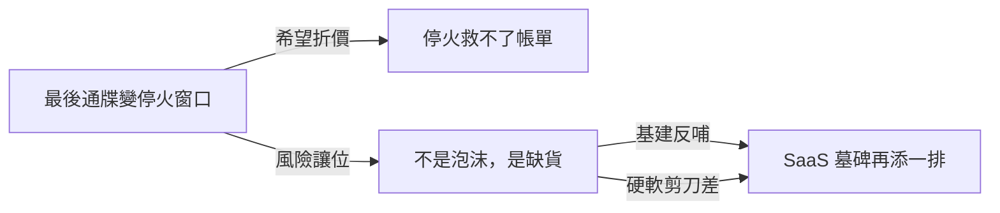
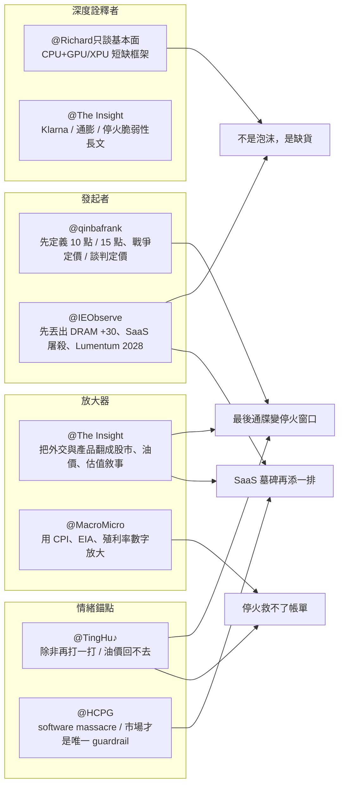

Weekly Narrative Brief（2026-04-05 ~ 2026-04-12）

### 1. 核心敘事（4 個）

- 敘事名：最後通牒變停火窗口——市場從戰爭定價切到談判定價
- 敘事骨架：因為川普從 3/21 的 48 小時最後通牒一路延到 4/6、4/7 又在巴基斯坦斡旋後接受兩週停火並收下伊朗 10 點方案，而美伊談判還升格成自 1979 年以來最高層級的 21 小時會談，所以市場情緒從「戰爭會不會失控」轉成「談判 headline 能撐多久」，接下來要追蹤美方 15 點方案與伊方 10 點方案能否縮小分歧，或再度回到以打促談。
- 主要佐證：3/21 川普先下 48 小時最後通牒，3/23 又延後 5 天，3/26 再延到 4/6，4/5 甚至重新宣告週二晚上 8 點若無協議就打擊電力與橋樑（The Insight，fb-2026-04-06-221754.md#8）；4/7 川普同意對伊朗「兩週暫停轟炸」，並確認收到伊朗 10 點方案，巴基斯坦總理則在凌晨 3 點出面請求延後最後期限（qinbafrank，tweet-2026-04-11-170304.md#74、tweet-2026-04-11-170304.md#70）；不到 24 小時後，川普又從接受伊朗 10 點方案轉回堅持美方 15 點方案，且停火對黎巴嫩戰線的界定依舊模糊（qinbafrank，tweet-2026-04-11-170304.md#33）；4/12 萬斯赴巴基斯坦與伊朗代表進行長達 21 小時協商，這是 1979 年以來美伊最高層級正式會晤，但最終仍未達成協議（The Insight、qinbafrank，fb-2026-04-12-121647.md#2；tweet-2026-04-12-121656.md#4）。
- 典型放大語句：「市場從『戰爭定價』到『談判定價』。」（qinbafrank，tweet-2026-04-11-170304.md#70）；「剛剛川普發文同意在兩周內暫停對伊朗的轟炸和襲擊。」（qinbafrank，tweet-2026-04-11-170304.md#74）
- 感染力來源：簡化口號——`戰爭定價 / 談判定價` 把原本非常複雜的外交與軍事拉鋸壓成交易員一聽就懂的兩段式敘事，所以極容易被二次轉述；英雄/反派結構——萬斯與巴基斯坦被講成把雙方拉回談判桌的人，川普仍是製造 headline 的主角，以色列與黎巴嫩戰線則像隨時可能搶戲的破局者，角色對立非常清楚；可驗證性——48 小時、4/6、兩週停火、10 點、15 點、21 小時、1979 年這些具體日期與數字，讓這條敘事不是抽象猜測，而是可以逐條追蹤的劇本。
- 代表貼文：@qinbafrank（tweet-2026-04-11-170304.md#74）——發起者，第一時間把雙向停火與 10 點方案組成可交易框架；@qinbafrank（tweet-2026-04-11-170304.md#70）——深度詮釋者，直接把市場語境命名為「戰爭定價→談判定價」；@The Insight（fb-2026-04-12-121647.md#2）——制度化放大器，把故事升級為 1979 年以來最高層級正式會晤；@The Insight（fb-2026-04-06-221754.md#8）——時間線整理者，把川普反覆延期的節奏可視化；@qinbafrank（tweet-2026-04-12-121656.md#4）——風險提醒者，強調第一輪談判失敗與核心紅線未解；@TingHu♪（tweet-2026-04-12-121656.md#1）——情緒錨點，用「除非再打一打」固定談判無果的殘酷預期。

- 敘事名：停火救不了帳單——CPI 開獎後，「大漲價時代」還在往前走
- 敘事骨架：因為油價在停火前已先把 WTI 推上 110 美元、3 月 CPI 也開到 3.29%~3.3%，而停火後原油雖自高點回落卻仍停在 95~98 美元區間、荷姆茲通行與肥料價格壓力也沒有消失，所以情緒從「風險解除就能鬆一口氣」轉成「帳單與通膨只是延後反映」，接下來要追蹤二次通膨、肥料與運費外溢，以及海峽通行費是否成為新常態。
- 主要佐證：4/6 前一週 WTI 原油期貨上漲超過 10% 並站上每桶 110 美元，金價重回每盎司 4,600 美元之上，美國 10 年期公債殖利率一度摸到 4.4% ~ 4.6% 區間（MacroMicro，fb-2026-04-06-221754.md#15）；4/11 美國 3 月 CPI 年增 3.29%（前 2.43%）、核心 CPI 年增 2.60%（前 2.47%），市場解讀為已 price in 短期油價衝擊（MacroMicro，fb-2026-04-11-170448.md#20）；同日另有貼文指出 3 月 CPI 月增 0.9%、年增 3.3%，近四分之三的月漲幅由汽油帶動，而美國原油雖單週下跌 13% 仍收在每桶 96.57 美元（The Insight，fb-2026-04-11-170448.md#13）；停火消息下，美國原油仍在 97.87 美元、布蘭特在 95.92 美元，伊朗還計畫把每天通過海峽的船量限制在十幾艘左右，同週 EIA 也預警全球石油庫存可能面臨每日 510 萬桶缺口（The Insight、MacroMicro，fb-2026-04-11-170448.md#48；fb-2026-04-11-170448.md#45）。
- 典型放大語句：「油價影響開獎：3 月通膨數據市場已 price in！」（MacroMicro，fb-2026-04-11-170448.md#20）；「停火協定下的貿易恢復了。」（The Insight，fb-2026-04-11-170448.md#48）
- 感染力來源：可驗證性——3.29%、3.3%、0.9%、96.57、97.87、95.92、510 萬桶這些數字直接對應 CPI、油價與庫存缺口，讓這條敘事具備很強的現實感；反直覺性——股市反彈與停火 headline 本來應該讓人聯想到風險下降，但這條敘事反過來說「風險是降了，價格壓力沒有」，所以特別容易被拿來糾正過度樂觀；身份認同——汽油、肥料、食品與利率不是交易員專屬語言，而是每個消費者與投資人都能直接代入的生活壓力，所以傳播面很廣。
- 代表貼文：@MacroMicro 財經M平方（fb-2026-04-11-170448.md#20）——數據型放大器，用 CPI 與市場反應替敘事定錨；@The Insight（fb-2026-04-11-170448.md#13）——深度詮釋者，把通膨、油價與消費者信心串成同一條鏈；@The Insight（fb-2026-04-11-170448.md#48）——現實回灌者，用 97.87 / 95.92 美元油價證明停火不等於價格回到戰前；@MacroMicro 財經M平方（fb-2026-04-11-170448.md#45）——供給端驗證者，用每日 510 萬桶缺口延長短缺敘事壽命；@MacroMicro 財經M平方（fb-2026-04-12-121647.md#6）——口號放大器，直接把本週定義成「大漲價時代」；@IEObserve 國際經濟觀察（fb-2026-04-12-121647.md#10）——情緒錨點，把肥料價格與農業州選票連起來，讓敘事有更強的政治觸感。

- 敘事名：不是泡沫，是缺貨——AI 算力飢荒把 CPU、DRAM、光通與封裝一起推爆
- 敘事骨架：因為記憶體、CPU、光通與雲端算力同時出現漲價、預付定金、長約鎖量與產能售罄訊號，而 AWS 與頭部科技客戶也開始用年化收入與整年包量來證明需求強度，所以情緒從「資本開支是否過熱」轉成「真正的問題是能不能搶到貨」，接下來要追蹤短缺是否進一步外溢到封裝、電力與替代產能路徑。
- 主要佐證：4/5 三星確認第二季 DRAM 供應價格較第一季再漲約 30%，而且漲幅不只涵蓋 HBM，也包括伺服器、PC 與行動裝置用通用 DRAM（IEObserve，fb-2026-04-05-160725.md#1）；4/6 市場傳出 SK 海力士與微軟協商為期 3 年、規模達數十萬億韓元的 DDR5 長約，條款甚至包含 10%~30% 預付定金與價格下限，且高層預期 DRAM、NAND、HBM 短缺可能延續到 2030 年（qinbafrank，tweet-2026-04-06-221813.md#6）；4/11 AWS 揭露 2026 年 Q1 AI 年化營收已超過 150 億美元，2025 年新增 3.9GW 電力容量仍供不應求，甚至有兩家大型客戶想包下 2026 年全部 Graviton 執行個體，Amazon 2026 年資本支出預計約 2,000 億美元（IEObserve，fb-2026-04-11-170448.md#49）；同週 Lumentum 表示光通產能在兩個季度內就將售罄到 2028 年全年，過去兩年日本主廠產能已擴大 12 倍，仍計畫再投資至少 1 億美元（IEObserve，fb-2026-04-11-170448.md#29）。
- 典型放大語句：「採購策略已由『價格最優化』轉向『優先鎖定物量』。」（qinbafrank，tweet-2026-04-06-221813.md#6）；「甚至有兩家大型 AWS 客戶詢問是否能包下 2026 年全部的 Graviton 執行個體產能。」（IEObserve，fb-2026-04-11-170448.md#49）
- 感染力來源：反直覺性——市場原本把 AI 短缺理解成 GPU 單一故事，但這週的敘事把 DRAM、CPU、光通、封裝與電力全都拖進來，擴大了可被投資與轉述的範圍；可驗證性——30%、3 年、10%~30%、2030、150 億、3.9GW、2,000 億、12 倍、2028 這些硬數字讓「缺貨」不是情緒，而是合約與產能現實；身份認同——半導體研究員、產業工程師與交易員都能從不同部位讀到同一個訊號，所以這條敘事很容易跨圈層傳播。
- 代表貼文：@IEObserve 國際經濟觀察（fb-2026-04-05-160725.md#1）——發起者，用三星 DRAM +30% 丟出第一個明確漲價訊號；@qinbafrank（tweet-2026-04-06-221813.md#6）——深度詮釋者，把長約、價格下限與預付定金翻成「先鎖量再談價」；@IEObserve 國際經濟觀察（fb-2026-04-11-170448.md#49）——需求放大器，用 AWS 150 億美元 AI 收入與 2026 全年包量故事把短缺坐實；@IEObserve 國際經濟觀察（fb-2026-04-11-170448.md#29）——供給端驗證者，用 Lumentum 2028 售罄補齊光通這一環；@Richard只談基本面（fb-2026-04-12-121647.md#14）——框架詮釋者，把全球算力不足明確寫成 CPU+GPU/XPU 雙箭頭；@IEObserve 國際經濟觀察（fb-2026-04-06-221754.md#7）——路徑補充者，把台積電滿載到 2028 與三星承接需求連成替代供應鏈敘事。

- 敘事名：SaaS 墓碑再添一排——Anthropic 把 Agent 從功能做成平台，軟體股開始按 API 重新估值
- 敘事骨架：因為 Klarna 式「AI=效率=利潤」敘事先被股價回撤打出裂縫，Anthropic 又把 Managed Agents、Cowork 與入口控制做成完整平台，同時其年化營收從 2025 年底的 90 億附近一路衝到 2026 年 4 月的 300 億美元，所以市場情緒從「AI 幫助 SaaS 降本增效」轉成「AI 平台正在吞 SaaS 的中間層」，接下來要追蹤財報能否證明哪些軟體公司還有不可替代的流程壁壘。
- 主要佐證：Klarna 在 IPO 前曾極力放大 AI 降本敘事，但上市後最大回撤已超過 70%，成為「AI 替代所有客服與流程」敘事反噬的代表案例（The Insight，fb-2026-04-11-170448.md#9）；同週貼文指出 SaaS 板塊在 Anthropic 新產品推出後遭到重新定價，連 CRM、NOW、INTU 這類績優股的 forward EV/FCF 都跌到 15 倍以下（IEObserve，fb-2026-04-11-170448.md#10）；4/9 Claude Managed Agents 正式把 sandbox、長 session、multi-agent 協調、權限控制、狀態管理與 scaling 等基礎設施一體化，讓企業能不依賴第三方 infra 直接把 agent 推上生產環境（IEObserve、qinbafrank，fb-2026-04-11-170448.md#42；tweet-2026-04-11-170304.md#32）；4/7 Anthropic 年化營收已超過 300 億美元，對比 2025 年底的 90 億、2026 年 2 月的 140 億、3 月的 190 億、4 月的 300 億，Claude Code 14 個月內年收入也已達 25 億美元，而 Palantir 花了 20 年才做到約 50 億美元規模（qinbafrank，tweet-2026-04-11-170304.md#94）。
- 典型放大語句：「最近的 SaaS 屠殺套路：Anthropic 發新產品，所有軟體股地毯式爆殺一輪。」（IEObserve，fb-2026-04-11-170448.md#52）；「AI 代理戰已經從模型聰明不聰明，徹底進入『誰控制用戶每天怎麼用 AI』的入口爭奪戰了。」（qinbafrank，tweet-2026-04-11-170304.md#32）
- 感染力來源：英雄/反派結構——Anthropic 被講成直接下場收走 agent 入口與運行層的進攻者，傳統 SaaS 則像被迫讓出中間層的守城方，戲劇性極強；簡化口號——`SaaS 屠殺`、`入口效應`、`token 轉售商` 這些詞把複雜商業模式重估壓縮成一句可複述的立場；可驗證性——70%、15 倍以下、90/140/190/300 億、25 億、20 年與 50 億這些數字，讓敘事不只靠情緒，而是有估值與收入曲線支撐。
- 代表貼文：@qinbafrank（tweet-2026-04-11-170304.md#32）——發起者，把 Managed Agents 直接命名為 AI Agent 入口爭奪戰；@IEObserve 國際經濟觀察（fb-2026-04-11-170448.md#42）——產品型放大器，逐條拆出 Managed Agents 對 SaaS 的替代路徑；@The Insight（fb-2026-04-11-170448.md#9）——深度詮釋者，用 Klarna 的 -70% 回撤說明 AI 降本敘事如何失靈；@IEObserve 國際經濟觀察（fb-2026-04-11-170448.md#52）——標題型放大器，用一句「SaaS 屠殺套路」把市場情緒釘住；@IEObserve 國際經濟觀察（fb-2026-04-11-170448.md#63）——情緒錨點，把 SaaS 公司描繪成可能淪為 token 轉售商；@qinbafrank（tweet-2026-04-11-170304.md#94）——收入驗證者，用 300 億美元 run-rate 把平台故事從概念拉回現金流。

### 2. 敘事星座（互相支撐/衝突/變體）

- 「最後通牒變停火窗口」如何變形成「停火救不了帳單」，機制名是「希望折價」：兩週停火先降低了市場對失控升級的即時恐慌，但 3.29% / 3.3% 的 CPI、97.87 / 95.92 美元油價與每日 510 萬桶缺口，又把樂觀重新折價成「價格只是晚點反映」。例子見 qinbafrank 的談判框架與 MacroMicro、The Insight 的 CPI / 油價貼文（tweet-2026-04-11-170304.md#70；fb-2026-04-11-170448.md#20、fb-2026-04-11-170448.md#48、fb-2026-04-11-170448.md#45）。
- 「最後通牒變停火窗口」如何支撐「不是泡沫，是缺貨」，機制名是「風險讓位」：當美伊敘事從戰爭定價切到談判定價，市場注意力就能重新回到 AI 基本面與供應鏈瓶頸，於是 DRAM、光通與雲端算力短缺重新成為主線。例子見 4/7 之後的停火反彈與 AWS / Lumentum 供需訊號（tweet-2026-04-11-170304.md#74；fb-2026-04-11-170448.md#29、fb-2026-04-11-170448.md#49）。
- 「不是泡沫，是缺貨」如何支撐「SaaS 墓碑再添一排」，機制名是「基建反哺」：只有當記憶體、CPU、光通與雲端容量真的供不應求，Anthropic 300 億美元 run-rate 和 Managed Agents 這類平台故事才會顯得可信，因為它證明 agent 熱潮正在把基建投入轉成收入。例子見 SK 海力士長約、AWS AI 收入與 Anthropic run-rate（tweet-2026-04-06-221813.md#6；fb-2026-04-11-170448.md#49；tweet-2026-04-11-170304.md#94）。
- 「不是泡沫，是缺貨」又如何衝突成「SaaS 墓碑再添一排」，機制名是「硬軟剪刀差」：同樣是 AI 熱潮，硬體與基建端因短缺而被追價，軟體端卻因 Managed Agents 和 API 平台化而被壓估值，形成最容易被轉述的冰火兩重天。例子見 IEObserve 連續用「半導體極度強勢，軟體股極度弱勢」與「SaaS 屠殺套路」定調（fb-2026-04-11-170448.md#19、fb-2026-04-11-170448.md#42、fb-2026-04-11-170448.md#52）。

### 3. 傳播與擴散（Who amplified what）

本週的傳播形狀是「雙中心接力擴散」。第一個中心是美伊停火與談判條件，節奏完全被凌晨消息、最後通牒與官方表態推著走；第二個中心是 AI 供應鏈與 Anthropic 平台進攻，節奏較像財報前的供需驗證與產品發布接力。前者靠 headline 驅動，後者靠數字與產品規格驅動，但兩條線都在 4/11 前後同時達到擴散高峰。

- 最早出現的來源：戰爭線最早的框架發起者是 @qinbafrank，因為他持續追一手軍政媒體、調解方與英文快訊，從 4/5 的 48 小時威脅、4/7 的兩週停火，到 4/12 的首輪談判失敗，都是他先把「10 點 vs 15 點」「戰爭定價 vs 談判定價」講成市場語言。AI 線最早的框架發起者則是 @IEObserve，因為他最先把三星 DRAM +30%、SaaS 屠殺、Managed Agents 這類訊號壓成可轉述的短句。
- 主要放大來源一：@The Insight 的放大方式是「把事件翻成資產價格」。它會把川普與萬斯的動作翻成股市、油價、CPI 與殖利率，把談判從外交故事改寫成市場劇本，也會把 Klarna 案例翻成對整體 SaaS 估值的提醒。
- 主要放大來源二：@IEObserve 國際經濟觀察 的放大方式是「把複雜局勢壓成一句立場」。像是 `SaaS 屠殺套路`、`Lumentum 光通訂單滿到 2028`、`算力缺乏，CoreWeave 生意做不完` 這種句型，非常適合被二次轉貼與口頭複述。
- 深度詮釋者：@Richard只談基本面 把 AI 短缺從 GPU 單點擴成 CPU+GPU/XPU 雙箭頭；@MacroMicro 財經M平方 則用 CPI、EIA、油價與殖利率補上結構化驗證框架。
- 情緒錨點：@TingHu♪ 用「除非再打一打」「油價很難回到戰前」這種第一人稱判斷，把脆弱停火的情緒釘住；@HCPG 則用 software massacre、fear of stock market crash 這種情緒化短句固定盤面感受。
- 事件觸發的時間順序：4/5 川普反覆用 48 小時與「電廠和橋樑日」威脅伊朗，戰爭線先進入最後通牒敘事（The Insight、qinbafrank，fb-2026-04-06-221754.md#8；tweet-2026-04-06-221813.md#11） → 4/7 巴基斯坦凌晨 3 點出面斡旋，川普接受兩週停火並收下 10 點方案，市場轉向談判定價（qinbafrank，tweet-2026-04-11-170304.md#74、tweet-2026-04-11-170304.md#70） → 4/9 川普回到 15 點方案，停火脆弱性與 Hormuz 再度關閉被放大（qinbafrank，tweet-2026-04-11-170304.md#33） → 4/11 CPI 開獎與停火下油價仍高，`大漲價時代` 成為新口號（MacroMicro、The Insight，fb-2026-04-11-170448.md#20、fb-2026-04-11-170448.md#48；fb-2026-04-12-121647.md#6）；AI 線則是 4/5 三星 DRAM +30% → 4/6 SK 海力士長約與 CPU 短缺 → 4/9 Claude Managed Agents 上線 → 4/10~4/11 Anthropic 300 億 run-rate 與 SaaS 屠殺同步擴散（IEObserve、qinbafrank、Richard，fb-2026-04-05-160725.md#1；tweet-2026-04-06-221813.md#6；tweet-2026-04-11-170304.md#32、tweet-2026-04-11-170304.md#94）。

### 4. 漂移與週對週變化

以下以上週摘要 `2026-03-30 ~ 2026-04-04` 為對照基準。

| 敘事骨架 | 上週（2026-03-30 ~ 2026-04-04） | 本週（2026-04-05 ~ 2026-04-12） | 漂移機制 | 代表引用 |
|---|---|---|---|---|
| 美伊 / TACO | 上週是「TACO 退場術上線」：焦點在川普會不會把退讓包裝成勝利稿 | 本週變成「最後通牒變停火窗口」：焦點從白宮怎麼寫贏學，漂移到 10 點 / 15 點方案、萬斯、巴基斯坦與正式談判程序 | **主角換位**：從川普個人話術，轉向談判架構與中介人角色；情緒也從嘲諷 TACO 變成交易談判窗口 | 上週：fb-2026-03-30-185126、fb-2026-04-01-164648、tweet-2026-04-01-164702；本週：fb-2026-04-06-221754.md#8、tweet-2026-04-11-170304.md#74、fb-2026-04-12-121647.md#2 |
| 通膨 / 海峽 | 上週是「海峽沒開，通膨先到」：重點在封鎖、名單放船與成本外溢的早期警報 | 本週變成「停火救不了帳單」：重點從預警轉成 CPI、油價、肥料與庫存缺口已經開獎 | **預警落地**：從「可能會漲」漂移到「已經反映在 CPI 和商品報價裡」 | 上週：tweet-2026-03-30-185107、fb-2026-04-01-164648、fb-2026-04-04-162328；本週：fb-2026-04-11-170448.md#20、fb-2026-04-11-170448.md#48、fb-2026-04-12-121647.md#6 |
| Agent / 軟體 | 上週是「Agent 前門保衛戰」：模型廠商不想被第三方 harness 商品化 | 本週變成「SaaS 墓碑再添一排」：Anthropic 不只守住前門，而是直接把 agent 平台、托管層與收入驗證一起做出來 | **防守轉進攻**：從入口防守漂移成平台上收與軟體估值重算 | 上週：tweet-2026-04-04-162148、fb-2026-04-04-162328；本週：tweet-2026-04-11-170304.md#32、tweet-2026-04-11-170304.md#94、fb-2026-04-11-170448.md#42 |
| AI 硬體 | 上週是「GPU 皇位未倒，但邊疆已失」：CPU、NAND、互連開始分食 AI 紅利 | 本週變成「不是泡沫，是缺貨」：從受惠輪動進一步漂移成實際長約、預付款、售罄與包量的供應鏈短缺現實 | **輪動變短缺**：從誰受惠，變成大家都在搶貨 | 上週：fb-2026-04-04-162328、fb-2026-04-01-164648、tweet-2026-04-04-162148；本週：fb-2026-04-05-160725.md#1、tweet-2026-04-06-221813.md#6、fb-2026-04-11-170448.md#49 |
