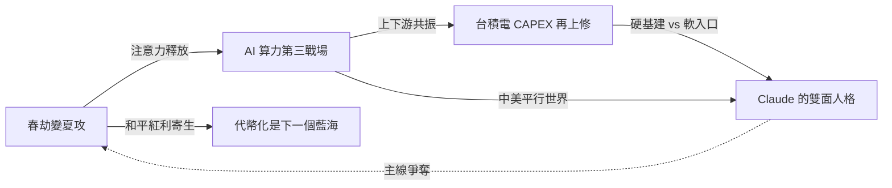
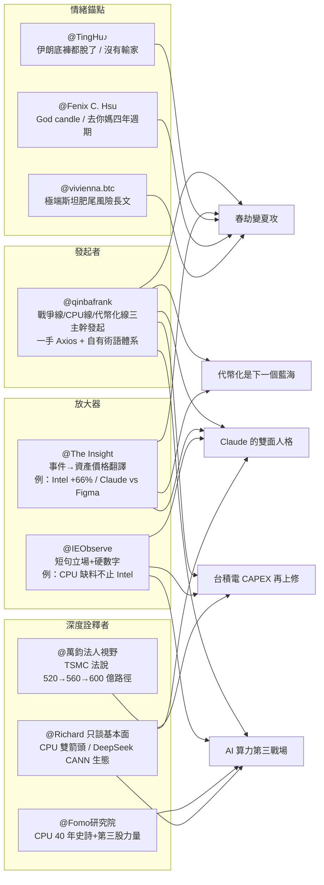

Weekly Narrative Brief（2026-04-13 ~ 2026-04-19）

### 1. 核心敘事（5 個）

- 敘事名：春劫變夏攻——11 天 V 反把美伊從「戰爭定價」翻成「和平溢價」
- 敘事骨架：因為川普 4/13 升級海上封鎖（只封伊朗港口、非全封海峽）被解讀為「制裁升級而非戰爭升級」、4/15 伊朗開始退讓、4/17 川普宣布荷姆茲海峽完全開放並曝光 200 億美金換 450 公斤 60% 濃縮鈾的三頁 MOU 談判，所以情緒從「停火能不能撐住」翻成「戰爭結束的 V 反值得追」，接下來要追蹤 4/20 伊斯蘭堡第二輪會晤能否把美方 20 年暫停鈾濃縮與伊朗原本只願 5 年的差距補上。
- 主要佐證：美軍封鎖界定為「不分國籍封所有進出伊朗港口船隻，但非伊朗港口船隻可自由通過海峽」，4/13 美東時間上午 10 點生效（IEObserve，fb-2026-04-13-203447.md#14）；4/15 標普 500 首次收盤突破 7000 點、那斯達克連漲 10-11 天、油價回落至 91.28 美元（3/25 以來最低）（The Insight，fb-2026-04-15-214603.md#30）；4/17 川普 Truth Social 宣布「荷姆茲海峽已完全開放、恢復商業運作，但對伊朗海軍封鎖仍維持，直至協議百分百完成」（IEObserve，fb-2026-04-18-175311.md#13）；Axios 4/17 披露三頁 MOU：解凍 200 億美金伊朗資產換交出全部濃縮鈾（含 450 公斤 60% 濃度），美要求暫停濃縮 20 年、伊朗僅願 5 年（qinbafrank，tweet-2026-04-18-223007.md#26）；高盛估未來一週 CTA 在所有情景都是買入 435~436 億美元美股、未來一個月買入 610~660 億美元（qinbafrank，tweet-2026-04-16-103338.md#18）。
- 典型放大語句：「既然他們曾做出承諾，就應該立刻開始行動，迅速讓這條國際水道重新開放！」（川普 Truth Social 轉述，fb-2026-04-13-203447.md#21）；「這次美伊戰爭沒有輸家？美國沒輸（石油賺錢了），伊朗沒輸（比戰前條件更好），金融市場也回歸了。但人死卻無法復生。」（TingHu♪，tweet-2026-04-18-223007.md#60）
- 感染力來源：簡化口號——`春劫行情告以段落`、`V 型反轉 11 天`、`戰爭結束 = 和平溢價` 把外交拉鋸壓成交易員一句話能複述的劇本，在本週市場連漲天數創紀錄時特別有黏性；可驗證性——7000 點、11 天、91.28 美元、200 億美金、450 公斤、60% 濃度、20 年 vs 5 年這些硬數字讓敘事像打勾表，每過一個就有人重貼一次；英雄/反派結構——川普從「破壞者」被改寫成「極限施壓的生意人」（TingHu 明白說「把川普行為放進《交易的藝術》的框架，就不再是混亂，而是高度可預測的生意人模式」），伊朗強硬派則被寫成「底褲都脫了」的退讓方，戲劇性極強（TingHu♪，tweet-2026-04-18-223007.md#39）。
- 代表貼文：@qinbafrank（tweet-2026-04-16-103338.md#1）——劇本驗證者，把 2 月以來的「春劫行情」自證為完整預言鏈並延伸到「夏季攻勢」敘事；@qinbafrank（tweet-2026-04-18-223007.md#42）——方法論詮釋者，4/17 那篇萬字覆盤把「暴走升級→添油模式→以打促談→有條件媾合」做成可複製框架；@TingHu♪（tweet-2026-04-18-223007.md#39）——情緒錨點，用「伊朗底褲都脫了」把退讓情緒釘住；@Nullable（tweet-2026-04-18-223007.md#15）——策略型放大器，用「猜對主線，市場就是會給丰厚奖励」把 4/7 盤後停火冲入的交易固化為示範動作；@Mark Minervini（tweet-2026-04-16-103338.md#5）——英語圈放大器，把 V 形反彈講成「11 天 V-shaped recovery」+「40 年經驗我依然不靠直覺」的權威敘事；@The Insight（fb-2026-04-16-103508.md#6）——機構視角放大器，把科技股+銀行財報強韌性連成「衝突不是主軸」的主流敘事；@IEObserve 國際經濟觀察（fb-2026-04-18-175311.md#13）——事件時間線整理者，把「阿川：荷姆茲海峽全開啦！」貼成本週最後節點。

- 敘事名：AI 算力第三戰場——CPU 從配角翻身，Agent 時代的新卡脖子
- 敘事骨架：因為 Dylan Patel 首次把 CPU 交期（拉到 6-12 週）、TrendForce 把 CPU:GPU 比從 1:4~1:8 重估到 1:1~1:2、ARM 伺服器 CPU 市占預計從 2025 年 25% 飆到 2029 年 90%，加上 Intel/AMD/Sandisk/Micron 自 3/30 低點 +66%/+61%/+42% 的股價打出「CPU 標的真能漲」的結果，所以敘事從「GPU 是算力的全部」漂移成「AI 算力是 CPU+GPU+電力+光通四重擠兌」，接下來要追蹤 Intel / AMD 月底財報的 CPU 實際出貨量與定價能否驗證 Dylan Patel 的結構論述。
- 主要佐證：Dylan Patel 訪談點出 Intel/AMD 伺服器 CPU 交期 6-12 週、價格漲 10%+、「demand far exceeded expectations」（IEObserve，fb-2026-04-16-103508.md#15）；TrendForce 指「AI 資料中心 CPU:GPU 比例從 1:4~1:8 變 1:1~1:2」，每 GW 算力所需 CPU 核心從 3000 萬激增到 1.2 億（4 倍）（Richard 轉引，fb-2026-04-15-214603.md#28）；OpenAI 披露 API 每分鐘處理量從 2025/10 月 60 億 Token 到 2026/3 月底 150 億 Token（半年 2.5 倍），GPU 租賃價格兩個月漲 48%（4.08 美元/小時 vs 兩個月前 2.75 美元）（qinbafrank，tweet-2026-04-16-103338.md#34）；自 3/30 標普 500 年內低點以來，Intel +66%、Sandisk +61%、Micron +42%，AMD 突破歷史新高（The Insight，fb-2026-04-18-175311.md#24）；DIGITIMES 點名 PC 端「處理器根本沒貨，有錢也買不到，Intel / AMD 都缺」，要等 Intel 18A 良率（fb-2026-04-18-175311.md#19）。
- 典型放大語句：「Agentic AI 把 CPU 從『可有可無』直接幹成了『必須配足』的總指揮。」（qinbafrank，tweet-2026-04-18-223007.md#43）；「CPU 從 AI 間接受惠變直接受惠、配角變主角（之一）、CPU+GPU/XPU 雙箭頭。」（Richard 只談基本面，fb-2026-04-15-214603.md#28）
- 感染力來源：反直覺性——過去一年半市場把算力敘事等同於 GPU，突然把 CPU 拉進「卡脖子」榜單挑戰了慣性認知，所以每條貼文都像「你以為 GPU 是全部，其實 CPU 才是下一輪主角」的驚喜式轉述；可驗證性——1:4→1:1、6-12 週、+10%、+66%、12 倍、150 億 Token、48% 漲幅這些數字直接對到財報與租賃價格，讓「缺 CPU」不是猜測而是可對賬的事實；身份認同——硬體研究員、雲端架構師、散戶選股者都能從不同位置代入同一條鏈，特別是 qinbafrank 把受益股分成美股核心（INTC/AMD/ARM）、港股製造（聯想、中芯）、A 股國產替代（海光、龍芯、瀾起、深南）讓每種讀者都能找到自己的進場點（tweet-2026-04-18-223007.md#43）。
- 代表貼文：@qinbafrank（tweet-2026-04-18-223007.md#43）——發起者，4/17 長文把 Agentic AI 為何需要 CPU、量級、受益股一次講清楚；@Richard 只談基本面（fb-2026-04-15-214603.md#28）——框架詮釋者，用 TrendForce 數字把 CPU 從「受惠輪動」升級成「雙箭頭」；@Fomo 研究院（fb-2026-04-15-214603.md#18、fb-2026-04-18-175311.md#22）——歷史敘事者，用「40 年 CPU 王者 → 10 年 GPU 篡位 → 現在天平重新傾斜」的三段式史詩讓敘事具有長尺度感，並補上「第三股力量：純 CPU 機架」；@IEObserve 國際經濟觀察（fb-2026-04-16-103508.md#15）——短句型放大器，用「CPU 正在成為新瓶頸，並蔓延到記憶體、儲存、產能」壓成一句立場；@IEObserve 國際經濟觀察（fb-2026-04-15-214603.md#22）——情緒錨點，用「Uber CTO 說 2026 AI 預算已經被 Token 燒光了」把算力緊缺的企業端感受講成梗；@The Insight（fb-2026-04-18-175311.md#24）——結果驗證者，用 +66%/+61%/+42% 這組強漲幅把敘事從「會漲」推進到「已經漲過」。

- 敘事名：台積電不上修 CAPEX 才奇怪——AI 產能紅利被鎖到 2028
- 敘事骨架：因為 TSMC Q1 營收 359 億美元（高於共識 356 億）、CAPEX 從 520-560 億上修到貼近上限 560 億（下半年可能再到 600 億）、ASML 全年指引從 340-390 億歐元上修到 360-400 億歐元並披露存儲客戶 2026 產能已售罄、南亞科 Q1 DRAM 均價季增逾 70% 並用 LTA 把自己綁進三大 NAND 廠朋友圈，所以敘事從「AI 缺貨是短期現象」固化成「缺貨被合約鎖到 2028 年的結構性紅利」，接下來要追蹤月底幾大雲廠 Q1 財報的 CAPEX 前瞻是否驗證這條產能鏈還能再加碼。
- 主要佐證：TSMC Q1 營收 359 億美元、EPS 22.08 元、毛利率 66.2%（皆優於財測上緣），Q2 指引中位數 396 億美元季增約 10%，全年美元營收成長率從「接近 30%」上調至「30% 以上」，CAPEX 靠近 520-560 億上緣（美股韭菜王，fb-2026-04-18-175311.md#27）；美系大行法說後上修 2026-2028 年 EPS 至 103.3 / 129 / 158 元，全年 CAPEX 預估拉高至 550 億美元（萬鈞法人視野，fb-2026-04-17-124927.md#7）；ASML Q1 營收 87.7 億歐元、毛利率 53%、淨利 28 億歐元均優於預期，2026 年全年銷售額指引從 340-390 億上修到 360-400 億歐元，存儲客戶「2026 產能已全部售罄、供應緊張持續到 2026 年之後」（qinbafrank，tweet-2026-04-16-103338.md#9）；南亞科 Q1 營收 490.87 億元、毛利率 67.9%、單季 EPS 8.41 元、DRAM 均價季增逾 70%，並與 SanDisk / 鎧俠 / SK 海力士三大 NAND 廠簽 LTA 切入 AI 雲端伺服器（JOV，fb-2026-04-13-203447.md#1）；博通與 Meta MTIA 合作延長至 2029 年，首期規模 1GW，後續擴展至數個 GW，陳福陽卸 Meta 董事轉顧問（IEObserve，fb-2026-04-15-214603.md#24）。
- 典型放大語句：「客戶明確告知，2026 年產能已全部售罄，供應緊張將持續到 2026 年以後。」（qinbafrank，tweet-2026-04-16-103338.md#9）；「TSM 明確表示將靠近 CAPEX 高標（很多人期待資本支出上修，但台積本來就從來不會在第二季就上修，就算不夠用也是下半年才上修）。」（萬鈞法人視野，fb-2026-04-17-124927.md#7）
- 感染力來源：可驗證性——359、66.2%、520-560、87.7、360-400、490.87、67.9%、70%、1GW、2029 這些財報數字讓這條敘事是「月月都可以驗證」的硬敘事；反直覺性——市場在 2~3 月一度擔心 AI CAPEX 泡沫，本週台積電 Q1 超預期+CAPEX 上修把「質疑」翻成「驗證」，讓曾空著 AI 部位的人有「必須補課」的壓力；英雄/反派結構——AI 基建鏈上的「護國神山（台積電）+ 一個人壟斷（ASML）+ LTA 大聯盟（南亞科+三大 NAND）」被排成同一陣線，對照 DeepSeek 華為昇騰路線的反派敘事（見敘事 5）拉出很清楚的中美對立戲。
- 代表貼文：@美股韭菜王（fb-2026-04-18-175311.md#27）——深度詮釋者，用 2200 億 CAPEX 看台積電 2026-2028 強化信心；@萬鈞法人視野 WJ Capital Perspective（fb-2026-04-17-124927.md#7）——行內分析型放大器，用「台積本來就不會在 Q2 就上修」解釋為何靠近上緣才是真訊號；@IEObserve 國際經濟觀察（fb-2026-04-15-214603.md#9、fb-2026-04-15-214603.md#24）——數字放大器，把 ASML 記憶體比重上升（Q4 2025 的 48% → Q1 66%）和博通+Meta MTIA 1GW 合作貼成兩則短訊；@JOV（fb-2026-04-13-203447.md#1）——通路詮釋者，用「三大 NAND 廠加持送入雲端」把南亞科從「只賣 DDR4」洗白成「AI 雲端供應鏈成員」；@qinbafrank（tweet-2026-04-16-103338.md#9）——財報翻譯者，把 ASML 法說會要點抽成 5 條可交易結論；@The Insight（fb-2026-04-15-214603.md#11）——盤面放大器，用台股大盤突破新高與台積電法說預期把本週敘事收合成「氣氛都烘托到這」。

- 敘事名：代幣化是下一個藍海——從 SEC 鬆綁到 SpaceX IPO 的「資產端到鏈上」
- 敘事骨架：因為 SEC 4/13 發布加密資產監管指引（首次把 BTC/ETH/SOL/XRP/ADA/DOGE 等明確定義為「數字商品、非證券」）+批准取消 PDT 25000 美元日內交易門檻、X 上線 Cashtags 並與加拿大 Wealthsimple 合作直接交易、Robinhood 獲選「特朗普账戶」兒童儲蓄計劃前端、SpaceX 在 Polymarket 上 IPO 市值預測 1.8T 70%/2.0T 49%，所以敘事從「加密賽道炒幣」漂移成「把全球優質資產端到鏈上，誰先做誰贏」，接下來要追蹤 Robinhood vs 嘉信理財的代際轉換，以及 SpaceX IPO 前 6 個月限售期的強叙事+低流通盤+被動買入機會。
- 主要佐證：SEC 4/13 發布《聯邦證券法對某些類型加密資產和涉及加密資產某些交易的適用性》最終解釋性指引，明確 BTC/ETH/SOL/XRP/ADA/DOGE/SHIB/AVAX/LINK 為「數字商品」，且 PoW 挖礦、PoS staking、liquid staking、1:1 wrapping、無對價空投均不屬證券（qinbafrank，tweet-2026-04-16-103338.md#42）；SEC 同日批准取消「Pattern Day Trader」規則（2001 年訂定的 25000 美元最低資金要求），改為實時日內保證金（qinbafrank，tweet-2026-04-16-103338.md#19）；X 平台 Cashtags 上線，用戶可在時間線直接看到股票/代幣價格圖表，並與 Wealthsimple 合作讓加拿大用戶無縫交易（qinbafrank，tweet-2026-04-16-103338.md#18）；Polymarket 預測 SpaceX IPO 市值 1.8T 70%、2.0T 49%、3.0T 16%，Bitget × Republic 以 1.5 萬億美金隱含估值發售 PresSPAX Pre-IPO 代幣，納斯達克 100 指數修改規則可在 SpaceX 上市後最快 15 天納入（qinbafrank，tweet-2026-04-16-103338.md#7）；美國財政部選 BNY + Robinhood 參與特朗普账戶兒童儲蓄計劃（每名 2025-2028 出生兒童 1000 美元政府種子基金），Vlad Tenev 目標「捕捉下一代投資者，在他們會爬之前」（qinbafrank，tweet-2026-04-16-103338.md#20）。
- 典型放大語句：「謊能最快、最無摩擦地在鏈上提供全球任意『優質/爆發資產』的交易暴露，誰就能在流動性、用戶上取得先機。這是 26 年證券代幣化浪潮下的『勝負手』核心關鍵。」（qinbafrank，tweet-2026-04-18-223007.md#14）；「每一代人都有自己的嘉信理財，Robinhood 未來很大概率能超越嘉信理財。」（qinbafrank，tweet-2026-04-16-103338.md#20）
- 感染力來源：英雄/反派結構——Robinhood / SpaceX / X 被排成「進攻方」，嘉信理財 / 傳統經紀商 / 舊規則被排成「守城方」，對比強烈；可驗證性——14000 顆 BTC、10 萬個 PreSPAX、1.8T/2.0T/3.0T 機率、1000 美元政府種子基金、2025-2028 出生兒童這些都是具體可追的時間點；反直覺性——過去一年敘事焦點在「加密 vs 股市誰贏」，本週的框架直接把兩者變成「同一條鏈上交易的不同資產類別」，把衝突敘事翻成融合敘事；簡化口號——`把資產端到鏈上`、`從搖籃到退休`、`每一代有自己的嘉信`。
- 代表貼文：@qinbafrank（tweet-2026-04-18-223007.md#14）——發起者，把「鏈上證券代幣化勝負手」定義成可對證的標準（誰先上線優質資產、滑點排第二、OI 規模等）；@qinbafrank（tweet-2026-04-16-103338.md#7）——數據放大器，用 Polymarket 賠率+納斯達克 100 指數納入規則，把 SpaceX IPO 變成可交易主題；@qinbafrank（tweet-2026-04-16-103338.md#20）——制度型放大器，用「從搖籃開始」把 Robinhood 從 meme 股 App 重寫成「終身客戶管道」；@qinbafrank（tweet-2026-04-16-103338.md#42）——法規型詮釋者，把 SEC 指引逐條翻成「加密監管明確」的利好；@Fenix C. Hsu（fb-2026-04-15-214603.md#27）——情緒錨點，用「一天 9000 顆」「STRC 一天 7500 顆比特幣又突破新紀錄」把代幣化飛輪講成每天更新的實況；@TingHu♪（tweet-2026-04-16-103338.md#35）——策略錨點，明確說「大仓位趨勢布局時機在美股大的 IPO 之後，尤其是 SpaceX 之後」，把 SpaceX 定為全體押注時鐘。

- 敘事名：Claude 的雙面人格——一邊是金融基建要 KYC，一邊是被指控恐嚇行銷
- 敘事骨架：因為 Claude Mythos 能自主發現零日漏洞（Cyber Gym 得分 83% vs 上代 66%、找出 OpenBSD 隱藏 27 年漏洞），逼得貝森特 + 鮑威爾緊急召見六大行 CEO，而 Anthropic 同步要求用戶做 KYC（身份由 Persona 托管）+推出 Claude Design 再次「給 Figma 判死刑」，另一邊 David Sacks 則公開批評 Anthropic「把恐嚇行銷與產品發佈綑綁」，所以敘事從「Claude 是應用工具」漂移到「Claude 既是金融基礎設施又是行銷爭議焦點」，接下來要追蹤 KYC 是否成為業界標準、Mythos 是否進一步放出，以及 DeepSeek V4 是否真能用華為昇騰 950PR 逼出中美 AI 平行世界。
- 主要佐證：Anthropic 自承 Mythos 在 Cyber Gym 基準得 83%（前代最高 66%），能自主找出所有主流 OS / 瀏覽器中數千個高危漏洞，包括 OpenBSD 隱藏 27 年、FFmpeg 500 萬次測試都未暴露的 bug，Anthropic 不敢公開發布、只有限提供給 Apple / Amazon / Microsoft 等 40 多家（Project Glasswing）（qinbafrank，tweet-2026-04-16-103338.md#17）；此消息把貝森特（財政部長）與鮑威爾（聯儲主席）同時促成臨時會議、警告華爾街六大行（qinbafrank，tweet-2026-04-16-103338.md#17）；Anthropic 要求用戶 KYC，身份由 Persona 托管，官方說法是「他們要的不是你的數據，是你這個人」（qinbafrank，tweet-2026-04-16-103338.md#17）；美國總統科技顧問 David Sacks 在 All In Podcast 上批評 Anthropic「擅長發布新產品的同時精於利用各種研究散布技術恐懼，試圖在推廣模型的當下操控公眾情緒」（The Insight，fb-2026-04-13-203447.md#7）；Claude Design 推出後 Figma 再被市場「判一次死刑」，Adobe 小跌 1.5%（IEObserve，fb-2026-04-18-175311.md#10）；DeepSeek V4 預計用華為昇騰 950PR（本月開始量產），阿里 / 字節 / 騰訊已向華為下單數十萬顆，路透 2 月已報導 DeepSeek 不再向美國晶片廠商提供旗艦型號早期存取（The Insight，fb-2026-04-18-175311.md#1、fb-2026-04-19-113652.md#12）。
- 典型放大語句：「他們要的不是你的數據，是你這個人。」（qinbafrank，tweet-2026-04-16-103338.md#17）；「Anthropic 每推個新產品，市場就給 Figma 判一次死刑。這次直接叫 Claude design 了。」（IEObserve，fb-2026-04-18-175311.md#10）
- 感染力來源：反直覺性——同一個 AI 公司，一週內被市場分別講成「金融基建的 KYC 守門人」與「用恐嚇行銷操縱情緒的商人」，兩種極端評價並存特別容易被轉述；英雄/反派結構——Anthropic/Claude 既是對付駭客的神兵（Mythos），又是 SaaS 公司的屠夫（Claude Design / Managed Agents），雙重身份讓本敘事自帶戲劇張力；可驗證性——83% vs 66%、27 年 OpenBSD、40 家 Project Glasswing、數十萬顆昇騰 950PR 都是很硬的事實鉤子；身份認同——軟體工程師、金融監管、AI 安全研究、一般用戶都能從中找到「自己該不該擔心」的角度。
- 代表貼文：@qinbafrank（tweet-2026-04-16-103338.md#17）——深度詮釋者，把 Mythos + 六大行會議 + KYC 串成「AI 成金融基礎設施」完整論述；@The Insight（fb-2026-04-13-203447.md#7）——反方放大器，用 David Sacks 的話把敘事翻成「行銷手段」，補上批判視角；@The Insight（fb-2026-04-18-175311.md#1、fb-2026-04-19-113652.md#12）——情境補完者，用 DeepSeek V4 / 華為 950PR 消息幫黃仁勳訪談中的擔憂作注腳；@IEObserve 國際經濟觀察（fb-2026-04-18-175311.md#10）——短句型放大器，用「每推個新產品就給 Figma 判一次死刑」把估值殺戮梗化；@Richard 只談基本面（fb-2026-04-18-175311.md#26）——生態型詮釋者，分析 DeepSeek V3 → V4 從 CUDA 生態系轉投 CANN 對 AI 開發者社群的「被迫幫忙 debug」效應；@qinbafrank（tweet-2026-04-19-183630.md#4）——用戶視角放大器，拋出「Opus 4.7 升級還是倒退」把 Claude 的產品體驗變成可討論話題。

### 2. 敘事星座（互相支撐/衝突/變體）

- 「春劫變夏攻」如何支撐「AI 算力第三戰場」，機制名是「注意力釋放」：當戰爭定價被 4/17 荷姆茲完全開放與 MOU 談判替換掉，市場注意力才能釋放回 AI 基本面，CPU 緊缺、Intel / AMD +66% / +42%、Agentic AI 導致 1:4 → 1:1 這條敘事才能在同一週接管頭條。例子見 qinbafrank 的「未來兩周流動性可能略收緊同時伊朗局勢最後關鍵時刻，希望能給大家上車機會」（tweet-2026-04-16-103338.md#2）與 Richard 同週力推 CPU 雙箭頭（fb-2026-04-15-214603.md#28）。
- 「AI 算力第三戰場」如何支撐「台積電 CAPEX 再上修」，機制名是「上下游共振」：CPU 緊缺、1:1 配比、每 GW 算力要 1.2 億 CPU 核心這些需求端訊號，直接回流成台積電 2026 CAPEX 靠近 560 億、ASML 存儲 2026 售罄、南亞科 DRAM +70% 這類產能端訊號；兩條敘事互相驗證彼此的可信度。例子見 qinbafrank 的 CPU 長文（tweet-2026-04-18-223007.md#43）與美股韭菜王的 TSMC 財報分析（fb-2026-04-18-175311.md#27）。
- 「台積電 CAPEX 再上修」如何變形成「Claude 的雙面人格」，機制名是「硬基建 vs 軟入口」：同樣是 AI 受益，硬體基建被長約和 CAPEX 鎖定估值，軟體入口卻被 Anthropic 自己當武器（Claude Design → Figma、Managed Agents → SaaS），變成「硬體盆滿缽滿 vs 軟體估值焦慮」的對稱劇本。例子見 The Insight「資本市場何時才會回頭看看軟體股呢？」（fb-2026-04-13-203447.md#7）與 IEObserve「Claude Design 判 Figma 死刑」（fb-2026-04-18-175311.md#10）。
- 「代幣化是下一個藍海」如何寄生於「春劫變夏攻」，機制名是「和平紅利寄生」：戰爭結束 + CTA 強制買入 + 標普 7000 點的背景，讓 SpaceX IPO、Robinhood 兒童账戶、SEC 加密指引、PDT 取消這些制度利多一次全部被市場吸納；沒有和平溢價這個宿主，監管與 IPO 時鐘不會被同時重估。例子見 qinbafrank 的「一旦伊朗問題得以解決接下來就是川普五月訪華+財政部 TGA 改善流動性+雲業務爆炸」（tweet-2026-04-16-103338.md#2）+ SpaceX Polymarket 賠率（tweet-2026-04-16-103338.md#7）。
- 「Claude 的雙面人格」如何衝突於「春劫變夏攻」，機制名是「主線爭奪」：本週所有科技股漲幅被「戰爭結束 = 基本面接管」主線吃下，但 Claude 的金融基建+恐嚇行銷雙面故事分走一部分注意力，特別是 Mythos 驚動貝森特+鮑威爾時一度要搶頭條；這是本週唯一有能力挑戰戰爭主線的第二劇本。例子見 qinbafrank 的 Mythos 長文（tweet-2026-04-16-103338.md#17）與同期 Mark Minervini 的 V 形反彈慶祝（tweet-2026-04-16-103338.md#5）。
- 「AI 算力第三戰場」如何變體成「Claude 的雙面人格」，機制名是「中美平行世界」：同樣是 AI 供需，美國路徑是 Intel/AMD/ARM+台積電+CoWoS 的硬體擁擠單，中國路徑則是 DeepSeek V4 用華為昇騰 950PR + CANN 替代 CUDA、CXMT 追上 HBM 的替代系統；這兩套供應鏈敘事本週第一次被 Richard、The Insight 並排擺出來講。例子見 Richard 的 DeepSeek V4 華為生態分析（fb-2026-04-18-175311.md#26）與 The Insight 的黃仁勳訪談細節補注（fb-2026-04-19-113652.md#12）。

### 3. 傳播與擴散（Who amplified what）

本週傳播形狀是「單中心擴散加雙尾變體」。單中心是美伊戰爭結束的劇本驗證（4/13 封港→4/15 伊朗讓步→4/17 海峽全開→4/18 MOU 曝光），由 qinbafrank 以「我早就說過」的 meta 敘事主導節奏；兩條尾巴一條是 AI 算力/CPU 由 Fomo研究院+Richard 延伸成歷史長敘事，另一條是代幣化/SpaceX 由 qinbafrank 本人分裂出的第二主線。全週幾乎沒有競爭性對抗敘事，情緒單向偏多。

- 最早出現的來源：@qinbafrank 是戰爭線、CPU 線、代幣化線三條主幹的最早框架發起者。他的資訊優勢來源有三：（1）中文圈少數系統追一手 Axios / 英文軍政媒體的人；（2）維持「戰爭定價 vs 談判定價」、「有條件媾合」、「算力即收入」這組個人化術語作為思想錨；（3）每條大事件發生後 24 小時內會發長文做系統化覆盤，例如 4/17 那篇 1 萬字「伊朗局勢判斷全覆盤」（tweet-2026-04-18-223007.md#42）就把 3/1 至今的每一個關鍵時點的自身判斷對一次 Checklist，這種「敘事+時間戳+自我驗證」三位一體的格式讓他天然具備發起者地位。
- 主要放大來源一：@IEObserve 國際經濟觀察 的放大方式是「短句立場 + 硬數字」。他不做長論述，而是用「你封海峽我封你，這樣油價不就狂噴」、「Anthropic 每推個新產品，市場就給 Figma 判一次死刑」、「CPU 缺料不止 Intel，AMD 也一樣」這種一句話立場配一個硬數字（+13% 光通年增、1GW MTIA、53% 毛利率），讓敘事能在讀圖時間 3 秒內被複製轉述。
- 主要放大來源二：@The Insight 的放大方式是「把事件翻成資產價格+市場心理」。他會把川普 Truth Social 貼文翻成股指、油價、銀行財報（fb-2026-04-16-103508.md#6），把 DeepSeek V4 翻成黃仁勳擔憂（fb-2026-04-18-175311.md#1），把 +66% Intel 翻成「3 月觸底反彈至今最強勁表現」（fb-2026-04-18-175311.md#24），屬於「把外部事件內化到投資結論」的風格，跟 IEObserve 的短句立場是互補分工而非競爭。
- 深度詮釋者：@Fomo 研究院 用歷史長度詮釋 CPU（40 年王者 → 10 年篡位 → 天平回擺），把本週算力話題從「缺貨」上升到「範式轉移」（fb-2026-04-15-214603.md#18、fb-2026-04-18-175311.md#22）；@Richard 只談基本面 用 TrendForce、IDC、Jeff Dean 訪談等研究資料把 CPU:GPU 重估、DeepSeek V4 華為生態、TurboQuant 這類技術主題做成可引用的框架文（fb-2026-04-15-214603.md#28、fb-2026-04-18-175311.md#26、fb-2026-04-13-203447.md#17）。
- 情緒錨點：@TingHu♪ 用「伊朗底褲都脫了」、「這次美伊戰爭沒有輸家（但人死不能復生）」、「75000 → 76000 押注時刻」把戰爭敘事的情緒極端化（tweet-2026-04-18-223007.md#39、tweet-2026-04-18-223007.md#60、tweet-2026-04-16-103338.md#29）；@vivienna.btc 用老人心梗手術的第一人稱經歷寫「極端斯坦的肥尾風險與非線性收益」，把市場敘事外延到人生選擇層面（tweet-2026-04-13-171336.md#2）；@Fenix C. Hsu 用「God candle 要來了！！去你媽的四年週期！！！」把比特幣情緒直接拉到最強（fb-2026-04-18-175311.md#11）。
- 事件觸發的時間順序：4/12 川普 Truth Social 宣布封鎖（qinbafrank、Nullable，tweet-2026-04-13-171336.md#10、tweet-2026-04-13-171336.md#4）→ 4/13 美軍 CENTCOM 澄清「只封進出伊朗港口的船隻」，敘事改寫成「制裁升級而非戰爭升級」（qinbafrank、IEObserve，tweet-2026-04-13-171336.md#4、fb-2026-04-13-203447.md#14）→ 4/14 中美通話+川普宣布 5 月訪華+60 天戰爭權力法時限浮現（qinbafrank，tweet-2026-04-16-103338.md#28）→ 4/15 標普 500 突破 7000 點、那指連 11 天、CTA 全情景買入（qinbafrank、The Insight，tweet-2026-04-16-103338.md#18、fb-2026-04-15-214603.md#30）→ 4/15 Anthropic Mythos 被披露+Claude KYC 要求+SEC 加密指引+PDT 取消（qinbafrank，tweet-2026-04-16-103338.md#17、tweet-2026-04-16-103338.md#42）→ 4/17 伊朗宣布荷姆茲對商船全開、Axios 披露 200 億美金 MOU（qinbafrank、IEObserve、The Insight，tweet-2026-04-18-223007.md#26、fb-2026-04-18-175311.md#13）→ 4/17 TSMC 法說 CAPEX 靠近 560 億（美股韭菜王、萬鈞，fb-2026-04-18-175311.md#27、fb-2026-04-17-124927.md#7）→ 4/18 油價再崩 10%、美方曝 20 年暫停鈾濃縮（IEObserve，fb-2026-04-18-175311.md#12）→ 4/19 qinbafrank 發 1 萬字覆盤，為整週敘事合攏收尾（tweet-2026-04-18-223007.md#42）。

### 4. 漂移與週對週變化

以下以上週摘要 `2026-04-05 ~ 2026-04-12` 為對照基準。

| 敘事骨架 | 上週（2026-04-05 ~ 2026-04-12） | 本週（2026-04-13 ~ 2026-04-19） | 漂移機制 | 代表引用 |
|---|---|---|---|---|
| 美伊 / 談判 | 上週是「最後通牒變停火窗口」：焦點在 10 點 vs 15 點方案、萬斯、巴基斯坦斡旋，市場從戰爭定價切談判定價 | 本週變成「春劫變夏攻」：焦點從談判定價漂移到結束定價，200 億美金換 450 公斤濃縮鈾的 MOU 和標普 500 首破 7000 點 | **談判落地成和平溢價**：從「談能不能談」漂移到「談完的分潤」，情緒從擔憂變押注夏季攻勢 | 上週：tweet-2026-04-11-170304.md#74、fb-2026-04-12-121647.md#2；本週：tweet-2026-04-18-223007.md#26、fb-2026-04-18-175311.md#13、fb-2026-04-15-214603.md#30 |
| 通膨 / 油價 | 上週是「停火救不了帳單」：重點在 CPI 3.29% / 油價 95~98 美元 / 每日 510 萬桶缺口等價格壓力未解 | 本週變成「油價再崩 10%」+「3 月 PPI 4% 優於預期、服務凍漲抵銷能源衝擊」，通膨敘事在本週被快速消音 | **敘事靜音**：從「帳單還沒來」漂移到「帳單被服務價格凍漲抵掉了」，本週甚至沒有成為核心敘事 | 上週：fb-2026-04-11-170448.md#20、fb-2026-04-11-170448.md#48；本週：fb-2026-04-18-175311.md#12、fb-2026-04-15-214603.md#23 |
| AI 算力 | 上週是「不是泡沫，是缺貨」：DRAM +30%、SK 海力士長約、光通 2028 售罄，主題是多維度缺貨 | 本週變成「AI 算力第三戰場」：CPU 交期 6-12 週、Intel +66%、AMD 新高、CPU:GPU 從 1:8 變 1:1，主題縮窄成單一環節大爆發 | **擴散聚焦**：從「大家都在缺」漂移到「這週最缺的是 CPU」，並從需求敘事延伸到 Agentic AI 範式轉移 | 上週：fb-2026-04-05-160725.md#1、tweet-2026-04-06-221813.md#6；本週：tweet-2026-04-18-223007.md#43、fb-2026-04-15-214603.md#28、fb-2026-04-18-175311.md#24 |
| Anthropic | 上週是「SaaS 墓碑再添一排」：Managed Agents、300 億 run-rate、Anthropic 把 agent 做成平台吞 SaaS | 本週變成「Claude 的雙面人格」：既是 Mythos + KYC 的金融基建守門人，又是被 David Sacks 批「恐嚇行銷」的爭議商人 | **角色分裂**：從「SaaS 殺手」漂移到「同一主體同時被兩極化敘事」，戲劇性更強 | 上週：tweet-2026-04-11-170304.md#32、tweet-2026-04-11-170304.md#94；本週：tweet-2026-04-16-103338.md#17、fb-2026-04-13-203447.md#7、fb-2026-04-18-175311.md#10 |
| 新敘事登場 | —（上週未被特別拉出） | 本週首次出現「代幣化是下一個藍海」：SEC 加密指引+PDT 取消+X Cashtags+SpaceX IPO+Robinhood 兒童账戶 | **和平溢價催生制度敘事**：戰爭風險解除後，市場重新消化本該早就被定價的制度利多 | 本週：tweet-2026-04-16-103338.md#42、tweet-2026-04-16-103338.md#19、tweet-2026-04-16-103338.md#7、tweet-2026-04-16-103338.md#20 |
